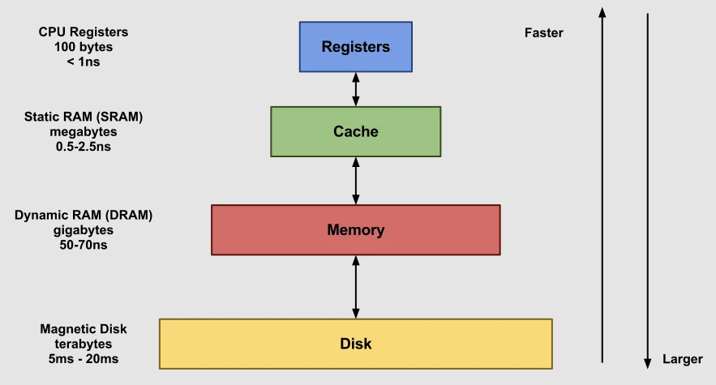
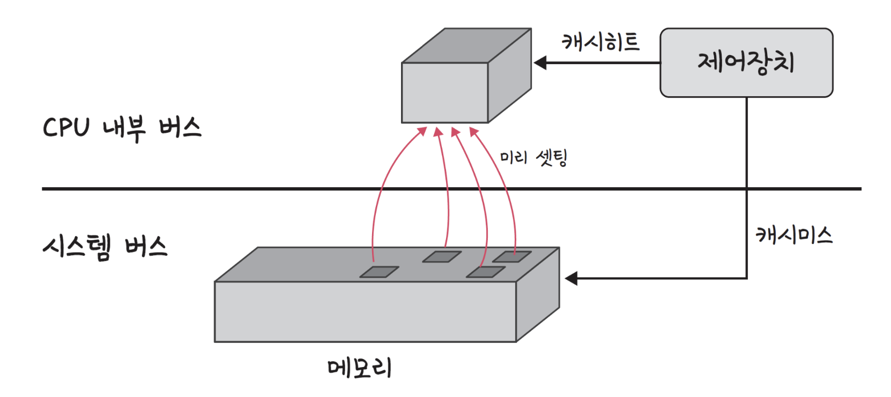

# 📘 1.1 컴퓨터 구조

# 1.1-3 캐시 메모리와 메모리 계층 구조

## 1. 캐시 메모리란?

- **캐시란?**

  - 데이터를 미리 복사해 놓은 임시 저장소.
  - CPU는 매우 빠르게 연산을 수행하지만, 메모리(RAM) 접근 속도는 상대적으로 느리다. 이로 인해 병목(Bottleneck)이 발생하는데, 이를 줄이기 위해 CPU와 RAM 사이에 위치한 **고속 임시 메모리**이다.

자주 사용하는 데이터를 가까이 두면 CPU가 더 빠르게 작업 가능

## 2. 지역성(Locality)의 원리

캐시가 효과적으로 작동하는 이유는 프로그램 실행 시 데이터 접근에 일정한 **패턴(지역성)**이 있기 때문이다.

### 2.1 시간 지역성 (Temporal Locality)

- 최근 사용한 데이터를 다시 접근하려는 특성.

* 최근 사용된 데이터는 곧 다시 사용될 가능성이 높다
* 예: `for(i=0; i<100; i++) sum += i;` ← i와 sum을 반복 사용

### 2.2 공간 지역성 (Spatial Locality)

- 최근 접근한 데이터를 이루고 있는 공간이나 그 가까운 공간에 접근하는 특성.

* 접근한 데이터 주변의 데이터도 함께 사용될 가능성이 높다
* 예: `arr[0], arr[1], arr[2]...` ← 배열 순차 접근

## 3. 메모리 계층 구조



- 위로 갈수록 **속도↑**, **용량↓**, **가격↑**
- 아래로 갈수록 **속도↓**, **용량↑**, **가격↓**

### 메모리 계층 구조 활용

- **레지스터** (가장 빠름) → **L1 캐시** → **L2 캐시** → **L3 캐시** → **메인 메모리** → **저장장치** (가장 느림)
- 각 계층의 지역성을 활용하여 전체적인 성능 향상

### 캐시 계층별 특징

**L1, L2, L3는 Level(계층)을 의미하며, 숫자가 낮을수록 CPU에 가까움**

- **L1 캐시 (1차 캐시)**: CPU 코어에 가장 가까움, 가장 빠름, 용량 작음 (보통 32KB~64KB)
- **L2 캐시 (2차 캐시)**: 중간 거리, 중간 속도, 중간 용량 (보통 256KB~1MB)
- **L3 캐시 (3차 캐시)**: 가장 멀리, 상대적으로 느림, 용량 큼, 여러 코어가 공유 (보통 8MB~32MB)

## 4. 캐시 히트 vs 미스

| 개념     | 설명                                                                  |
| -------- | --------------------------------------------------------------------- |
| **히트** | 필요한 데이터가 캐시에 있어 빠르게 처리됨                             |
| **미스** | 캐시에 없어서 RAM(주메모리)까지 접근 → 느려짐 (10-100배 느릴 수 있음) |



- **캐시히트**를 하게 되면 해당 데이터를 제어장치를 거쳐 가져오게 된다.
- **캐시미스**가 발생되면 메모리에서 가져오게 되는데, 이는 시스템 버스를 기반으로 작동하기 때문에 느리다.

### 캐시 미스의 종류

| 캐시 미스 종류    | 원인                             | 대표 상황               |
| ----------------- | -------------------------------- | ----------------------- |
| **Cold Miss**     | 처음 접근이라 아직 캐시에 없음   | 프로그램 실행 초반      |
| **Capacity Miss** | 캐시에 담기엔 데이터가 너무 많음 | 큰 배열 순회            |
| **Conflict Miss** | 캐시 주소가 충돌해서 덮어쓰기됨  | 특정 간격으로 반복 접근 |

**1️⃣ Cold Miss**

- 프로그램이 처음으로 특정 데이터를 요청할 때는 캐시에 존재하지 않기 때문에 무조건 미스가 발생한다.

```cpp
int a = arr[0]; // arr 배열을 처음 접근할 때
```

- `arr[0]`을 처음 읽는 순간 → 캐시에 없음 → 메모리에서 불러옴 → Cold Miss 발생

<br/>

**2️⃣ Capacity Miss**

- 캐시 용량보다 더 많은 데이터를 접근하면, 예전에 있던 데이터는 쫓겨나게 된다.
- 다시 필요해질 때는 이미 없어졌으므로 다시 불러와야 하는 미스가 발생한다.

```cpp
for (int i = 0; i < 1024; i += 64) {
    sum += array[i];
}
```

- `big_array`가 캐시보다 훨씬 크면 → 자꾸 새로 읽고 → 이전 데이터는 사라짐 → 계속 미스 발생

<br/>

**3️⃣ Conflict Miss**

- 캐시는 보통 "n개의 블록에만 특정 데이터 주소를 저장"하도록 구조화되어 있다.
- 다른 데이터라도 주소가 캐시에서 같은 위치에 매핑되면 서로 자리를 뺏으려 하는 미스가 발생한다.

```cpp
for (int i = 0; i < 1024; i += 64) {
    sum += array[i];
}
```

## 5. 캐시 매핑

> CPU의 레지스터와 주 메모리(RAM) 간에 데이터를 주고받을 때를 기반으로 설명하며, **캐시의 어느 위치(라인)에 저장할지**를 결정하는 방법.

- 캐시는 작기 때문에, 큰 메모리 공간에서 어떻게 매핑할지 규칙이 필요하다.

| 매핑 방식                                       | 설명                                                                                    | 장점                                                                                 | 단점                                                                                   | 컴퓨터공학적 예시                                                                         |
| ----------------------------------------------- | --------------------------------------------------------------------------------------- | ------------------------------------------------------------------------------------ | -------------------------------------------------------------------------------------- | ----------------------------------------------------------------------------------------- |
| **직접 매핑**<br>(Direct Mapping)               | 메모리 블록은 **캐시의 특정 라인 1곳**에만 매핑됨<br>→ 주소 `% 캐시라인 수`로 위치 결정 | - 구현이 간단<br>- 접근 속도 빠름<br>- 검색 비용 낮음                                | - 서로 다른 주소가 같은 라인에 저장되면 **충돌 잦음 (Conflict Miss)**<br>- 유연성 낮음 | - `4KB 캐시`, `64B 블록`이면 `64줄`, 주소 1024 → `1024 % 64 = 0`번 줄에만 저장 가능       |
| **연관 매핑**<br>(Associative Mapping)          | 메모리 블록을 **캐시의 어느 라인에도 저장 가능**<br>→ 검색은 모든 줄을 검사해야 함      | - 저장 유연성 최고<br>- Conflict Miss 없음                                           | - 구현 복잡<br>- 비교 비용 큼 (모든 태그 검사 필요)<br>- 시간/전력 소모 ↑              | - 고속 연산 장치 (e.g. TLB, Translation Lookaside Buffer)는 대부분 완전 연관 방식 사용    |
| **집합 연관 매핑**<br>(Set-Associative Mapping) | 캐시를 여러 세트로 나누고,<br>한 주소는 특정 세트 안의 **여러 라인 중 하나에 저장**     | - 유연성과 성능 균형<br>- Conflict Miss 확률 낮음<br>- 적절한 교체 정책(LRU 등) 가능 | - 하드웨어 복잡도 있음<br>- 교체 알고리즘 필요                                         | - L1/L2 CPU 캐시는 일반적으로 2\~8-way 세트 연관 방식 사용<br>(예: 4-way set-associative) |

- `Direct Mapping`: 저가형 CPU, 단순한 캐시 설계에서 사용

- `Associative`: 적은 캐시 줄을 정밀하게 쓰는 영역 (예: TLB)

- `Set-Associative`: 가장 현실적이고 널리 사용되는 방식 (성능/비용 균형)
