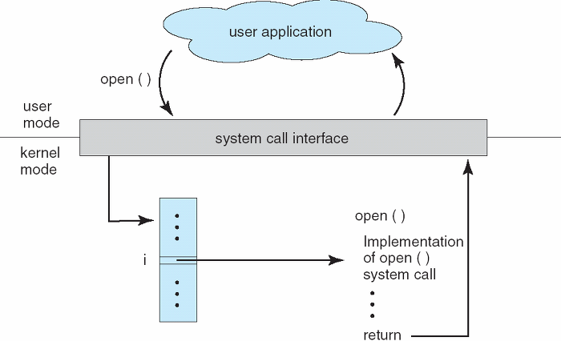

# 📘 1.2 운영체제 기본 개념

# 1.2-2 커널과 시스템 콜

## 1. 커널(Kernel)이란?

> 커널은 운영체제의 **핵심 부분이자 가장 낮은 수준의 추상화 계층**으로, 컴퓨터의 **하드웨어 자원을 직접 제어**하고 **모든 프로그램 실행을 관리**한다. 사용자와 하드웨어 사이의 **중간 관리자** 역할을 하며, 운영체제에서 가장 먼저 로드되고 가장 마지막에 종료되는 부분이다.

- 보안, 메모리, 프로세스, 파일 시스템, I/O 디바이스, I/O 요청 관리 등 핵심적 역할을 한다.

### 사용자 영역 vs 커널 영역

운영체제는 **보안성과 안정성 확보**를 위해 메모리 공간을 크게 두 영역으로 나눈다:

| 영역                     | 설명                       |
| ---------------------- | ------------------------ |
| **커널 모드(Kernel Mode)** | 운영체제와 하드웨어를 직접 다루는 특권 영역 |
| **사용자 모드(User Mode)**  | 일반 사용자 프로그램이 실행되는 제한된 영역 |

사용자 프로그램은 하드웨어에 직접 접근할 수 없고, **커널의 도움을 받아야만** 자원에 접근할 수 있다.

## 2. 시스템 콜(System Call)이란?

> 시스템 콜은 **사용자 프로그램이 운영체제의 커널 기능을 요청하는 메커니즘**이다. 즉, 프로그램이 CPU, 메모리, 파일, 네트워크 등 **하드웨어 자원이나 OS 서비스를 사용하기 위해 커널 함수를 호출**할 때 사용한다.

- 운영체제에서는 **커널모드**와 **사용자 모드**로 나뉘어 구동되는데, 프로그램이 구동되는 데 있어 파일을 읽거나 쓰거나 출력하는 등 많은 부분(I/O 요청에 대한 처리)이 **커널모드**를 사용한다.
- **시스템 콜**은 이러한 커널 영역의 기능을 사용자 모드가 사용 가능하게 해준다.
    - 이 과정을 통해 컴퓨터 자원에 대한 직접 접근을 차단할 수 있고 프로그램을 다른 프로그램으로부터 보호할 수 있다.

### 왜 시스템 콜이 필요한가?

* **보안**: 사용자 프로그램이 임의로 하드웨어에 접근하는 것을 방지
* **안정성**: 커널이 자원을 중앙에서 통제하므로 충돌이나 오류를 줄임
* **추상화**: 복잡한 하드웨어 제어를 단순한 함수 호출처럼 제공

## 3. 시스템 콜 처리 흐름

> 커널 영역의 기능을 사용자 모드가 사용 가능하게, 즉 프로세스가 하드웨어에 직접 접근하여 필요한 기능(ex I/O 요청)을 사용할 수 있게 해준다.

1. 사용자 프로그램이 시스템 콜 함수를 호출 (ex. `open()`)
2. CPU가 \*\*트랩(Trap)\*\*을 통해 **커널 모드로 전환**
3. 커널이 해당 요청을 처리
4. 처리 결과를 사용자 프로그램으로 반환
5. CPU는 다시 **사용자 모드로 복귀**

**실생활 예시**: 메모장에서 "저장" 버튼을 누르면

1. 프로그램이 write() 시스템 콜 호출
2. 커널 모드 전환 → 파일 시스템이 디스크에 쓰기
3. 완료 후 사용자 모드로 복귀 → "저장 완료" 메시지 표시

### 시스템 콜 오버헤드

* **모드 전환 비용**: 사용자 모드 ↔ 커널 모드 전환 시 **성능 저하** 발생
* 시스템 콜은 일반 함수 호출보다 **수십 배 이상 느릴 수 있음**

## 4. modebit
> 시스템 콜의 modebit는 사용자 모드(1)과 커널모드(0) 사이를 전환하기 위한 비트이다.

- 사용자 모드에서 시스템콜을 호출하면, 커널 모드로 전환되어 시스템콜 함수를 실행하고, 실행이 완료되면 다시 사용자 모드로 돌아간다.
- 사용자 모드에서는 시스템 콜을 못하도록 막아서 한정된 일만 수행할 수 있다.
- 예시 : 유저 프로그램이 카메라를 이용하려고 한다.
    1. 사용자 모드에서 시스템 콜 호출하여 modebit 1 -> 0
    2. 커널 모드에서 자원을 이용한 로직 수행
    3. modebit 0 -> 1 
    4. 사용자 모드에서 이후 로직 수행

## 핵심 요약

* 커널은 운영체제의 핵심으로 하드웨어를 직접 제어하는 특권 영역이다
* 시스템 콜을 통해 사용자 프로그램이 안전하게 OS 기능을 사용할 수 있다
* 모드 전환(사용자 모드 ↔ 커널 모드) 시 오버헤드가 발생한다
* 보안과 안정성을 위해 하드웨어 직접 접근을 제한하고 커널이 중재한다

## 용어 설명

* **커널(Kernel)**: 운영체제의 핵심, 하드웨어 자원을 직접 제어
* **시스템 콜(System Call)**: 사용자 프로그램이 커널 기능을 요청하는 방법
* **트랩(Trap)**: 사용자 모드에서 커널 모드로 전환하는 인터럽트
* **오버헤드**: 시스템 콜 호출 시 발생하는 성능 비용
* **추상화**: 복잡한 하드웨어 동작을 간단한 함수 호출로 제공
* **특권 영역**: 하드웨어에 직접 접근할 수 있는 커널 모드
* **드라이버**: 하드웨어를 제어하기 위한 소프트웨어