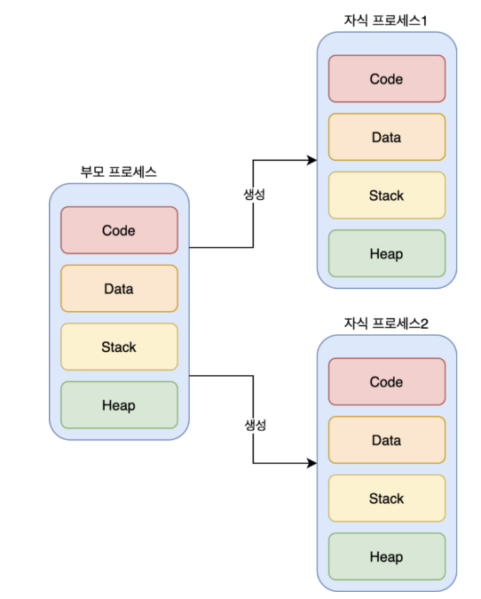

# 📘 1.2 운영체제 기본 개념

# 1.2-3 프로세스와 스레드

> 프로세스는 컴퓨터에서 실행되고 있는 프로그램을 말하며 CPU 스케줄링의 대상이 되는 작업이라는 용어와 거의 같은 의미. 프로세스 끼리는 독립적.


> 스레드는 프로세스 내 작업의 흐름. 프로세스의 실행 가능한 가장 작은 단위. 하나의 프로세스는 여러 스레드를 가질 수 있다.


- 크롬 브라우저를 실행하고, 이 프로세스에서 파일을 다운 받으며 온라인 쇼핑도 하고 게임을 한다.

## 1. 프로세스(Process)란?

프로세스는 **실행 중인 프로그램의 인스턴스**로, 프로그램이 **메모리에 적재**되어 CPU 자원을 할당받아 수행되는 단위이다. 하나의 프로그램은 여러 개의 프로세스로 실행될 수 있다.

- 프로그램은 어떤 작업을 하기 위해 실행할 수 있는 파일이다. (EX) 엑셀, VSCODE 등)
    - 쉽게 생각하면 코드 덩어리
- 프로세스는 실행되어 작업중인 컴퓨터 프로그램이다. (EX) 컴퓨터 작업관리자에서 보이는 실행 중인 카카오톡, 구글 크롬 등)
    - 쉽게 생각하면 그 코드 덩어리를 실행한 것

### 프로세스의 주요 특징
* 독립된 메모리 공간(코드, 데이터, 스택, 힙 영역)을 가짐
* 운영체제가 CPU, 메모리 등 자원을 할당함
* 프로세스 간에는 직접적인 메모리 공유가 불가능하며, 통신 시 별도 방식(IPC)을 사용해야 함

## 2. 프로세스 구조 (메모리 관점)


### 스택과 힙 영역
- 동적 할당되는 영역 : **런타임** 단계에서 메모리를 할당받는 것
- **스택 영역** : 지역 변수, 매개변수, 실행되는 함수에 의해 늘어나거나 줄어드는 메모리 영역.
    - 함수의 호출될 때마다 호출될 때의 환경 등 특정 정보가 스택에 계속해서 저장
    - 스택 영역을 초과하면 `stack overflow` 에러가 발생
    - 재귀 함수가 호출된다면 새로운 스택 프레임이 매번 사용되기 때문에 함수 내의 변수 집합이 해당 함수의 다른 인스턴스 변수를 방해하지 않음
- **힙 영역** : 생성자, 인스턴스와 같은 동적으로 할당되는 데이터들을 위해 존재하는 공간.
    - 사용자에 의해 메모리 공간이 동적으로 할당되고 해제됨.
    - `malloc()`, `free()` 함수를 통해 관리할 수 있음.
    - vector는 내부적으로 힙 영역을 사용함.

### 데이터 영역
- 데이터 영역은 **BSS segment**, **DATA segment**로 이루어져 있음
- *BSS*는 전역 변수 또는 static, const로 선언되어 있고 0으로 초기화 또는 초기화가 어떠한 값으로 되어 있지 **않은** 변수들이 이 메모리에 할당
- *Data*는 전역변수 또는 static, const로 선언되어 있고 **0이 아닌 값으로 초기화된 변수**가 이 메모리에 할당

### 코드 영역
- 프로그래머가 작성한 프로그램 함수들의 코드가 CPU가 해석 가능한 기계어 형태로 저장되어 있음


## 3. 멀티프로세싱

> 여러 개의 프로세스, 즉 멀티프로세스를 통해 동시에 두 가지 이상의 일을 수행하는 것

- 예시) 웹 브라우저의 상단 탭이나 새 창 : 각 브라우저 탭은 같은 브라우저 *프로그램* 실행이지만, **각기 다른 사이트를 실행**




### 멀티프로세싱 장점
- 하나 이상의 일을 **병렬로 처리** 가능
- **신뢰성 증가** : 특정 프로세스의 메모리, 프로세스 중 일부에 문제가 발생되더라도 다른 프로세스를 이용해서 처리 가능
- **프로그램 안정성** : 각 프로세스가 독립적인 메모리 공간을 가지므로, 한 프로세스가 비정상적으로 종료되어도 다른 프로세스에 영향을 주지 않음
- **프로그램 확장성** : 각 프로세스가 독립적이므로, 새로운 기능이나 모듈을 추가하거나 수정할 때 다른 프로세스에 영향을 주지 않음. 시스템 규모를 쉽게 확장 가능.

### 멀티프로세싱 단점
- **context switching overhead** : 멀티 태스킹을 구성하는 컨텍스트 스위칭 과정에서 성능 저하가 올 수 있음
    - CPU는 프로세스의 정보를 불러오기 위해 메모리를 검색하고, 캐시 메모리를 초기화하고(캐시미스) 프로세스 상태를 저장하고 불러올 데이터를 준비해야하기 때문에 빈번한 스위칭 작업으로 인해 비용 오버헤드가 발생할 수 있음
    - 스레드로 컨텍스트 스위칭하면 비용이 더 적고 시간도 더 적게 듦
    
- **자원 공유 비효율성** : 각 프로세스가 독립적인 메모리 공간을 가지므로, 결과적으로 메모리 사용량이 증가함. 프로세스 간 자원 공유가 필요한 경우 복잡한 통신 기법(IPC)를 사용하여야 한다.

### 멀티프로세스 간의 자원 공유 방법, IPC(Inter Process Communication)
> 프로세스끼리 데이터를 주고받고 공유 데이터를 관리하는 메커니즘

- 예시) 클라이언트와 서버 : 클라이언트는 데이터를 요청하고 서버는 응답한다.
- 아래 IPC들은, 모두 메모리가 완전히 공유되는 스레드보다는 속도가 떨어진다.

<br/>

1. **공유 메모리** : 여러 프로세스에 동일한 메모리 블록에 대한 **접근 권한이 부여**되어 프로세스가 서로 통신할 수 있도록 공유 메모리를 생성해서 통신하는 것
    - 데이터를 주고 받는 것이 아닌 **메모리 공유**로 불필요한 데이터 복사의 오버헤드가 발생하지 않아 가장 빠르다.
    - 그러나 메모리 공유로 인해 동기화가 필요하다.

2. **파일** : 디스크에 저장된 데이터 또는 파일 서버에서 제공한 데이터
3. **소켓** : 동일한 컴퓨터의 다른 프로세스나 네트워크의 다른 컴퓨터로 네트워크 인터페이스를 통해 전송하는 데이터를 의미
    - 종류 : TCP, UDP
4. **익명 파이프** : 프로세스 간에 FIFO 방식으로 읽히는 임시 공간인 파이프를 기반으로 데이터를 주고 받는 것
    - 단방향 방식의 읽기 전용, 쓰기 전용 파이프를 만들어 작동한다.
5. **명명된 파이프** : 파이프 서버와 하나 이상의 파이프 클라이언트 간의 통신을 위해 망명된 단방향 또는 양방향 파이프
    - 클라이언트/서버 통신을 위한 별도의 파이프를 제공하며, 여러 파이프를 동시에 사용 가능
6. **메세지 큐** : 큐 데이터 구조 형태로 관리하는 것을 의미.
    - 커널의 전역변수 형태 등 커널에서 전역적으로 관리
    - 매우 직관적이고 간단함

<br/>

---

## 4. 스레드(Thread)란?

스레드는 **프로세스 내에서 실행되는 실행 단위(작업 흐름)**이다. 하나의 프로세스 안에는 여러 개의 스레드가 존재할 수 있으며, 이를 통해 병렬 처리(멀티스레딩)가 가능하다.

### 스레드의 특징
* 코드, 데이터, 힙 영역은 **동일 프로세스 내 스레드 간 공유** = 공유 자원
* **스택 영역은 각 스레드마다 별도로 존재 (스택만 할당받아 복사된다)**
    > ❗INFO
    >
    > stack은 함수 호출 시 전달되는 인자, 되돌아갈 주소값, 함수 내 선언하는 변수 등을 저장하는 메모리 공간이기 때문에, 독립적인 함수 호출이 가능하다. 그리고 곧 이는 독립적인 실행 흐름이 추가된다는 말이다. 즉, stack을 가짐으로써 스레드는 독립적인 실행 흐름을 가진다.
* 문맥 전환(Context Switching) 비용이 낮음 (프로세스 전환보다 가벼움)
* 한 스레드의 오류로 전체 프로세스가 영향을 받을 수 있음


## 5. 멀티스레딩
> 프로세스 내 작업을 여러 개의 스레드, 멀티스레드로 처리하는 기법

### 멀티스레드 프로세스 구조
```
┌─────────────────────────────┐
│        하나의 프로세스        │
│ ┌─────────┬────────────────┐│
│ │코드 영역  │   데이터 영역   ││ ← 공유
│ └─────────┴────────────────┘│
│ ┌──────────────────────────┐│
│ │        힙 영역            ││ ← 공유  
│ └──────────────────────────┘│
│ ┌─────┐ ┌─────┐ ┌─────────┐ │
│ │스택1 │ │스택2│  │ 스택3   │ │ ← 각각 독립
│ └─────┘ └─────┘ └─────────┘ │
└─────────────────────────────┘
```

### 멀티스레딩 장점
- **자원의 효율성** : 멀테스레딩은 서로 자원을 공유하기 때문에 **효율성**이 좋음.
- 한 스레드가 중단(blocked)되어도 다른 스레드는 실행(running) 상태일 수 있기 때문에 중단되지 않은 빠른 처리가 가능.
- **동시성** : 서로 독립적인 작업들을 작은 단위로 나누고 동시에 실행되는 것처럼 보여주는 것

### 멀티스레딩 단점
- **안정성 문제** : **한 스레드에 문제**가 생기면 **다른 스레드에도 영향**을 끼쳐 스레드로 이루어져 있는 **프로세스에 영향**을 줄 수도 있음.
- **동기화로 인한 성능 저하** : 여러 스레드가 동시에 한 자원을 변경해 버린다면 의도되지 않은 치명적인 버그가 생길 수 있음. 따라서 스레드 간 동기화가 데이터 접근을 제어하기 위해 필수적.
    - 동기화 작업은 여러 스레드 접근을 제한하는 것이기 때문에 **병목 현상**으로 성능이 저하될 수 있음
    > 📕 해결방법
    >
    > **임계 영역(Critical Section)** : 멀티 스레드 프로그래밍에서 임계 영역은 공유 자원을 접근하는 코드 영역을 말한다. 대표적으로 전역 변수나 heap 메모리 영역을 들 수 있다.
    >
    > **뮤텍스(Mutex)** : 공유 자원에 대한 접근을 제어하기 위한 상호 배제 기법 중 하나로, 임계 영역에 진입하기 전에 락(lock)을 획득하고, 임계 영역을 빠져나올 때 락을 해제하여 다른 스레드들이 접근할 수 있도록 한다. 한마디로 오직 1개의 스레드만이 공유 자원에 접근할 수 있도록 제어하는 기법이다.
    >
    > **세마포어(Semaphore)** : 세마포어는 동시에 접근 가능한 스레드의 개수를 지정할 수 있다. 세마포어 값이 1이면 뮤텍스와 동일한 역할을 하며, 값이 2 이상이면 동시에 접근 가능한 스레드의 수를 제어할 수 있다. 스레드가 임계 영역에 진입하기 전에 세마포어 값을 확인하고, 값이 허용된 범위 내에 있을 때만 락을 획득할 수 있는 형식이다. 한마디로 뮤텍스 상위 호환 이라고 보면 된다.

<br />

---

## 5. 프로세스 vs 스레드 비교

| 항목 | 프로세스 | 스레드 |
|------|----------|--------|
| 기본 단위 | 프로그램 실행 단위 | 작업 실행 단위 |
| 메모리 | 독립적 메모리 공간 | 코드/데이터/힙 공유, 스택만 분리 |
| 생성 비용 | 큼 | 작음 |
| 통신 방식 | IPC 필요 | 공유 메모리 사용 |
| 안정성 | 높음 (독립성 보장) | 낮음 (영향 공유) |

## 6. 왜 스레드를 사용하는가?

* **빠른 처리**: 병렬 작업을 통해 응답성과 처리 속도 향상
* **자원 효율성**: 동일한 메모리 공간을 공유하므로 자원 절약
* **구체적 예시**:
  - 동영상 플레이어: 영상 재생 + 오디오 재생 + UI 처리 스레드 분리
  - 게임: 캐릭터 이동, 몬스터 AI, 그래픽 렌더링을 각각 다른 스레드로 처리


---

## 7. 멀티프로세싱 vs 멀티스레딩

| 항목 | 멀티프로세싱 | 멀티스레딩 |
|------|--------------|------------|
| 정의 | 여러 프로세스를 동시에 실행 | 하나의 프로세스 내 여러 스레드 실행 |
| 안정성 | 높음 (프로세스 간 영향 없음) | 낮음 (스레드 간 영향 있음) |
| 메모리 사용 | 더 많음 | 더 적음 |
| 예시 | 크롬 브라우저의 탭마다 독립 프로세스 | 게임에서 캐릭터, 배경, 효과 처리 스레드 분리 |

## 핵심 요약

* 프로세스는 독립된 메모리를 가진 실행 단위, 스레드는 프로세스 내 작업 단위
* 스레드는 메모리를 공유하므로 빠르지만, 하나의 오류가 전체에 영향을 줄 수 있음
* 멀티프로세싱은 안정성, 멀티스레딩은 효율성에 유리함
* 현대 프로그램은 대부분 멀티스레드 구조로 동작함