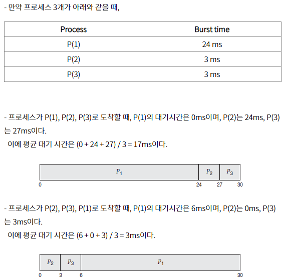
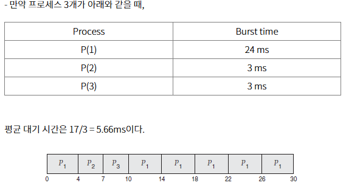

# 📘 1.2 운영체제 기본 개념

# 1.2-4 CPU 스케줄링

## 1. CPU 스케줄링이란?

CPU 스케줄링은 **Ready 상태의 여러 프로세스 중 어떤 프로세스에 CPU를 할당할지 결정하는 작업**이다. CPU는 한 번에 하나의 프로세스만 실행할 수 있으므로, 효율적인 자원 배분을 위해 스케줄링이 필요하다.

### 스케줄링이 일어나는 시점

1. 프로세스가 종료될 때
2. 프로세스가 I/O 등으로 Waiting 상태로 전환될 때
3. 새로운 프로세스가 Ready 상태로 진입할 때
4. 타이머 인터럽트에 의해 시간 할당이 끝날 때 (선점형)

- 1과 2의 경우, 스케줄링이 발생하면 대부분 비선점형이다.
- 3과 4의 경우가 함께있게 되면, 스케줄링이 선점형일 수 있다.

## 2. 선점형 vs 비선점형

| 유형       | 설명                                                          | 예시                      |
| -------- | ----------------------------------------------------------- | ----------------------- |
| **비선점형** | 한 번 CPU를 할당받은 프로세스가 스스로 종료하거나 I/O 요청을 하기 전까지 CPU를 계속 사용     | FCFS, SJF               |
| **선점형**  | 더 높은 우선순위의 프로세스가 Ready 상태로 진입하면 현재 실행 중인 프로세스를 중단하고 CPU를 양도 | RR, Priority(선점형), SRTF |

## 3. 비선점형 방식의 주요 스케줄링 알고리즘

> 프로세스가 스스로 CPU 소유권을 포기하는 방식, 강제로 프로세스를 중지하진 않아서 컨텍스트 스위칭으로 인한 부하가 적다.

### 3.1 선입 선처리 스케줄링, FCFS (First Come First Serve)

* 먼저 도착한 순서대로 CPU를 할당
* 큐 방식
* **단점**: 긴 작업이 앞에 있으면 전체 지연 발생 (Convoy Effect)

- FCFS 방법을 사용했을 때, 평균 대기 시간은 일반적으로 최소가 아님.

### 3.2 최단 작업 우선 스케줄링, SJF (Shortest Job First)

* 실행 시간이 가장 짧은 프로세스에 먼저 CPU 할당
* **장점**: 평균 대기 시간 최소화
* **단점**: 실제로 각 프로세스의 실행 시간을 정확히 예측하기 어려워서 과거의 실행했던 시간을 토대로 추측해 사용
* **예시**: A(8), B(4), C(1) → 실행 순서: C → B → A

---

### 우선순위 스케줄링, PS (Priority Scheduling)
- 기존 SJF 방법의 경우 긴 시간을 가진 프로세스사 실행되지 않는 현상이 발견
- CPU는 가장 높은 우선순위를 가진 프로세스에게 할당됨. 우선순위가 같다면, 프로세스들은 FCFS 순서로 스케줄 됨
    > **❓우선순위**
    >
    > 내부적으로는 시간제한, 메모리 요구 비율 등
    > 외부적으로는 프로세스의 중요성, 비용 등이 있다.

- **선점형이거나 비선점형일 수 있음**
- 낮은 우선순위 프로세스들이 CPU를 무한히 대기해야할 수도 있는데(Starvation), 이 문제를 해결하는 방법은 **Aging**
    - Aging : 오랫동안 시스템에서 대기하는 프로세스들의 우선순위를 점진적으로 높임
- **예시**: A(우선순위 3), B(우선순위 1), C(우선순위 2) → 실행 순서: B → C → A

---

## 4. 선점형 방식의 주요 스케줄링 알고리즘
### 4.1 라운드 로빈 스케줄링, RR (Round Robin)

* 각 프로세스에 일정 시간(Time Quantum)만큼 CPU를 할당하고, 그 시간 안에 끝나지 않으면 다시 준비 큐에 들어가 순환하면서 실행
* **장점**: 응답 시간이 좋고 공정성 보장
* **단점**: Time Quantum이 너무 짧으면 컨텍스트 스위칭 오버헤드 발생, 너무 길면 FCFS 형태.
* **예시**: 로드밸런서에서 트래픽 분산 알고리즘으로도 쓰임

### 4.2 SRF (Shortest Remaining Time First)
- SJF는 중간에 실행 시간이 더 짧은 작업이 추가로 들어와도, 기존 짧은 작업을 모두 수행하고 그 다음 짧은 작업을 이어나감.
- SRF는 중간에 더 짧은 작업이 들어오면, **수행하던 프로세스를 중단하고 해당 프로세스를 수행** 하는 알고리즘

---

### 다단계 큐 스케줄링
- 우선순위에 따른 준비 큐를 **여러 개** 사용함. 각 큐들은 자신의 스케줄링 알고리즘을 가질 수 있음.
- **장점**: 큐 간의 프로세스 이동이 안 되므로 스케줄링 부담이 적음
- **단점**: 유연성이 떨어짐

## 핵심 요약

* CPU 스케줄링은 Ready 상태의 프로세스 중 CPU를 누가 사용할지 결정하는 작업이다
* 선점형은 중간에 프로세스를 중단할 수 있고, 비선점형은 그렇지 않다
* FCFS, SJF, RR, Priority는 각각의 특성과 용도에 맞게 선택해야 한다
* Time Quantum, Starvation, Context Switching 등은 실전 설계에서 중요한 요소다

## 용어 설명

* **Convoy Effect**: 짧은 작업들이 긴 작업 뒤에 묶여 지연되는 현상
* **Time Quantum**: Round Robin에서 프로세스에 주어지는 시간 단위
* **Starvation**: 우선순위가 낮은 작업이 계속 대기하게 되는 문제
* **Aging**: Starvation을 방지하기 위해 대기 시간이 길수록 우선순위를 높이는 기법