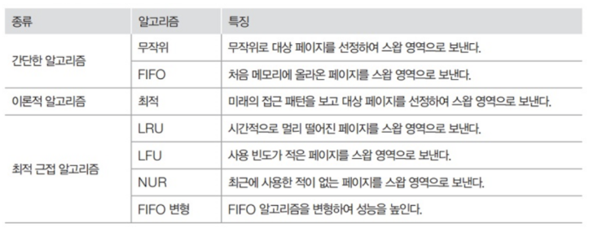
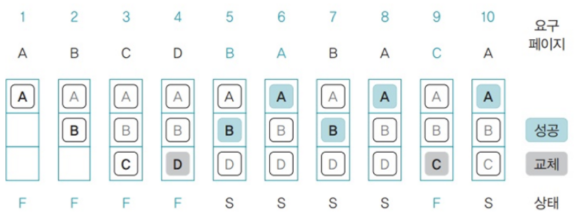
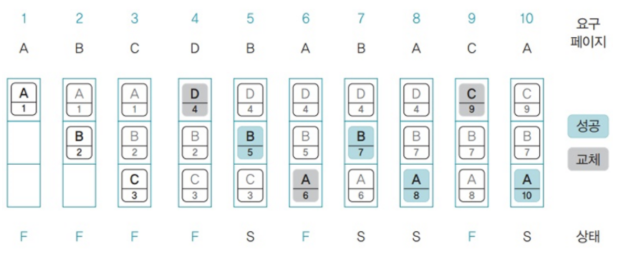
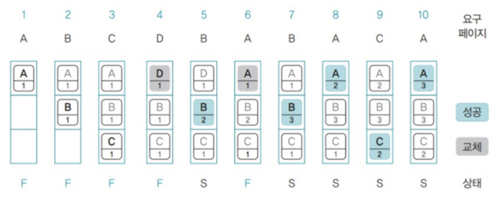
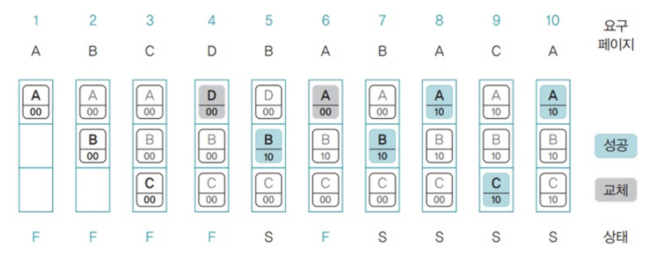

# 📘 1.2 운영체제 기본 개념

# 1.2-5 메모리 관리

## 1. 메모리 관리란?

운영체제는 **여러 프로세스에 메모리를 효율적으로 분배하고 관리**해야 한다. 제한된 메모리 자원을 효율적으로 사용하는 것이 중요하며, 이를 위해 다양한 기법이 사용된다.

## 2. 물리 메모리 vs 가상 메모리

| 구분    | 물리 메모리    | 가상 메모리                       |
| ----- | --------- | ---------------------------- |
| 정의    | 실제 RAM 공간 | 논리적으로 확장된 메모리 공간 (디스크 일부 활용) |
| 접근 방식 | 직접 접근     | 운영체제가 매핑하여 간접 접근             |
| 용도    | 실제 데이터 저장 | 프로세스가 사용하는 논리 주소 공간          |

* **가상 메모리(Virtual Memory)**는 프로세스마다 독립적인 메모리 공간을 제공하며, **물리 메모리보다 더 큰 주소 공간을 사용할 수 있게 한다**.

---

## 3. 가상 메모리
> 메모리 관리 기법의 하나로 컴퓨터가 실제로 이용 가능한 메모리 자원을 추상화하여 이를 사용하는 사용자들에게 매우 큰 메모리로 보이게 만드는 것

- 프로세스 전체가 메모리 내에 적재되지 않아도 실행이 가능하도록 하는 기법
- 모든 데이터를 주 기억장치에 올리지 않고, 필요한 것들만 올려서 사용
- 가상 메모리의 주소와 실제 메모리의 주소는 **일치하지 않음**
    - 가상 메모리의 주소와 실제 메모리 주소를 1:1 대응 시켜야 함.
    - 가상 메모리는 가상 주소와 실제 주소가 매핑되어 있고 프로세스의 주소 정보가 들어있는 `페이지 테이블`로 관리됨.
    - 메모리관리장치(MMU)에 의해 메모리 주소를 가상에서 실제로 변환함.
        > **MMU**
        >
        > 변환참조버퍼(TLB)라는 메모리와 CPU 사이에 있는 주소 변환을 위한 고속 캐시를 사용하여 최근에 변환된 주소 정보를 저장함으로써 성능을 향상시킴

### 요구 페이징
> CPU가 요청할 때, 프로세스의 데이터를 RAM에 올리는 것

**요구 페이징의 작동 원리**
요구 페이징은 페이지 테이블의 유효성 비트(valid bit)를 통해 구현된다.

1. CPU가 특정 페이지에 접근 시도
2. 페이지 테이블의 유효성 비트 확인
3. 유효(1)인 경우: 물리 메모리에서 페이지 접근
4. 무효(0)인 경우: 페이지 폴트 발생

### 페이지 폴트
> 프로세스의 주소 공간에는 존재하지만 지금 컴퓨터의 RAM에는 없는 데이터에 접근 했을 경우 발생

**🚨 페이지폴트 발생 상황**
1. **Lazy Loading**: 프로그램 실행 시 필요한 페이지가 아직 로드되지 않은 경우
2. **Swap Out**: 메모리 부족으로 디스크로 스왑된 페이지에 접근하는 경우
3. **Stack Growth**: 스택 영역 확장이 필요한 경우
4. **권한 위반**: 읽기 전용 페이지에 쓰기 시도하는 경우

**↩️ 페이지 폴트 처리 과정**
1. **페이지 폴트 인터럽트 발생**: 운영 체제가 인터럽트를 처리하고 현재 CPU 상태 저장
2. **페이지 위치 확인**: 보조기억장치에서 해당 페이지 탐색해 물리적 메모리로 로드
3. **메모리 할당 (페이지 로딩)**: 빈 프레임에 페이지 교체 알고리즘 기반으로 페이지 로드 (스와핑)
4. **페이지 테이블 업데이트**: 매핑 정보 갱신
5. **프로세스 재개**: 중단된 명령어부터 실행 재개

## 4. 스와핑
> 메모리에 사용되지 않는 프로세스를 보조기억장치로 내보내고, 실행할 프로세스를 메모리에 적재하는 메모리 관리 기법

- 가상 메모리에는 존재하지만 실제 메모리인 RAM에는 현재 없는 데이터나 코드에 접근할 경우, 메모리를 옮기는데 이를 **스와핑**이라 한다.
- 이를 통해 마치 페이지 폴트가 일어나지 않은 것처럼 만든다.

## 5. 스레싱 (Thrashing)
> 메모리의 페이지 폴트율이 높은 것, 컴퓨터의 심각한 성능 저하를 초래

- 운영체제가 페이지 폴트를 처리하느라 대부분의 시간을 소모하여 실제 작업 처리 시간이 부족해지는 현상

### 주요 원인
- **과도한 멀티태스킹**: 동시 실행 프로세스 수가 너무 많음
- **작업 집합 크기 초과**: 프로세스의 작업 집합이 물리 메모리보다 큼
- **메모리 부족**: 시스템의 물리적 메모리 부족

### 해결 방법
- 메모리 늘리기, SSD 이용하기
- 작업 세트(Working set) 이용: 프로세스 과거 사용 이력인 **지역성**을 통해 결정된 페이지 집합을 만들어서 미리 메모리에 로드
- PFF(Page Fault Frequency) 방법: 페이지 폴트 빈도를 조절하여 상한선과 하한선을 만듦
    - 상한선에 도달한다면 프레임을 늘리고, 하한선에 도달한다면 프레임을 줄임

## 6. 페이지 교체 알고리즘
> 메모리가 부족할 때 어떤 페이지를 제거할 지 결정하는 알고리즘


### 6.1 FIFO (First In First Out)
- 가장 먼저 메모리에 들어온 페이지를 먼저 교체하는 방식
- 큐(queue)로 구현
- **장점**: 구현이 간단하고 공정함
- **단점**: 자주 사용되는 페이지도 오래되면 교체됨

### 6.2 최적(OPT, Optimal) 알고리즘
- 앞으로 가장 오랫동안 사용되지 않을 페이지를 교체하는 이상적인 알고리즘
- **장점**: 이론적으로 최적의 성능
- **단점**: 미래의 페이지 참조 패턴을 알 수 없어 실제 구현 불가능


### 6.3 LRU (Least Recently Used)
- 가장 오랫동안 사용되지 않은 페이지를 교체하는 알고리즘

**가장 오래된 것을 알아내는 구현 방법**
1. 카운터 방식: 각 페이지별 접근 시간 기록
2. 스택 방식: 최근 사용된 페이지를 스택 상단으로 이동
3. 참조 비트 시프트: 일정 크기의 참조 비트를 시프트하여 관리

<br />

- 장점: 시간 지역성 활용으로 좋은 성능
- 단점: 구현 복잡도 높음, 오버헤드 존재


<br />

### 6.4 LFU (Least Frequently Used)
- 참조 횟수가 가장 적은 페이지를 교체하는 알고리즘
- **장점**: 장기적 참조 패턴 고려, FIFO 보다 성능 우수
- **단점**: 최근 로드된 페이지가 즉시 교체될 수 있음, 빈도를 표시해야하는 추가 공간이 필요하므로 그만큼 메모리 낭비 존재



### 6.5 NUR (Not Used Recently)
- 참조 비트와 변경 비트를 사용하여 최근에 사용되지 않은 페이지를 교체

**비트 조합에 따른 우선순위**
1. (0,0): 최근에 참조되지도 변경되지도 않음 (최우선 교체)
2. (0,1): 최근에 참조되지 않았지만 변경됨
3. (1,0): 최근에 참조되었지만 변경되지 않음
4. (1,1): 최근에 참조되고 변경됨 (교체 우선순위 최하)



---

## 7. 메모리 할당 방식

### 7.1 연속 할당 방식

* 메모리를 **연속된 블록**으로 할당
- 프로세스1, 2, 3이 순차적으로 공간에 할당되는 것
- **고정 분할 방식**과 **가변 분할 방식**이 존재.
* 단점: **외부 단편화(External Fragmentation)** 발생 가능

#### 고정 분할

* 메모리를 미리 정해진 크기로 나누어 할당
- 메모리가 미리 나누어져 있어서 융통성이 없음
* 분할 간 **크기 차이로 인한 낭비** 발생 가능 (내부 단편화)

#### 가변 분할

* 요청 크기만큼 메모리를 동적할당
* 사용 후 해제가 반복되면 **외부 단편화** 발생 가능

### 7.2 불연속 할당 방식

* 물리 메모리의 **여러 영역에 나누어 저장 가능** (프로세스가 연속되지 않아도 됨)
* 대표 기법: **페이징, 세그멘테이션**

---

## 1️⃣ 페이징(Paging)

* 메모리를 **고정 크기**의 블록인 페이지(Page)로 나누어 관리
* **프레임(Frame)**: 물리 메모리의 고정 크기 블록
* **페이지(Page)**: 가상 주소 공간의 블록
* 페이지 테이블을 통해 가상 주소 → 물리 주소 매핑

### 특징

* 연속된 공간이 필요 없으므로 **외부 단편화를 줄임**
* 단, 마지막 페이지에 남는 공간으로 인해 **내부 단편화** 발생 가능

### 주소 변환 과정

```
[가상 주소] → [페이지 번호 + 오프셋]
→ 페이지 테이블 참조 → 프레임 번호로 변환 → [물리 주소]
```

## 2️⃣ 세그멘테이션(Segmentation)

* **논리적 단위(세그먼트)** 단위로 메모리를 분할 (예: 코드, 데이터, 스택)
* 각 세그먼트는 크기가 다르고 독립적임
* 세그먼트 테이블을 통해 접근 (세그먼트 번호 + 오프셋)

### 특징

* 프로그래머가 논리 구조대로 메모리 관리 가능
* **외부 단편화** 발생 가능 (가변 크기 세그먼트)
* 내부 단편화는 거의 없음

## 핵심 요약

* 연속 할당은 단순하지만 외부 단편화 문제가 있음
* 페이징은 고정 크기 분할로 **외부 단편화를 줄이고**, 내부 단편화는 일부 발생
* 세그멘테이션은 논리 단위 분할로 유연하지만 외부 단편화 발생 가능
* 가상 메모리를 통해 물리 메모리를 초과하는 주소 공간을 사용할 수 있음

## 용어 설명

* **가상 메모리**: 물리 메모리보다 큰 주소 공간을 제공하는 기법
* **페이지(Page)**: 가상 메모리를 고정 크기로 나눈 블록 (최소 크기 단위)
* **프레임(Frame)**: 물리 메모리를 고정 크기로 나눈 블록 (최소 크기 단위)
* **페이지 테이블**: 가상 주소를 물리 주소로 변환하는 자료구조
* **세그먼트(Segment)**: 코드, 데이터, 스택 등 논리적 단위의 메모리 블록
* **내부 단편화**: 할당된 메모리 블록 내에서 사용되지 않는 공간이 생기는 현상 (메모리 나눈 크기 > 프로그램)
* **외부 단편화**: 전체 메모리 공간은 충분하지만 연속되지 않아 사용할 수 없는 현상 (메모리 나눈 크기 < 프로그램)
