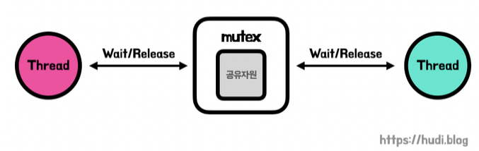
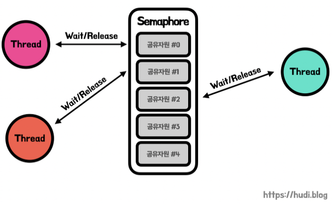
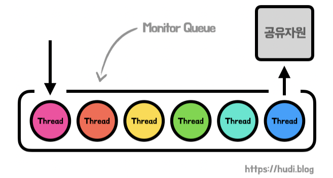

# 📘 1.2 운영체제 기본 개념

# 1.2-9 동기화와 상호배제

## 1. 경쟁 상태(Race Condition)

경쟁 상태는 **둘 이상의 스레드 또는 프로세스가 동시에 같은 자원(공유자원)에 접근**하고, 그 중 **하나 이상이 쓰기 연산을 수행할 때** 발생하는 문제이다. 실행 순서에 따라 결과가 달라질 수 있어 **예측 불가능한 버그**로 이어진다.

### 예시

* 은행 시스템에서 동시에 같은 계좌에 입출금을 할 경우, 순서에 따라 잔액이 다르게 계산될 수 있음

## 2. 임계구역(Critical Section)과 상호배제(Mutual Exclusion)

**임계구역**은 둘 이상의 스레드가 동시에 접근하면 안 되는 공유 자원 접근 코드 영역이다. (동시 접근 시 결과다 달라질 수 있음)

 

**상호배제**는 한 번에 하나의 스레드만 임계구역에 들어가도록 제어하는 개념이다. 이를 통해 경쟁 상태를 방지한다.

### 임계구역 문제 해결 조건

| 조건        | 설명                              |
| --------- | ------------------------------- |
| **상호배제**  | 동시에 둘 이상 진입 불가                  |
| **진행 조건** | 임계구역 진입 여부는 참여 중인 프로세스에 의해서만 결정 |
| **한정 대기** | 특정 프로세스가 무한히 기다리지 않도록 보장        |

## 3. 뮤텍스(Mutex), 세마포어(Semaphore), 모니터
> **임계 영역을 해결하기 위한 방법**
> 방법에 토대가 되는 매커니즘 : lock(잠금)

### 뮤텍스 (Mutual Exclusion Object)

* 이진 상태(wait/release)를 가지며, **한 번에 하나의 스레드만 자원 접근 가능**
* 잠금 획득 → 임계구역 진입 → 작업 종료 후 잠금 해제
* 자원 보호에 적합 (ex. 파일 쓰기, 리스트 수정 등)

### 세마포어 (Semaphore)

* **정수 값 기반의 동기화 도구**, 이는 공유자원에 접근할 수 있는 프로세스 혹은 스레드의 최대 허용치
- 공유 자원에 접근할 시 정수값 하나가 줄고, 자원을 모두 사용하고 임계 구역에서 나오면 다시 정수값 하나를 늘림
    - 각각 `wait()` (또는 P 함수), `signal()` (또는 V 함수)
    * `P()` 연산: 값 감소, 자원 요청
    * `V()` 연산: 값 증가, 자원 반환
- 정수 크기에 따라 두 가지의 세마포어 방식이 존재
    * **카운팅 세마포어**: 동시에 여러 개까지 접근 허용 (ex. DB 커넥션 풀)
    * **바이너리 세마포어**: 0 또는 1의 값을 가지며 뮤텍스와 유사

### 모니터 (Monitor)
- 둘 이상의 스레드나 프로세스가 공유 자원에 안전하게 접근할 수 있도록 공유 자원을 숨기고 해당 접근에 대해 인터페이스만 제공
- 모니터 큐에 프로세스/스레드 작업을 순차적으로 쌓아두고 한 번에 하나만 임계 영역에 접근할 수 있도록 함

 

---

## 4. 데드락(Deadlock, 교착상태)

> **여러 프로세스가 서로 자원을 점유한 채 상대방의 자원을 기다리며 무한 대기**하는 상태

### 데드락 발생 조건 (Coffman 조건)

| 조건         | 설명                        |
| ---------- | ------------------------- |
| **상호배제**   | 자원을 한 번에 한 프로세스만 사용할 수 있음 |
| **점유와 대기** | 특정 프로세스가 점유한 자원을 다른 프로세스가 요청하는 상태   |
| **비선점**    | 자원을 강제로 빼앗을 수 없음          |
| **순환 대기**  | 프로세스 간 원형 대기 형태 존재, 서로가 서로의 자원을 요구하는 상황   |

### 해결 방법

* **예방**: 네 가지 조건 중 하나라도 애초에 성립하지 않게 설계
* **회피**: 자원 요청 시 데드락 가능성을 평가해 결정 (ex. 은행가 알고리즘)
    > 🏦 은행원 알고리즘
    >
    > 총 자원의 양과 현재 할당한 자원의 양을 기준으로 안정 또는 불안정 상태로 나누고 안정 상태로 가도록 자원을 할당하는 알고리즘
* **발견**: 주기적으로 자원 그래프를 점검해 데드락 상태 탐지
* **복구**: 데드락 상태 프로세스를 종료하거나 자원을 회수함

## 핵심 요약

* 경쟁 상태는 동시에 공유 자원 접근 시 발생하는 예측 불가능한 문제이다.
* 임계구역은 공유 자원을 다루는 코드 블록이며, 상호배제를 통해 하나씩 접근하도록 제어해야 한다.
* 뮤텍스는 1개 스레드만 자원에 접근하게 하며, 세마포어는 여러 접근을 제어할 수 있다.
* 데드락은 자원을 기다리며 무한 대기하는 상태로, 이를 방지하거나 회피해야 한다.

## 용어 설명

* **경쟁 상태 (Race Condition)**: 여러 스레드가 동시에 자원에 접근해 실행 순서에 따라 결과가 달라지는 문제
* **임계구역 (Critical Section)**: 동시에 접근하면 문제가 발생하는 공유 자원 영역
* **상호배제 (Mutual Exclusion)**: 임계구역에 하나의 스레드만 접근하도록 보장
* **뮤텍스 (Mutex)**: 상호배제를 위해 사용하는 이진 잠금 장치
* **세마포어 (Semaphore)**: 정수값으로 접근을 제어하는 동기화 기법
* **데드락 (Deadlock)**: 서로 자원을 점유한 채 상대방 자원을 기다려 발생하는 교착 상태
* **은행가 알고리즘 (Banker’s Algorithm)**: 시스템이 안전 상태일 때만 자원 할당을 허용하는 회피 기법
