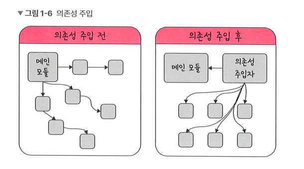

# 싱글톤 패턴

## 1. 디자인패턴
> 프로그램을 설계할 때 발생했던 문제점들을 객체 간의 상호 관계 등을
이용하여 해결할 수 있도록 하나의 규약 형태로 만들어 놓은 것

- 종류 :
  - 생성 패턴 : 싱클톤 패턴, 팩토리 패턴, 추상 패턴, 빌더 패턴, 프로토타입 패턴 등
  - 구조 패턴 : 어댑터 패턴, 브릿지 패턴, 프록시 패턴 등
  - 행위 패턴 : 옵저버 패턴, 전략 패턴, 이터레이터 페턴 등

## 1.1 싱글톤 패턴(Singleton pattern)

### 1.1.1 개념 정리

- 정의 : 하나의 클래스에 **오직 하나**의 인스턴스만 가지는 패턴
- 사용 : 주로 데이터베이스 연결 모듈에 사용 
<br>

### 1.1.2 장점과 단점

- 장점 : 하나의 인스턴스를 다른 모듈들이 공유하기 때문에 인스턴스 생성 비용 절감
- 단점 : 의존성이 높음
<br>

### 1.1.3 자바스크립트의 싱글톤 패턴
> 리터럴{} 또는 new Object로 객체를 생성하게 되면 다른 어떤 객체와도 같지 않기 때문에 이 자체만으로 싱클톤 패턴을 구현 가능

#### 📌 예시(javaScript) 
```
class Singleton {
    constructor() {
        if (!Singleton.instance) {
            Singleton.instance = this
        }
        return Singleton.instance
    }
    getInstance() {
        return this 
    }
}
const a = new Singleton()
const b = new Singleton() 
console.log(a === b) // true 
```
- Singleton.instance라는 하나의 인스턴스를 가지는 Singleton 클래스를 구현
- a,b 는 하나의 인스턴스를 가짐

#### 📌 데이터베이스 연결 모듈 (javaScript)
```javaScript
// DB 연결을 하는 것이기 때문에 비용이 더 높은 작업 
const URL = 'mongodb://localhost:27017/kundolapp' 
const createConnection = url => ({"url" : url})    
class DB {
    constructor(url) {
        if (!DB.instance) { 
            DB.instance = createConnection(url)
        }
        return DB.instance
    }
    connect() {
        return this.instance
    }
}
const a = new DB(URL)
const b = new DB(URL) 
console.log(a === b) // true
```
- B.instance 라는 하나의 인스턴스를 기반으로 a, b 를 생성

<br>

### 1.1.4 JAVA의 싱글톤 패턴

#### 📌 예시(JAVA) 
```Java
class Singleton {
    private static class singleInstanceHolder {
        private static final Singleton INSTANCE = new Singleton();
    }
    public static Singleton getInstance() {
        return singleInstanceHolder.INSTANCE;
    }
}

public class HelloWorld{ 
     public static void main(String []args){ 
        Singleton a = Singleton.getInstance(); 
        Singleton b = Singleton.getInstance(); 
        System.out.println(a.hashCode());
        System.out.println(b.hashCode());  
        if (a == b){
         System.out.println(true); 
        } 
     }
}
/*
705927765
705927765
true

1. 클래스안에 클래스(Holder), static이며 중첩된 클래스인 singleInstanceHolder를 
기반으로 객체를 선언했기 때문에 한 번만 로드되므로 싱글톤 클래스의 인스턴스는 애플리케이션 당 하나만 존재하며 
클래스가 두 번 로드되지 않기 때문에 두 스레드가 동일한 JVM에서 2개의 인스턴스를 생성할 수 없습니다. 
그렇기 때문에 동기화, 즉 synchronized를 신경쓰지 않아도 됩니다. 
2. final 키워드를 통해서 read only 즉, 다시 값이 할당되지 않도록 했습니다.
3. 중첩클래스 Holder로 만들었기 때문에 싱글톤 클래스가 로드될 때 클래스가 메모리에 로드되지 않고 
어떠한 모듈에서 getInstance()메서드가 호출할 때 싱글톤 객체를 최초로 생성 및 리턴하게 됩니다. 
*/
```

### 1.1.5 C++의 싱글톤 패턴

#### 📌 예시(C++) 

### 1.1.4 mongoose의 싱글톤 패턴
- 실제로 싱글톤 패턴은 Node.js 에서 MongoDB 데이터베이스를 연결할 때 쓰는 mongoose 모듈에서 볼 수 있음

#### 📌 예시(mongoose의 connect() 구현) 
javascript
```javascript
Mongoose.prototype.connect = function(uri, options, callback) {
	const _mongoose = this instanceof Mongoose ? this : mongoose;
    const conn = _mongoose.connection;
    
    return _mongoose._promiseOrCallback(callback, cb => {
    	conn.openUri(uri, options, err => {
        	if(err != null) {
            	return cb(err);
            }
            return cb(null, _mongoose);
        })
    })
}
```
- mongoose 의 데이터베이스를 연결할 때 쓰는 connect() 라는 함수는 싱글톤 인스턴스를 반환

#### 📌 예시(mySQL) 
```
// 메인 모듈
const mysql  = require('mysql');
const pool = mysql.createPool({
	connectionLimit: 10,
    host: 'example.org',
    user: 'kundol',
    password: 'secret',
    database: '히빈쓰디비'
});
pool.connect();

// 모듈 A
pool.query(query, function (error, results, fields) {
	if(error) throw error;
    console.log('solution is : ', results[0].solution);
});

// 모듈 B
pool.query(query, function (error, results, fields) {
	if(error) throw error;
    console.log('solution is : ', results[0].solution);
});
```
- Node.js에서 MySQL 데이터베이스를 연결
- 메인 모듈에서 데이터베이스 연결에 관한 인스턴스를 정의하고 다른 모듈인 A 또는 B에서 해당 인스턴스 기반으로 쿼리를 보내는 형식

### 1.1.5 싱글톤 패턴의 단점
- TDD(Test Driven Development)와 충돌 :
  - 단위 테스트는 독립적이어야 하고, 순서에 상관없이 실행가능해야 함
  - 싱글톤은 하나의 인스턴스만 생성하므로 테스트마다 새로운 인스턴스를 만들기 어려움 
  - 결과적으로 테스트 간의 의존성이 생기고 오류가 발생하기 때문에 TDD 관점에서는 테스트하기 어려운 패턴

- 의존성 주입 :
  - 싱글톤은 편리하지만 모듈간의 **결합도가 높음**
  - 그러나 의존성 주의(DI, Dependency Injection)을 통해 결합도를 낮추는 구조로 개선 가능
    
    - 메인 모듈이 **직접** 의존성을 주기보다 중간에 의존성 주입자(dependency injector)가 **간접**적으로 의존성 주입 → 의존성 저하

#### 🔗 의존성 주입의 장점과 단점, 원칙
- 장점 : 
  - 모듈들을 쉽게 교체할 수 있어 테스팅과 마이그레이션이 용이함
  - 추상화 레이어를 사용해 의존성 방향이 일관되고, 애플리케이션 구조가 명확해짐
  - 모듈 간 관계가 명확해지고 유지보수가 쉬워짐

- 단점 :
  - 모듈이 분리되면서 클래스 수가 늘어나 복잡성이 증가할 수 있음
  - 런타임에서 약간의 성능 저하가 발생할 수 있음 

- 원칙 : 
  - 상위 모듈은 하위 모듈의 구체 구현을 알면 안 됨
  - 양쪽 모두 추상화(인터페이스/추상 클래스 등)에 의존해야 함
  - 추상화는 세부 구현에 의존하면 안 됨


--- 
### 부연설명
- [Java로 구현하는 싱글톤 패턴 7가지 방법](https://www.youtube.com/watch?v=3rfbnQYOCFA)
