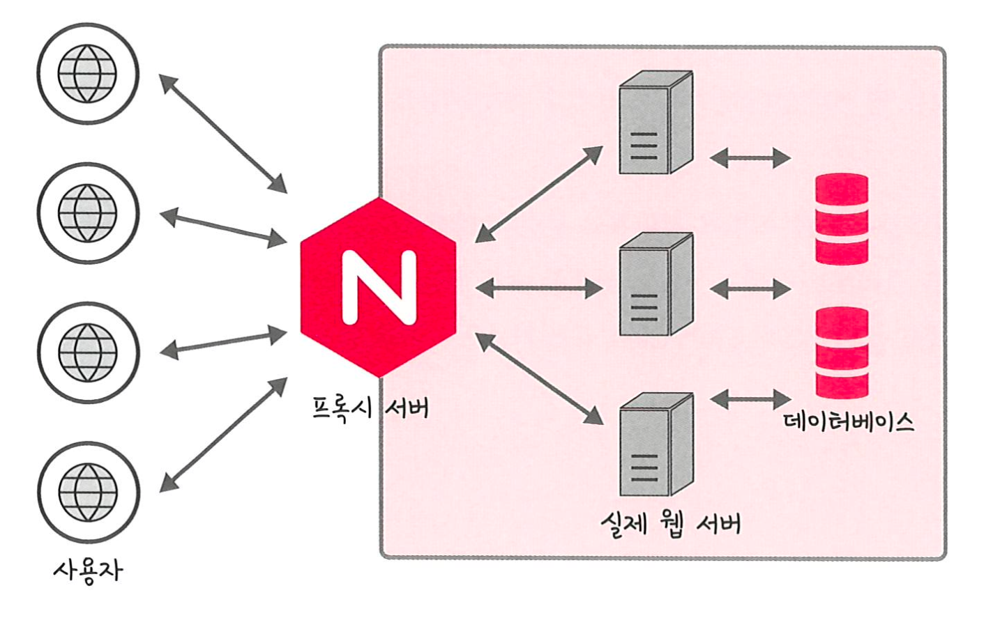
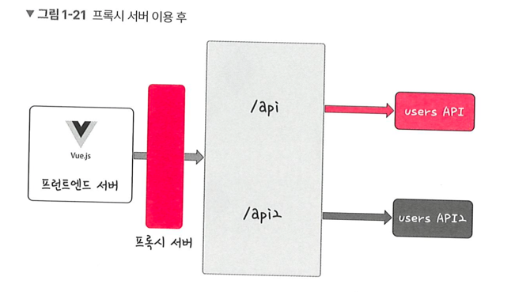

# 프록시 패턴과 프록시 서버

## 1. 프록시 객체(proxy)

### 1.1 개념 정리

- 정의 : 어떠한 대상의 기본적인 동작(속성 접근, 할당, 순회, 열거, 함수 호출 등)의 작업을 가로챌 수 있는 객체

## 2. 프록시 패턴(proxy pattern)

### 2.1 개념 정리

- 정의 : 대상 객체(subject)에 접근하기 전 그 접근에 대한 흐름을 가로채 해당 접근을 필터링하거나 수정하는 등의 **역할을 하는 계층이 있는 디자인 패턴**
- 활용 : 객체의 속성, 변환 등을 보완하며 보안, 데이터 검증, 캐싱, 로깅에 사용

## 3. 프록시 서버(proxy server)

### 3.1 개념 정리

- 정의 : 서버와 클라이언트 사이에서 클라이언트가 자신을 통해 다른 네트워크 서비스에 간접적으로 접속할 수 있게 해주는 컴퓨터 시스템 혹은 응용 프로그램

### 3.2 프록시 서버로 쓰는 nginx

#### 3.2.1 nginx 개념 정리

- 정의 : 비동기 이벤트 기반의 구조와 다수의 연결을 효과적으로 처리 가능한 웹서버 
- 활용 : **주로 Node.js 서버 앞단의 프록시 서버로 활용**

#### 3.2.2 장점

- 장점 
  - **보안 강화** : 익명의 사용자가 직접 서버에 접근하는 것을 차단
  - 정적 자원 Gzip 압축 : HTML, CSS, JS 같은 정적 파일을 gzip으로 압축하면 용량이 줄어듦 → 전송 속도 향상
  - 프록시 서버에 로깅 가능 : 장애 추적, 보안 분석, 트래픽 모니터링에 유용 
  

 

### 3.3 프록시 서버로 쓰는 CloudFlare

#### 3.3.1 CloudFlare 개념 정리

- 정의 : 전 세계적으로 분산된 서버가 있고 이를 통해 어떠한 시스템의 콘텐츠 전달을 빠르게 할 수 있는 CDN 서비스
- 활용 :
  - 서버 앞단에 프록시 서버로 두어 DDOS 공격 방어나 HTTPS 구축에 활용
  - 해외에서 의심스러운 트래픽 발생 시, CloudFlare에서 먼저 판단 후 CAPTCHA 등을 기반으로 일정 부분을 막아주는 역할을 수행
  
#### 3.3.2 CloudFlare 장점

- 장점
  - DDOS 공격 방어 :
    - 의심스러운 트래픽, 특히 사용자가 접속하는 것이 아닌 시스템을 통해 오는 트래픽을 자동으로 차단
    - 거대한 네트워크 용량과 캐싱 전략으로 소규모 DDOS 공격은 쉽게 차단
  - HTTPS 구축 : 
    - 일반적으로 서버에서 HTTPS 구축 시 인증서를 기반으로 구축
    - BUT, CloudFlare 사용 시 별도의 인증서 없이 구축 가능

 

### 3.4 CORS 와 프런트엔드의 프록시 서버

### 3.4.1 CORS(Cross-Origin Resource Sharing) 는의 개념

- 정의 :
  - 브라우저에서 다른 오리진(origin)의 리소스 요청을 **제한**하는 HTTP 헤더 기반 보안 정책
  - 오리진이 다르면 기본적으로 브라우저는 요청을 차단함

#### 3.4.2 CORS 에러 발생 예시

- 프론트엔드 테스트 서버: `http://127.0.0.1:3000`  
- 백엔드 API 서버: `http://127.0.0.1:12010`  
➡ 포트 번호가 다르므로 오리진이 다름 → **CORS 에러 발생**

#### 3.4.3 프록시 서버를 통한 해결
- 프론트엔드 서버 앞단에 프록시 서버를 놓아 api 요청은 users API, /api2 요청은 users ADI2 에 요청할

---
### 부연 설명
- [CORS](https://www.youtube.com/watch?v=j2Q2Ev6CZzQ)
---
### 용어
- 프록시 서버에서의 캐싱 : 캐시 안에 정보를 담아두고, 캐시 안에 있는 정보를 요구하는 요청에 대해 멀리 있는 원격 서버에 요청하지 않고 캐시 안에 있는 데이터를 활용하는 것을 말함
- 버퍼 오버플로우 : 버퍼는 데이터가 저장되는 메모리 공간이며, 메모리 공간을 벗어나는 경우를 뜻함
- gzip 압축 : LZ77 과 Huffman 코딩의 조합인 DEFLATE 알고리즘을 기반으로 한 압축 기술, 압축 해제시 오버헤드 고려
- DDOS 공격 : 짧은 기간 동안 네트워크에 많은 요청을 보내 네트워크를 마비시켜 웹 사이트의 가용성을 방해하는 사이버 공격 유형
- CDN(Content Delievery Network) : 각 사용자가 인터넷에 접속하는 곳과 가까운 곳에서 캐싱 또는 배포하는 서버 네트워크를 말함
- 오리진 : 프로토콜과 호스트 이름, 포트의 조합 (예) `https://kundo.com:12010/test` 라는 주소에서 오리진은 `https://kundol.com:12010`을 뜻한다.
- 127.0.0.1 :  루프백 (oopback) IP 로 , 본인 PC 서버의 IP 를 뜻함