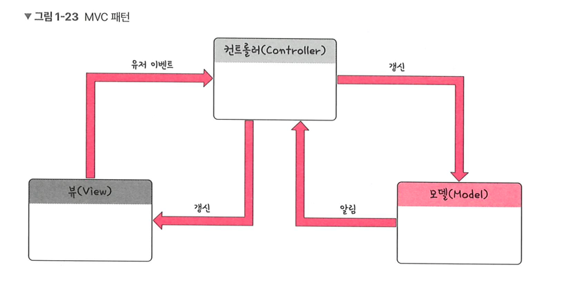

# MVC 패턴

## 1. 개념 정리

- 정의 : 모델(Model), 뷰(View), 컨트롤러(Controller)로 이루어진 디자인 패턴


## 2. MVC 패턴의 장점

- 장점 : 재사용성과 확작성 용이
- 단점 : 애플리케이션이 복잡해질수록 모델과 뷰의 관계과 복잡

## 3. 모델(model)

### 3.1 개념 정리

- 정의 : 애플리케이션의 데이터인 **데이터 자체 또는 구조**(데이터베이스, 상수, 변수 등)을 뜻함
- 특징 : 뷰에서 데이터를 생성하거나 수정하면 컨트롤러를 통해 모델을 생성 또는 갱신
- 예시 : 
  - 사용자 정보 : 아래 정보들을 저장하고 관리하는 구조가 바로 User 모델
  ```
  {
  "name": "홍길동",
  "email": "hong@gmail.com",
  "age": 25,
  "profileImage": "https://example.com/photo.jpg"
  }
  ```

## 4. 뷰(View)

### 4.1 개념 정리

- 정의 : 모델 기반 사용자가 볼 수 있는 화면을 뜻함(inputbox, checkbox, textarea 등 사용자 인터페이스 요소를 나타냄)
- 특징 : 
  - 모델이 가지고 있는 정보를 따로 저장하지 않음
  - 단순히 사각형 형태 등의 화면에 표시하는 정보만 가지고 있어야 함
  - 변경이 일어나면 이를 컨트롤러에 전달


## 5. 컨트롤러(controller)

### 5.1 개념 정리

- 정의 : 하나 이상의 모델과 하나 이상의 뷰를 잇는 다리 역할(이벤트, 메인 로직을 담당)
- 특징 : 
  - 모델과 뷰의 생명주기 관리
  - 모델과 뷰의 변경 통지를 받으면 이를 해석해 각각의 구성 요소에 해당 내용 전달

## 6. MVC 패턴의 예시

### 6.1 Spring
- Spring은 자바 플랫폼 기반 오픈 소스 애플리케이션 프레임워크임 
- 대표적으로 MVC(Model-View-Controller) 패턴을 사용함

#### 6.1.1 특징

- Spring의 Web MVC는 웹 서비스 구축을 위한 다양한 기능 제공함  
  - @RequestParam, @RequestHeader, @Pach Variable 등의 애너테이션을 기반으로 사용자의 요청 값들을 쉽게 분석 가능

---
### 부연 설명
- [Spring 과 MVC 패턴](https://www.youtube.com/watch?v=6ty3GBhqTDM)