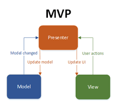

# 📘 디자인 패턴

# MVP 패턴 (Model-View-Presenter Pattern)

## 1. 정의

MVP 패턴은 **사용자 인터페이스와 비즈니스 로직을 분리하기 위한 아키텍처 패턴**이다. MVC 패턴에서 발전된 형태로, **View와 Model 간의 직접적인 의존성을 제거**하고 Presenter가 모든 중재 역할을 담당한다.

View는 단순히 화면 표시만 담당하고, 모든 비즈니스 로직과 View 제어는 Presenter가 처리함으로써 **느슨한 결합과 높은 테스트 가능성**을 실현한다.

> 참고: 이 패턴은 GoF의 23개 디자인 패턴에는 포함되지 않으며, GUI 애플리케이션 개발에서 발전된 아키텍처 패턴입니다.

### 언제 사용하면 좋은가?

**개발 관련 예시로 이해하기:**
- **안드로이드 앱 개발**: Activity/Fragment는 View, Presenter가 비즈니스 로직 처리
- **웹 프론트엔드**: React/Vue 컴포넌트는 View, 별도 Presenter 클래스가 상태 관리
- **데스크톱 애플리케이션**: WinForms/WPF에서 코드비하인드 대신 Presenter 사용
- **게임 UI 시스템**: 게임 화면은 View, 게임 로직 처리는 Presenter

**이런 상황에서 MVP Pattern을 사용하면 좋습니다:**
- **View와 Model의 결합도를 낮추고** 싶을 때
- **단위 테스트가 중요한** 프로젝트에서 (View 없이 Presenter 테스트 가능)
- **복잡한 UI 로직**이 있어 비즈니스 로직과 분리하고 싶을 때
- **여러 View가 같은 로직을 공유**해야 할 때
- **View 기술이 자주 바뀔 가능성**이 있을 때

## 2. 구조도



> * `Model`: 데이터와 비즈니스 로직을 담당하는 계층
> * `View`: 사용자 인터페이스를 담당하며, 사용자 입력을 Presenter에 전달
> * `Presenter`: View와 Model 사이의 중재자 역할, 모든 로직을 처리

## 3. 예시

### 예: 사용자 로그인 시스템

```java
// Model - 데이터와 비즈니스 로직
class UserModel {
    private DatabaseService dbService;
    
    public UserModel(DatabaseService dbService) {
        this.dbService = dbService;
    }
    
    public User login(String username, String password) {
        // 실제 인증 로직
        if (username == null || password == null) {
            return null;
        }
        return dbService.authenticate(username, password);
    }
    
    public boolean isValidEmail(String email) {
        return email != null && email.contains("@");
    }
}

// View 인터페이스 - 테스트 가능하게 인터페이스로 정의
interface LoginView {
    String getUsername();
    String getPassword();
    void showWelcomeMessage(String username);
    void showErrorMessage(String message);
    void showLoading(boolean isLoading);
    void clearFields();
}

// Presenter - 모든 로직을 처리
class LoginPresenter {
    private LoginView view;
    private UserModel model;
    
    public LoginPresenter(LoginView view, UserModel model) {
        this.view = view;
        this.model = model;
    }
    
    public void onLoginClicked() {
        String username = view.getUsername();
        String password = view.getPassword();
        
        // 입력 검증
        if (username == null || username.trim().isEmpty()) {
            view.showErrorMessage("사용자명을 입력해주세요.");
            return;
        }
        
        if (password == null || password.trim().isEmpty()) {
            view.showErrorMessage("비밀번호를 입력해주세요.");
            return;
        }
        
        // 로그인 처리
        view.showLoading(true);
        
        User user = model.login(username, password);
        
        view.showLoading(false);
        
        if (user != null) {
            view.showWelcomeMessage("환영합니다, " + user.getName() + "님!");
            view.clearFields();
        } else {
            view.showErrorMessage("로그인에 실패했습니다. 다시 시도해주세요.");
        }
    }
    
    public void onEmailValidation() {
        String email = view.getUsername();
        if (!model.isValidEmail(email)) {
            view.showErrorMessage("올바른 이메일 형식이 아닙니다.");
        }
    }
}

// View 구현체 (Android Activity 예시)
class LoginActivity extends AppCompatActivity implements LoginView {
    private EditText usernameField;
    private EditText passwordField;
    private Button loginButton;
    private ProgressBar loadingBar;
    private LoginPresenter presenter;
    
    @Override
    protected void onCreate(Bundle savedInstanceState) {
        super.onCreate(savedInstanceState);
        setContentView(R.layout.activity_login);
        
        initViews();
        
        // Presenter 초기화
        UserModel model = new UserModel(new DatabaseService());
        presenter = new LoginPresenter(this, model);
        
        // 이벤트 리스너 설정
        loginButton.setOnClickListener(v -> presenter.onLoginClicked());
    }
    
    private void initViews() {
        usernameField = findViewById(R.id.username);
        passwordField = findViewById(R.id.password);
        loginButton = findViewById(R.id.login_button);
        loadingBar = findViewById(R.id.loading);
    }
    
    @Override
    public String getUsername() {
        return usernameField.getText().toString();
    }
    
    @Override
    public String getPassword() {
        return passwordField.getText().toString();
    }
    
    @Override
    public void showWelcomeMessage(String username) {
        Toast.makeText(this, username, Toast.LENGTH_SHORT).show();
    }
    
    @Override
    public void showErrorMessage(String message) {
        Toast.makeText(this, message, Toast.LENGTH_SHORT).show();
    }
    
    @Override
    public void showLoading(boolean isLoading) {
        loadingBar.setVisibility(isLoading ? View.VISIBLE : View.GONE);
        loginButton.setEnabled(!isLoading);
    }
    
    @Override
    public void clearFields() {
        usernameField.setText("");
        passwordField.setText("");
    }
}
```

### 예: 할 일 목록 관리 앱

```typescript
// Model
interface Task {
  id: number;
  title: string;
  completed: boolean;
  createdAt: Date;
}

class TaskModel {
  private tasks: Task[] = [];
  private nextId = 1;
  
  addTask(title: string): Task {
    const task: Task = {
      id: this.nextId++,
      title,
      completed: false,
      createdAt: new Date()
    };
    this.tasks.push(task);
    return task;
  }
  
  toggleTask(id: number): boolean {
    const task = this.tasks.find(t => t.id === id);
    if (task) {
      task.completed = !task.completed;
      return true;
    }
    return false;
  }
  
  deleteTask(id: number): boolean {
    const index = this.tasks.findIndex(t => t.id === id);
    if (index !== -1) {
      this.tasks.splice(index, 1);
      return true;
    }
    return false;
  }
  
  getTasks(): Task[] {
    return [...this.tasks];
  }
  
  getCompletedCount(): number {
    return this.tasks.filter(t => t.completed).length;
  }
}

// View 인터페이스
interface TaskView {
  getNewTaskTitle(): string;
  clearNewTaskInput(): void;
  displayTasks(tasks: Task[]): void;
  showTaskCount(total: number, completed: number): void;
  showErrorMessage(message: string): void;
  showSuccessMessage(message: string): void;
}

// Presenter
class TaskPresenter {
  private view: TaskView;
  private model: TaskModel;
  
  constructor(view: TaskView, model: TaskModel) {
    this.view = view;
    this.model = model;
    this.updateView();
  }
  
  onAddTaskClicked(): void {
    const title = this.view.getNewTaskTitle().trim();
    
    if (!title) {
      this.view.showErrorMessage("할 일 제목을 입력해주세요.");
      return;
    }
    
    if (title.length > 100) {
      this.view.showErrorMessage("제목은 100자 이내로 입력해주세요.");
      return;
    }
    
    const task = this.model.addTask(title);
    this.view.clearNewTaskInput();
    this.view.showSuccessMessage(`"${task.title}" 할 일이 추가되었습니다.`);
    this.updateView();
  }
  
  onTaskToggled(taskId: number): void {
    const success = this.model.toggleTask(taskId);
    if (success) {
      this.updateView();
    } else {
      this.view.showErrorMessage("할 일을 찾을 수 없습니다.");
    }
  }
  
  onTaskDeleted(taskId: number): void {
    const success = this.model.deleteTask(taskId);
    if (success) {
      this.view.showSuccessMessage("할 일이 삭제되었습니다.");
      this.updateView();
    } else {
      this.view.showErrorMessage("할 일을 찾을 수 없습니다.");
    }
  }
  
  private updateView(): void {
    const tasks = this.model.getTasks();
    const completedCount = this.model.getCompletedCount();
    
    this.view.displayTasks(tasks);
    this.view.showTaskCount(tasks.length, completedCount);
  }
}

// View 구현체 (React 컴포넌트 예시)
class TaskComponent extends React.Component implements TaskView {
  private presenter: TaskPresenter;
  private model: TaskModel;
  
  constructor(props: any) {
    super(props);
    this.state = {
      tasks: [],
      newTaskTitle: '',
      totalCount: 0,
      completedCount: 0,
      message: ''
    };
    
    this.model = new TaskModel();
    this.presenter = new TaskPresenter(this, this.model);
  }
  
  getNewTaskTitle(): string {
    return this.state.newTaskTitle;
  }
  
  clearNewTaskInput(): void {
    this.setState({ newTaskTitle: '' });
  }
  
  displayTasks(tasks: Task[]): void {
    this.setState({ tasks });
  }
  
  showTaskCount(total: number, completed: number): void {
    this.setState({ totalCount: total, completedCount: completed });
  }
  
  showErrorMessage(message: string): void {
    this.setState({ message });
  }
  
  showSuccessMessage(message: string): void {
    this.setState({ message });
  }
  
  render() {
    return (
      <div>
        <h1>할 일 목록</h1>
        <div>
          총 {this.state.totalCount}개 중 {this.state.completedCount}개 완료
        </div>
        
        <input 
          value={this.state.newTaskTitle}
          onChange={(e) => this.setState({ newTaskTitle: e.target.value })}
          placeholder="새 할 일 입력"
        />
        <button onClick={() => this.presenter.onAddTaskClicked()}>
          추가
        </button>
        
        <ul>
          {this.state.tasks.map(task => (
            <li key={task.id}>
              <input 
                type="checkbox" 
                checked={task.completed}
                onChange={() => this.presenter.onTaskToggled(task.id)}
              />
              <span className={task.completed ? 'completed' : ''}>
                {task.title}
              </span>
              <button onClick={() => this.presenter.onTaskDeleted(task.id)}>
                삭제
              </button>
            </li>
          ))}
        </ul>
        
        {this.state.message && <div>{this.state.message}</div>}
      </div>
    );
  }
}
```

### 예: 온라인 쇼핑 장바구니

```csharp
// Model
public class Product
{
    public int Id { get; set; }
    public string Name { get; set; }
    public decimal Price { get; set; }
    public int Stock { get; set; }
}

public class CartItem
{
    public Product Product { get; set; }
    public int Quantity { get; set; }
    public decimal Subtotal => Product.Price * Quantity;
}

public class ShoppingCartModel
{
    private List<CartItem> items = new List<CartItem>();
    private IProductService productService;
    
    public ShoppingCartModel(IProductService productService)
    {
        this.productService = productService;
    }
    
    public bool AddProduct(int productId, int quantity)
    {
        var product = productService.GetProduct(productId);
        if (product == null || product.Stock < quantity)
        {
            return false;
        }
        
        var existingItem = items.FirstOrDefault(i => i.Product.Id == productId);
        if (existingItem != null)
        {
            if (existingItem.Quantity + quantity > product.Stock)
            {
                return false;
            }
            existingItem.Quantity += quantity;
        }
        else
        {
            items.Add(new CartItem { Product = product, Quantity = quantity });
        }
        
        return true;
    }
    
    public bool RemoveProduct(int productId)
    {
        var item = items.FirstOrDefault(i => i.Product.Id == productId);
        if (item != null)
        {
            items.Remove(item);
            return true;
        }
        return false;
    }
    
    public decimal GetTotalPrice()
    {
        return items.Sum(i => i.Subtotal);
    }
    
    public List<CartItem> GetItems()
    {
        return new List<CartItem>(items);
    }
    
    public int GetTotalItemCount()
    {
        return items.Sum(i => i.Quantity);
    }
}

// View 인터페이스
public interface IShoppingCartView
{
    void DisplayCartItems(List<CartItem> items);
    void ShowTotalPrice(decimal total);
    void ShowItemCount(int count);
    void ShowErrorMessage(string message);
    void ShowSuccessMessage(string message);
    void ClearProductSelection();
}

// Presenter
public class ShoppingCartPresenter
{
    private IShoppingCartView view;
    private ShoppingCartModel model;
    
    public ShoppingCartPresenter(IShoppingCartView view, ShoppingCartModel model)
    {
        this.view = view;
        this.model = model;
        UpdateView();
    }
    
    public void AddProductToCart(int productId, int quantity)
    {
        if (quantity <= 0)
        {
            view.ShowErrorMessage("수량은 1개 이상이어야 합니다.");
            return;
        }
        
        bool success = model.AddProduct(productId, quantity);
        
        if (success)
        {
            view.ShowSuccessMessage($"{quantity}개 상품이 장바구니에 추가되었습니다.");
            view.ClearProductSelection();
            UpdateView();
        }
        else
        {
            view.ShowErrorMessage("재고가 부족하거나 상품을 찾을 수 없습니다.");
        }
    }
    
    public void RemoveProductFromCart(int productId)
    {
        bool success = model.RemoveProduct(productId);
        
        if (success)
        {
            view.ShowSuccessMessage("상품이 장바구니에서 제거되었습니다.");
            UpdateView();
        }
        else
        {
            view.ShowErrorMessage("상품을 찾을 수 없습니다.");
        }
    }
    
    public void OnCheckoutClicked()
    {
        var items = model.GetItems();
        if (!items.Any())
        {
            view.ShowErrorMessage("장바구니에 상품이 없습니다.");
            return;
        }
        
        decimal total = model.GetTotalPrice();
        view.ShowSuccessMessage($"총 {total:C} 결제를 진행합니다.");
    }
    
    private void UpdateView()
    {
        var items = model.GetItems();
        var total = model.GetTotalPrice();
        var itemCount = model.GetTotalItemCount();
        
        view.DisplayCartItems(items);
        view.ShowTotalPrice(total);
        view.ShowItemCount(itemCount);
    }
}
```

## 4. 다양한 구현 방식

### Passive View (수동적 뷰)

```java
// View가 완전히 수동적, Presenter가 모든 것을 제어
interface PassiveView {
    void setUsername(String username);
    void setPassword(String password);
    void setLoginButtonEnabled(boolean enabled);
}

class PassivePresenter {
    void onUsernameChanged(String username) {
        view.setLoginButtonEnabled(isFormValid());
    }
}
```

### Supervising Controller (감독 컨트롤러)

```java
// View가 일부 간단한 로직은 직접 처리
interface SupervisingView {
    void bindUserData(User user); // View가 직접 데이터 바인딩
    String getUsername();
    String getPassword();
}

class SupervisingPresenter {
    void onLoginSuccess(User user) {
        view.bindUserData(user); // 복잡한 바인딩은 View에 위임
    }
}
```

### 비동기 처리 방식

```typescript
class AsyncPresenter {
    async onLoginClicked(): Promise<void> {
        this.view.showLoading(true);
        
        try {
            const user = await this.model.loginAsync(username, password);
            this.view.showWelcomeMessage(user.name);
        } catch (error) {
            this.view.showErrorMessage("로그인 실패");
        } finally {
            this.view.showLoading(false);
        }
    }
}
```

## 5. 장단점

| 장점 | 설명 |
|------|------|
| 높은 테스트 가능성 | View 인터페이스를 Mock으로 대체하여 Presenter 단독 테스트 가능 |
| 관심사 분리 | UI 로직과 비즈니스 로직이 명확히 분리됨 |
| 재사용성 | 같은 Presenter를 다른 View와 함께 사용 가능 |
| 느슨한 결합 | View와 Model이 직접 의존하지 않음 |

| 단점 | 설명 |
|------|------|
| 복잡성 증가 | 간단한 화면에도 많은 인터페이스와 클래스 필요 |
| 코드량 증가 | View 인터페이스와 구현체를 모두 작성해야 함 |
| Presenter 비대화 | 복잡한 UI에서는 Presenter가 과도하게 커질 수 있음 |
| 러닝 커브 | 개발자들이 패턴을 이해하고 적용하는데 시간 필요 |

## 6. 활용 예시

* Android 애플리케이션 개발 (Clean Architecture)
* ASP.NET Web Forms 애플리케이션
* WinForms/WPF 데스크톱 애플리케이션
* Unity 게임 엔진의 UI 시스템
* React/Vue.js 컴포넌트 아키텍처

## MVP Pattern을 사용하지 말아야 할 경우

* 매우 간단한 정적 화면이나 단순 표시용 View
* 프로토타입이나 일회성 프로젝트
* 팀원들이 패턴에 익숙하지 않고 학습 시간이 부족한 경우
* View와 Model의 관계가 매우 단순하고 변경 가능성이 낮은 경우

> 예: 단순한 About 페이지나 고정된 설정 화면 같은 경우에는 MVP 패턴이 오버엔지니어링일 수 있음

## 유사 패턴과 비교

### MVC Pattern (Model-View-Controller)
전통적인 웹 애플리케이션에서 주로 사용되는 패턴으로, **Controller가 요청을 처리하고 적절한 View를 선택**합니다.

**차이점**: MVC에서는 View가 Model을 직접 참조할 수 있지만, MVP에서는 Presenter가 모든 중재를 담당

### MVVM Pattern (Model-View-ViewModel)
데이터 바인딩을 지원하는 플랫폼에서 사용되며, **ViewModel이 View의 상태를 관리**합니다.

**차이점**: MVVM은 양방향 데이터 바인딩 기반, MVP는 명시적인 메서드 호출 기반

| 항목 | MVP Pattern | MVC Pattern | MVVM Pattern |
|------|-------------|-------------|--------------|
| View-Model 관계 | Presenter가 완전 중재 | View가 Model 직접 접근 가능 | ViewModel과 양방향 바인딩 |
| 테스트 용이성 | 매우 높음 | 중간 | 높음 |
| 복잡성 | 높음 | 중간 | 중간 |
| 적합한 플랫폼 | 모바일, 데스크톱 | 웹 애플리케이션 | WPF, Angular, Vue |

> 핵심 차이: MVP는 "완전한 분리"를 추구, MVC는 "역할 분담"을 추구, MVVM은 "자동 동기화"를 추구

## 핵심 요약

* MVP 패턴은 **View와 Model 사이의 모든 통신을 Presenter가 중재**하는 아키텍처 패턴이다.
* View는 단순히 **UI 표시와 사용자 입력 수집**만 담당한다.
* Presenter는 **모든 비즈니스 로직과 View 제어**를 담당한다.
* **높은 테스트 가능성과 관심사 분리**가 주요 장점이다.

## 용어 설명

* **MVP (Model-View-Presenter)**: 사용자 인터페이스 개발을 위한 아키텍처 패턴
* **Model**: 애플리케이션의 데이터와 비즈니스 로직을 담당하는 계층
* **View**: 사용자 인터페이스를 담당하며 사용자 입력을 받고 결과를 표시
* **Presenter**: View와 Model 사이의 중재자로 모든 로직을 처리
* **Passive View**: View가 완전히 수동적이며 Presenter가 모든 것을 제어하는 방식
* **Supervising Controller**: View가 간단한 로직은 직접 처리하고 복잡한 것만 Presenter가 담당하는 방식
* **관심사 분리 (Separation of Concerns)**: 각 구성 요소가 명확하게 정의된 책임만을 가지는 설계 원칙
* **테스트 가능성 (Testability)**: 단위 테스트를 작성하기 쉬운 정도
* **느슨한 결합 (Loose Coupling)**: 구성 요소 간의 의존성을 최소화하는 설계 방식