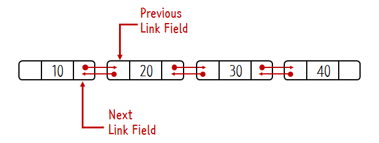

# 선형 자료 구조

# 2. 연결 리스트 (Linked List)

> 데이터를 감싼 노드를 포인터로 연결해서 공간적인 효율성을 극대화시킨 자료 구조.

## 1️⃣ 단일 연결 리스트 (Singly Linked List)


### 개념

- 각 노드가 **데이터**와 **다음 노드를 가리키는 포인터** 하나만 가지는 연결 리스트
- 한 방향으로만 순회 가능 (head → tail)
    - head : 맨 앞에 있는 노드
- 가장 기본적이고 단순한 연결 리스트 형태

### 특징

- **단방향 순회**: head에서 시작해서 tail까지만 이동 가능
- **메모리 효율성**: 포인터 하나만 저장하므로 메모리 사용량이 적음
- **역방향 접근 불가**: 이전 노드로 돌아가려면 처음부터 다시 순회해야 함
- **삽입/삭제 용이**: 특정 위치에 노드를 삽입하거나 삭제할 때, 해당 위치의 앞뒤 노드만 연결을 변경하면 되므로 배열에 비해 연산이 효율적.
- 위치를 알고 있을 때 삽입/삭제가 O(1), 임의 위치 접근이 O(n)

### 구현 참고
<details>
<summary> c++ 단일 연결 리스트 </summary>
<div markdown="1">

```cpp
#include <iostream>

// Node 구조체 정의: 데이터와 다음 노드를 가리키는 포인터
struct Node {
    int data;       // 노드가 저장하는 값
    Node* next;     // 다음 노드를 가리키는 포인터

    // 생성자: Node를 만들 때 data를 초기화, next는 nullptr로 설정
    Node(int val) : data(val), next(nullptr) {}
};

// LinkedList 클래스 정의
class LinkedList {
private:
    Node* head; // 첫 번째 노드를 가리키는 포인터

public:
    // 생성자: 처음에는 head를 nullptr로 초기화
    LinkedList() : head(nullptr) {}

    // 소멸자: 동적 할당된 모든 노드를 해제
    ~LinkedList() {
        Node* current = head;
        while (current != nullptr) {
            Node* temp = current; // 현재 노드를 temp에 저장
            current = current->next; // 다음 노드로 이동
            delete temp; // 현재 노드 삭제
        }
    }

    // 맨 앞에 노드 삽입
    void insertFront(int val) {
        Node* newNode = new Node(val); // 새 노드 생성
        newNode->next = head; // 새 노드의 next를 현재 head로 연결
        head = newNode; // head를 새 노드로 변경
    }

    // 맨 뒤에 노드 삽입
    void insertBack(int val) {
        Node* newNode = new Node(val); // 새 노드 생성
        if (head == nullptr) { // 리스트가 비어있으면
            head = newNode; // head를 새 노드로 설정
            return;
        }
        Node* current = head; // 리스트의 처음부터 시작
        while (current->next != nullptr) { // 마지막 노드까지 이동
            current = current->next;
        }
        current->next = newNode; // 마지막 노드의 next를 새 노드로 연결
    }

    // 특정 값을 가진 첫 번째 노드 삭제
    void deleteValue(int val) {
        if (head == nullptr) return; // 리스트가 비어있으면 종료

        // head 노드가 삭제할 값이라면
        if (head->data == val) {
            Node* temp = head; // 현재 head를 temp에 저장
            head = head->next; // head를 다음 노드로 이동
            delete temp; // 이전 head 삭제
            return;
        }

        Node* current = head;
        // 삭제할 값을 찾을 때까지 이동 (current->next를 확인해야 하므로)
        while (current->next != nullptr && current->next->data != val) {
            current = current->next;
        }

        // 삭제할 값을 찾았다면
        if (current->next != nullptr) {
            Node* temp = current->next; // 삭제할 노드 저장
            current->next = current->next->next; // 삭제할 노드를 건너뛰어 연결
            delete temp; // 삭제
        }
    }

    // 리스트에서 특정 값이 있는지 조회
    bool search(int val) {
        Node* current = head; // 처음부터 시작
        while (current != nullptr) {
            if (current->data == val) return true; // 찾으면 true
            current = current->next; // 다음 노드로 이동
        }
        return false; // 끝까지 가도 없으면 false
    }

    // head(첫 번째 노드) 값 조회
    int getFront() {
        if (head == nullptr) throw std::runtime_error("List is empty");
        return head->data;
    }

    // tail(마지막 노드) 값 조회
    int getBack() {
        if (head == nullptr) throw std::runtime_error("List is empty");
        Node* current = head;
        while (current->next != nullptr) {
            current = current->next;
        }
        return current->data;
    }

    // 전체 리스트 출력
    void printList() {
        Node* current = head; // 처음부터 시작
        while (current != nullptr) {
            std::cout << current->data << " -> "; // 현재 노드 값 출력
            current = current->next; // 다음 노드로 이동
        }
        std::cout << "NULL" << std::endl; // 리스트 끝 표시
    }
};

// main 함수: 사용 예시
int main() {
    LinkedList list;

    list.insertBack(10); // 10 삽입
    list.insertFront(5); // 5를 맨 앞에 삽입
    list.insertBack(20); // 20 삽입
    list.insertBack(30); // 30 삽입
    list.printList(); // 리스트 출력: 5 -> 10 -> 20 -> 30 -> NULL

    std::cout << "Head: " << list.getFront() << std::endl; // 5
    std::cout << "Tail: " << list.getBack() << std::endl;  // 30

    list.deleteValue(20); // 값이 20인 노드 삭제
    list.printList(); // 5 -> 10 -> 30 -> NULL

    std::cout << "Search 10: " << (list.search(10) ? "Found" : "Not Found") << std::endl; // Found
    std::cout << "Search 100: " << (list.search(100) ? "Found" : "Not Found") << std::endl; // Not Found

    return 0;
}

```

</div>
</details>


<details>
<summary> java 단일 연결 리스트 </summary>
<div markdown="1">

```java
class ListNode {
    int data;
    ListNode next;

    public ListNode(int data) {
        this.data = data;
        this.next = null;
    }
}

class SinglyLinkedList {
    private ListNode head;
    private int size;

    public SinglyLinkedList() {
        this.head = null;
        this.size = 0;
    }

    // 맨 앞에 삽입
    public void insertFirst(int data) {
        ListNode newNode = new ListNode(data);
        newNode.next = head;
        head = newNode;
        size++;
    }

    // 맨 뒤에 삽입
    public void insertLast(int data) {
        ListNode newNode = new ListNode(data);
        if (head == null) {
            head = newNode;
        } else {
            ListNode current = head;
            while (current.next != null) {
                current = current.next;
            }
            current.next = newNode;
        }
        size++;
    }

    // 특정 위치에 삽입
    public void insertAt(int index, int data) {
        if (index < 0 || index > size) {
            throw new IndexOutOfBoundsException("Index out of bounds");
        }

        if (index == 0) {
            insertFirst(data);
            return;
        }

        ListNode newNode = new ListNode(data);
        ListNode current = head;
        for (int i = 0; i < index - 1; i++) {
            current = current.next;
        }
        newNode.next = current.next;
        current.next = newNode;
        size++;
    }

    // 값으로 삭제
    public boolean delete(int data) {
        if (head == null) return false;

        if (head.data == data) {
            head = head.next;
            size--;
            return true;
        }

        ListNode current = head;
        while (current.next != null && current.next.data != data) {
            current = current.next;
        }

        if (current.next != null) {
            current.next = current.next.next;
            size--;
            return true;
        }
        return false;
    }

    // 인덱스로 삭제
    public boolean deleteAt(int index) {
        if (index < 0 || index >= size) {
            return false;
        }

        if (index == 0) {
            head = head.next;
            size--;
            return true;
        }

        ListNode current = head;
        for (int i = 0; i < index - 1; i++) {
            current = current.next;
        }
        current.next = current.next.next;
        size--;
        return true;
    }

    // 탐색
    public ListNode search(int data) {
        ListNode current = head;
        while (current != null) {
            if (current.data == data) {
                return current;
            }
            current = current.next;
        }
        return null;
    }

    // 특정 인덱스의 값 반환
    public int get(int index) {
        if (index < 0 || index >= size) {
            throw new IndexOutOfBoundsException("Index out of bounds");
        }

        ListNode current = head;
        for (int i = 0; i < index; i++) {
            current = current.next;
        }
        return current.data;
    }

    // 크기 반환
    public int size() {
        return size;
    }

    // 비어있는지 확인
    public boolean isEmpty() {
        return head == null;
    }

    // 출력
    public void display() {
        ListNode current = head;
        while (current != null) {
            System.out.print(current.data + " -> ");
            current = current.next;
        }
        System.out.println("null");
    }
}
```

</div>
</details>

## 2️⃣ 이중 연결 리스트 (Doubly Linked List)



### 개념

- 각 노드가 **데이터**, **다음 노드 포인터(next)**, **이전 노드 포인터(prev)** 를 가지는 연결 리스트
- 양방향 순회 가능 (head ↔ tail)
- 더 유연한 탐색과 조작이 가능

### 특징

- **양방향 순회**: 앞뒤로 자유롭게 이동 가능해서 역순 정렬이나 역방향 작업에 유리
- **효율적인 삭제**: 특정 노드 삭제 시 이전 노드 탐색 불필요
- **head와 tail 포인터**: 양쪽 끝에서의 삽입/삭제가 효율적
- **메모리 증가**: 추가 메모리 필요 (prev 포인터)
- 양쪽 끝에서의 삽입/삭제가 O(1)

### 구현 참고
<details>
<summary> c++ 이중 연결 리스트 </summary>
<div markdown="1">

```cpp
#include <iostream>

// Node 구조체 정의: 데이터와 이전, 다음 노드를 가리키는 포인터
struct Node {
    int data;       // 노드가 저장하는 값
    Node* prev;     // 이전 노드를 가리키는 포인터
    Node* next;     // 다음 노드를 가리키는 포인터

    // 생성자: data를 초기화하고 prev, next는 nullptr로 설정
    Node(int val) : data(val), prev(nullptr), next(nullptr) {}
};

// DoublyLinkedList 클래스 정의
class DoublyLinkedList {
private:
    Node* head; // 첫 번째 노드를 가리키는 포인터
    Node* tail; // 마지막 노드를 가리키는 포인터

public:
    // 생성자: head, tail을 nullptr로 초기화
    DoublyLinkedList() : head(nullptr), tail(nullptr) {}

    // 소멸자: 동적 할당된 모든 노드를 해제
    ~DoublyLinkedList() {
        Node* current = head;
        while (current != nullptr) {
            Node* temp = current; // 현재 노드를 temp에 저장
            current = current->next; // 다음 노드로 이동
            delete temp; // 현재 노드 삭제
        }
    }

    // 맨 앞에 노드 삽입
    void insertFront(int val) {
        Node* newNode = new Node(val); // 새 노드 생성
        newNode->next = head; // 새 노드의 next를 현재 head로 연결
        if (head != nullptr)
            head->prev = newNode; // 기존 head의 prev를 새 노드로 연결
        else
            tail = newNode; // 리스트가 비어있다면 tail도 새 노드로 설정
        head = newNode; // head를 새 노드로 변경
    }

    // 맨 뒤에 노드 삽입
    void insertBack(int val) {
        Node* newNode = new Node(val); // 새 노드 생성
        newNode->prev = tail; // 새 노드의 prev를 현재 tail로 연결
        if (tail != nullptr)
            tail->next = newNode; // 기존 tail의 next를 새 노드로 연결
        else
            head = newNode; // 리스트가 비어있다면 head도 새 노드로 설정
        tail = newNode; // tail을 새 노드로 변경
    }

    // 특정 값을 가진 첫 번째 노드 삭제
    void deleteValue(int val) {
        Node* current = head; // 처음부터 시작
        while (current != nullptr && current->data != val) {
            current = current->next; // 삭제할 값을 찾을 때까지 이동
        }

        if (current == nullptr) return; // 값이 없으면 종료

        if (current->prev != nullptr)
            current->prev->next = current->next; // 이전 노드의 next를 현재의 next로 연결
        else
            head = current->next; // current가 head라면 head를 다음 노드로 이동

        if (current->next != nullptr)
            current->next->prev = current->prev; // 다음 노드의 prev를 현재의 prev로 연결
        else
            tail = current->prev; // current가 tail이라면 tail을 이전 노드로 이동

        delete current; // 현재 노드 삭제
    }

    // 리스트에서 특정 값이 있는지 조회
    bool search(int val) {
        Node* current = head; // 처음부터 시작
        while (current != nullptr) {
            if (current->data == val) return true; // 찾으면 true
            current = current->next; // 다음 노드로 이동
        }
        return false; // 끝까지 가도 없으면 false
    }

    // head(첫 번째 노드) 값 조회
    int getFront() {
        if (head == nullptr) throw std::runtime_error("List is empty");
        return head->data;
    }

    // tail(마지막 노드) 값 조회
    int getBack() {
        if (tail == nullptr) throw std::runtime_error("List is empty");
        return tail->data;
    }

    // 전체 리스트 정방향 출력
    void printForward() {
        Node* current = head; // 처음부터 시작
        while (current != nullptr) {
            std::cout << current->data << " <-> "; // 현재 노드 값 출력
            current = current->next; // 다음 노드로 이동
        }
        std::cout << "NULL" << std::endl; // 리스트 끝 표시
    }

    // 전체 리스트 역방향 출력
    void printBackward() {
        Node* current = tail; // 끝에서 시작
        while (current != nullptr) {
            std::cout << current->data << " <-> "; // 현재 노드 값 출력
            current = current->prev; // 이전 노드로 이동
        }
        std::cout << "NULL" << std::endl; // 리스트 시작 표시
    }
};

// main 함수: 사용 예시
int main() {
    DoublyLinkedList list;

    list.insertBack(10); // 10 삽입
    list.insertFront(5); // 5를 맨 앞에 삽입
    list.insertBack(20); // 20 삽입
    list.insertBack(30); // 30 삽입

    std::cout << "정방향 출력: ";
    list.printForward(); // 5 <-> 10 <-> 20 <-> 30 <-> NULL

    std::cout << "역방향 출력: ";
    list.printBackward(); // 30 <-> 20 <-> 10 <-> 5 <-> NULL

    std::cout << "Head: " << list.getFront() << std::endl; // 5
    std::cout << "Tail: " << list.getBack() << std::endl;  // 30

    list.deleteValue(20); // 값이 20인 노드 삭제

    std::cout << "삭제 후 정방향 출력: ";
    list.printForward(); // 5 <-> 10 <-> 30 <-> NULL

    std::cout << "Search 10: " << (list.search(10) ? "Found" : "Not Found") << std::endl; // Found
    std::cout << "Search 100: " << (list.search(100) ? "Found" : "Not Found") << std::endl; // Not Found

    return 0;
}
```

</div>
</details>


<details>
<summary> java 이중 연결 리스트 </summary>
<div markdown="1">

```java
class DoublyListNode {
    int data;
    DoublyListNode next;
    DoublyListNode prev;

    public DoublyListNode(int data) {
        this.data = data;
        this.next = null;
        this.prev = null;
    }
}

class DoublyLinkedList {
    private DoublyListNode head;
    private DoublyListNode tail;
    private int size;

    public DoublyLinkedList() {
        this.head = null;
        this.tail = null;
        this.size = 0;
    }

    // 맨 앞에 삽입
    public void insertFirst(int data) {
        DoublyListNode newNode = new DoublyListNode(data);

        if (head == null) {
            head = tail = newNode;
        } else {
            newNode.next = head;
            head.prev = newNode;
            head = newNode;
        }
        size++;
    }

    // 맨 뒤에 삽입
    public void insertLast(int data) {
        DoublyListNode newNode = new DoublyListNode(data);

        if (head == null) {
            head = tail = newNode;
        } else {
            tail.next = newNode;
            newNode.prev = tail;
            tail = newNode;
        }
        size++;
    }

    // 특정 위치에 삽입
    public void insertAt(int index, int data) {
        if (index < 0 || index > size) {
            throw new IndexOutOfBoundsException("Index out of bounds");
        }

        if (index == 0) {
            insertFirst(data);
            return;
        }
        if (index == size) {
            insertLast(data);
            return;
        }

        DoublyListNode newNode = new DoublyListNode(data);
        DoublyListNode current = getNodeAt(index);

        newNode.next = current;
        newNode.prev = current.prev;
        current.prev.next = newNode;
        current.prev = newNode;
        size++;
    }

    // 값으로 삭제
    public boolean delete(int data) {
        DoublyListNode current = head;

        while (current != null) {
            if (current.data == data) {
                deleteNode(current);
                return true;
            }
            current = current.next;
        }
        return false;
    }

    // 인덱스로 삭제
    public boolean deleteAt(int index) {
        if (index < 0 || index >= size) {
            return false;
        }

        DoublyListNode nodeToDelete = getNodeAt(index);
        deleteNode(nodeToDelete);
        return true;
    }

    // 특정 노드 삭제 (내부 메서드)
    private void deleteNode(DoublyListNode node) {
        if (node.prev != null) {
            node.prev.next = node.next;
        } else {
            head = node.next;
        }

        if (node.next != null) {
            node.next.prev = node.prev;
        } else {
            tail = node.prev;
        }

        // 메모리 누수 방지
        node.prev = null;
        node.next = null;
        size--;
    }

    // 특정 인덱스의 노드 반환 (내부 메서드)
    private DoublyListNode getNodeAt(int index) {
        if (index < 0 || index >= size) {
            throw new IndexOutOfBoundsException("Index out of bounds");
        }

        DoublyListNode current;

        // 중간점을 기준으로 앞/뒤에서 탐색 시작 (최적화)
        if (index < size / 2) {
            current = head;
            for (int i = 0; i < index; i++) {
                current = current.next;
            }
        } else {
            current = tail;
            for (int i = size - 1; i > index; i--) {
                current = current.prev;
            }
        }
        return current;
    }

    // 특정 인덱스의 값 반환
    public int get(int index) {
        return getNodeAt(index).data;
    }

    // 탐색
    public DoublyListNode search(int data) {
        DoublyListNode current = head;
        while (current != null) {
            if (current.data == data) {
                return current;
            }
            current = current.next;
        }
        return null;
    }

    // 크기 반환
    public int size() {
        return size;
    }

    // 비어있는지 확인
    public boolean isEmpty() {
        return head == null;
    }

    // 정방향 출력
    public void displayForward() {
        DoublyListNode current = head;
        while (current != null) {
            System.out.print(current.data + " <-> ");
            current = current.next;
        }
        System.out.println("null");
    }

    // 역방향 출력
    public void displayBackward() {
        DoublyListNode current = tail;
        while (current != null) {
            System.out.print(current.data + " <-> ");
            current = current.prev;
        }
        System.out.println("null");
    }
}
```

</div>
</details>


## 3️⃣ 원형 연결 리스트 (Circular Linked List)


#### 개념

- 마지막 노드가 첫 번째 노드를 가리켜서 **원형 구조**를 만드는 연결 리스트
- 끝이 없는 순환 구조
- 단일 원형과 이중 원형 두 가지 형태 존재

#### 특징

- **순환 구조**: 마지막 노드의 next가 head를 가리킴
- **끝이 없음**: 계속해서 순회 가능
- **시작점이 임의적**: 어느 노드에서든 시작 가능

### 장단점

**장점:**

- 모든 노드에서 모든 다른 노드 접근 가능
- 라운드 로빈 스케줄링에 적합
- 큐와 스택을 하나의 구조로 구현 가능
- NULL 포인터 처리 불필요

**단점:**

- 무한 루프 위험 (종료 조건 관리 중요)
- 구현이 복잡
- 디버깅이 어려움
- 메모리 누수 위험 (순환 참조)


### 구현 참고
<details>
<summary> c++ 원형 이중 연결 리스트 </summary>
<div markdown="1">

```cpp
#include <iostream>

// Node 구조체 정의: 데이터와 이전, 다음 노드를 가리키는 포인터
struct Node {
    int data;       // 노드가 저장하는 값
    Node* prev;     // 이전 노드를 가리키는 포인터
    Node* next;     // 다음 노드를 가리키는 포인터

    // 생성자: data를 초기화, prev와 next는 nullptr로 설정
    Node(int val) : data(val), prev(nullptr), next(nullptr) {}
};

// CircularDoublyLinkedList 클래스 정의
class CircularDoublyLinkedList {
private:
    Node* head; // 리스트의 시작 노드를 가리키는 포인터

public:
    // 생성자: head를 nullptr로 초기화
    CircularDoublyLinkedList() : head(nullptr) {}

    // 소멸자: 동적 할당된 모든 노드를 해제
    ~CircularDoublyLinkedList() {
        if (head == nullptr) return; // 리스트가 비어있으면 종료

        Node* current = head;
        do {
            Node* temp = current;
            current = current->next;
            delete temp;
        } while (current != head); // 다시 head로 돌아올 때까지 반복
    }

    // 리스트가 비어있는지 확인
    bool isEmpty() {
        return head == nullptr;
    }

    // 맨 앞에 노드 삽입
    void insertFront(int val) {
        Node* newNode = new Node(val); // 새 노드 생성

        if (head == nullptr) {
            // 리스트가 비어있으면 새 노드가 자기 자신을 가리킴
            newNode->next = newNode;
            newNode->prev = newNode;
            head = newNode; // head를 새 노드로 설정
            return;
        }

        Node* tail = head->prev; // tail은 head의 prev

        newNode->next = head; // 새 노드의 next를 현재 head로
        newNode->prev = tail; // 새 노드의 prev를 tail로

        tail->next = newNode; // tail의 next를 새 노드로
        head->prev = newNode; // head의 prev를 새 노드로

        head = newNode; // head를 새 노드로 변경
    }

    // 맨 뒤에 노드 삽입
    void insertBack(int val) {
        Node* newNode = new Node(val); // 새 노드 생성

        if (head == nullptr) {
            // 리스트가 비어있으면 새 노드가 자기 자신을 가리킴
            newNode->next = newNode;
            newNode->prev = newNode;
            head = newNode; // head를 새 노드로 설정
            return;
        }

        Node* tail = head->prev; // tail은 head의 prev

        newNode->next = head; // 새 노드의 next를 head로
        newNode->prev = tail; // 새 노드의 prev를 tail로

        tail->next = newNode; // tail의 next를 새 노드로
        head->prev = newNode; // head의 prev를 새 노드로
    }

    // 특정 값을 가진 첫 번째 노드 삭제
    void deleteValue(int val) {
        if (head == nullptr) return; // 리스트가 비어있으면 종료

        Node* current = head;
        do {
            if (current->data == val) {
                if (current->next == current) {
                    // 리스트에 노드가 하나뿐이면 삭제 후 비움
                    delete current;
                    head = nullptr;
                    return;
                }

                Node* prevNode = current->prev;
                Node* nextNode = current->next;

                prevNode->next = nextNode;
                nextNode->prev = prevNode;

                if (current == head)
                    head = nextNode; // head가 삭제된다면 head를 다음 노드로

                delete current;
                return;
            }
            current = current->next;
        } while (current != head);
    }

    // 리스트에서 특정 값이 있는지 조회
    bool search(int val) {
        if (head == nullptr) return false;

        Node* current = head;
        do {
            if (current->data == val)
                return true;
            current = current->next;
        } while (current != head);

        return false;
    }

    // head(첫 번째 노드) 값 조회
    int getFront() {
        if (head == nullptr) throw std::runtime_error("List is empty");
        return head->data;
    }

    // tail(마지막 노드) 값 조회
    int getBack() {
        if (head == nullptr) throw std::runtime_error("List is empty");
        return head->prev->data; // tail은 head->prev
    }

    // 전체 리스트 정방향 출력
    void printForward() {
        if (head == nullptr) {
            std::cout << "List is empty" << std::endl;
            return;
        }

        Node* current = head;
        do {
            std::cout << current->data << " <-> ";
            current = current->next;
        } while (current != head);
        std::cout << "(head)" << std::endl; // head로 돌아옴 표시
    }

    // 전체 리스트 역방향 출력
    void printBackward() {
        if (head == nullptr) {
            std::cout << "List is empty" << std::endl;
            return;
        }

        Node* current = head->prev; // tail부터 시작
        Node* tail = current;
        do {
            std::cout << current->data << " <-> ";
            current = current->prev;
        } while (current != tail);
        std::cout << "(tail)" << std::endl; // tail로 돌아옴 표시
    }
};

// main 함수: 사용 예시
int main() {
    CircularDoublyLinkedList list;

    list.insertBack(10); // 10 삽입
    list.insertFront(5); // 5를 맨 앞에 삽입
    list.insertBack(20); // 20 삽입
    list.insertBack(30); // 30 삽입

    std::cout << "정방향 출력: ";
    list.printForward(); // 5 <-> 10 <-> 20 <-> 30 <-> (head)

    std::cout << "역방향 출력: ";
    list.printBackward(); // 30 <-> 20 <-> 10 <-> 5 <-> (tail)

    std::cout << "Head: " << list.getFront() << std::endl; // 5
    std::cout << "Tail: " << list.getBack() << std::endl;  // 30

    list.deleteValue(20); // 값이 20인 노드 삭제

    std::cout << "삭제 후 정방향 출력: ";
    list.printForward(); // 5 <-> 10 <-> 30 <-> (head)

    std::cout << "Search 10: " << (list.search(10) ? "Found" : "Not Found") << std::endl; // Found
    std::cout << "Search 100: " << (list.search(100) ? "Found" : "Not Found") << std::endl; // Not Found

    return 0;
}
```

</div>
</details>


<details>
<summary> java 단일 원형 연결 리스트 </summary>
<div markdown="1">

```java
class CircularLinkedList {
    private ListNode head;
    private int size;

    public CircularLinkedList() {
        this.head = null;
        this.size = 0;
    }

    // 맨 앞에 삽입
    public void insertFirst(int data) {
        ListNode newNode = new ListNode(data);

        if (head == null) {
            head = newNode;
            newNode.next = head; // 자기 자신을 가리킴
        } else {
            // 마지막 노드를 찾아서 연결 업데이트
            ListNode last = getLastNode();
            newNode.next = head;
            last.next = newNode;
            head = newNode;
        }
        size++;
    }

    // 맨 뒤에 삽입
    public void insertLast(int data) {
        ListNode newNode = new ListNode(data);

        if (head == null) {
            head = newNode;
            newNode.next = head;
        } else {
            ListNode last = getLastNode();
            last.next = newNode;
            newNode.next = head;
        }
        size++;
    }

    // 특정 위치에 삽입
    public void insertAt(int index, int data) {
        if (index < 0 || index > size) {
            throw new IndexOutOfBoundsException("Index out of bounds");
        }

        if (index == 0) {
            insertFirst(data);
            return;
        }

        ListNode newNode = new ListNode(data);
        ListNode current = head;

        for (int i = 0; i < index - 1; i++) {
            current = current.next;
        }

        newNode.next = current.next;
        current.next = newNode;
        size++;
    }

    // 값으로 삭제
    public boolean delete(int data) {
        if (head == null) return false;

        // 노드가 하나뿐인 경우
        if (size == 1 && head.data == data) {
            head = null;
            size--;
            return true;
        }

        // head 노드를 삭제하는 경우
        if (head.data == data) {
            ListNode last = getLastNode();
            head = head.next;
            last.next = head;
            size--;
            return true;
        }

        // 다른 노드를 삭제하는 경우
        ListNode current = head;
        do {
            if (current.next.data == data) {
                current.next = current.next.next;
                size--;
                return true;
            }
            current = current.next;
        } while (current != head);

        return false;
    }

    // 인덱스로 삭제
    public boolean deleteAt(int index) {
        if (index < 0 || index >= size) {
            return false;
        }

        if (index == 0) {
            if (size == 1) {
                head = null;
            } else {
                ListNode last = getLastNode();
                head = head.next;
                last.next = head;
            }
            size--;
            return true;
        }

        ListNode current = head;
        for (int i = 0; i < index - 1; i++) {
            current = current.next;
        }
        current.next = current.next.next;
        size--;
        return true;
    }

    // 탐색
    public ListNode search(int data) {
        if (head == null) return null;

        ListNode current = head;
        do {
            if (current.data == data) {
                return current;
            }
            current = current.next;
        } while (current != head);

        return null;
    }

    // 특정 인덱스의 값 반환
    public int get(int index) {
        if (index < 0 || index >= size) {
            throw new IndexOutOfBoundsException("Index out of bounds");
        }

        ListNode current = head;
        for (int i = 0; i < index; i++) {
            current = current.next;
        }
        return current.data;
    }

    // 마지막 노드 반환 (내부 메서드)
    private ListNode getLastNode() {
        if (head == null) return null;

        ListNode current = head;
        while (current.next != head) {
            current = current.next;
        }
        return current;
    }

    // 크기 반환
    public int size() {
        return size;
    }

    // 비어있는지 확인
    public boolean isEmpty() {
        return head == null;
    }

    // 출력 (무한 루프 방지)
    public void display() {
        if (head == null) {
            System.out.println("List is empty");
            return;
        }

        ListNode current = head;
        do {
            System.out.print(current.data + " -> ");
            current = current.next;
        } while (current != head);
        System.out.println("(back to " + head.data + ")");
    }

    // n번 순회하며 출력
    public void displayNTimes(int n) {
        if (head == null) {
            System.out.println("List is empty");
            return;
        }

        ListNode current = head;
        for (int i = 0; i < n; i++) {
            System.out.print(current.data + " -> ");
            current = current.next;
        }
        System.out.println("...");
    }
}
```

</div>
</details>

---

## 배열 vs 연결 리스트 비교

| 특징           | 배열 (Array)                      | 연결 리스트 (Linked List)              |
| ------------ | ------------------------------- | --------------------------------- |
| **메모리 배치**   | 연속된 메모리 공간                      | 노드가 흩어져 있고 포인터로 연결                |
| **접근 속도**    | O(1) (인덱스로 바로 접근 가능)            | O(n) (처음부터 순차 탐색 필요)              |
| **삽입/삭제 속도** | 느림 (중간 삽입/삭제 시, 뒤의 원소들을 이동해야 함) | 빠름 (포인터만 수정하면 됨)                  |
| **메모리 사용**   | 고정 크기 (동적 할당 시에도 내부적으로는 연속)     | 노드마다 추가 메모리(포인터) 필요               |
| **캐시 효율성**   | 좋음 (연속된 메모리)                    | 나쁨 (흩어져 있음)                       |
| **추가 공간**    | 없음                              | 포인터 공간 필요 (단일 연결 리스트는 1개, 이중은 2개) |
| **랜덤 액세스**   | 가능 (arr\[i])                    | 불가능 (순차 탐색 필요)                    |
| **구현 난이도**   | 쉽다                              | 상대적으로 복잡                          |


### 배열 사용이 유리한 상황
- 인덱스 기반의 빠른 접근이 필요할 때
    - ex) 데이터베이스의 인덱스 배열, 순차 탐색 + 랜덤 접근 혼용
- 크기가 변하지 않거나 적게 변할 때
    - ex) 고정된 학생 수의 점수 리스트
- 캐시 효율성이 중요한 경우
    - ex) 배열은 메모리상 연속되어 CPU 캐시 적중률이 높음 → 빠름


### 연결 리스트 사용이 유리한 상황
- 중간 삽입/삭제가 빈번할 때
    - 배열은 중간 삽입/삭제 시 뒤의 요소들을 모두 이동해야 함 → O(n)
- 크기를 예측할 수 없고 자주 변할 때
    - 배열은 크기 변경 시 재할당 비용이 큰데 연결 리스트는 메모리만 있으면 계속 추가 가능