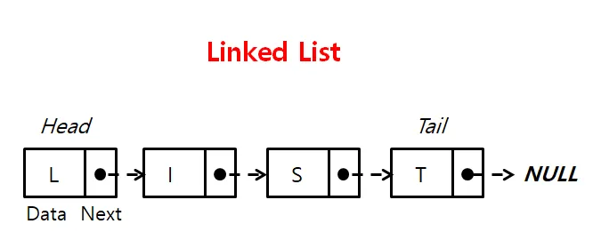

# 선형 자료 구조

# 2. 연결 리스트 (Linked List)

> 데이터를 감싼 노드를 포인터로 연결해서 공간적인 효율성을 극대화시킨 자료 구조.

## 1️⃣ 단일 연결 리스트 (Singly Linked List)



### 개념

- 각 노드가 **데이터**와 **다음 노드를 가리키는 포인터** 하나만 가지는 연결 리스트
- 한 방향으로만 순회 가능 (head → tail)
    - head : 맨 앞에 있는 노드
- 가장 기본적이고 단순한 연결 리스트 형태

### 특징

- **단방향 순회**: head에서 시작해서 tail까지만 이동 가능
- **메모리 효율성**: 포인터 하나만 저장하므로 메모리 사용량이 적음
- **역방향 접근 불가**: 이전 노드로 돌아가려면 처음부터 다시 순회해야 함
- **삽입/삭제 용이**: 특정 위치에 노드를 삽입하거나 삭제할 때, 해당 위치의 앞뒤 노드만 연결을 변경하면 되므로 배열에 비해 연산이 효율적.
- 위치를 알고 있을 때 삽입/삭제가 O(1), 임의 위치 접근이 O(n)

### 구현 참고
<details>
<summary> c++ 단일 연결 리스트 </summary>
<div markdown="1">

```cpp
#include <iostream>

// Node 구조체 정의: 데이터와 다음 노드를 가리키는 포인터
struct Node {
    int data;       // 노드가 저장하는 값
    Node* next;     // 다음 노드를 가리키는 포인터

    // 생성자: Node를 만들 때 data를 초기화, next는 nullptr로 설정
    Node(int val) : data(val), next(nullptr) {}
};

// LinkedList 클래스 정의
class LinkedList {
private:
    Node* head; // 첫 번째 노드를 가리키는 포인터

public:
    // 생성자: 처음에는 head를 nullptr로 초기화
    LinkedList() : head(nullptr) {}

    // 소멸자: 동적 할당된 모든 노드를 해제
    ~LinkedList() {
        Node* current = head;
        while (current != nullptr) {
            Node* temp = current; // 현재 노드를 temp에 저장
            current = current->next; // 다음 노드로 이동
            delete temp; // 현재 노드 삭제
        }
    }

    // 맨 앞에 노드 삽입
    void insertFront(int val) {
        Node* newNode = new Node(val); // 새 노드 생성
        newNode->next = head; // 새 노드의 next를 현재 head로 연결
        head = newNode; // head를 새 노드로 변경
    }

    // 맨 뒤에 노드 삽입
    void insertBack(int val) {
        Node* newNode = new Node(val); // 새 노드 생성
        if (head == nullptr) { // 리스트가 비어있으면
            head = newNode; // head를 새 노드로 설정
            return;
        }
        Node* current = head; // 리스트의 처음부터 시작
        while (current->next != nullptr) { // 마지막 노드까지 이동
            current = current->next;
        }
        current->next = newNode; // 마지막 노드의 next를 새 노드로 연결
    }

    // 특정 값을 가진 첫 번째 노드 삭제
    void deleteValue(int val) {
        if (head == nullptr) return; // 리스트가 비어있으면 종료

        // head 노드가 삭제할 값이라면
        if (head->data == val) {
            Node* temp = head; // 현재 head를 temp에 저장
            head = head->next; // head를 다음 노드로 이동
            delete temp; // 이전 head 삭제
            return;
        }

        Node* current = head;
        // 삭제할 값을 찾을 때까지 이동 (current->next를 확인해야 하므로)
        while (current->next != nullptr && current->next->data != val) {
            current = current->next;
        }

        // 삭제할 값을 찾았다면
        if (current->next != nullptr) {
            Node* temp = current->next; // 삭제할 노드 저장
            current->next = current->next->next; // 삭제할 노드를 건너뛰어 연결
            delete temp; // 삭제
        }
    }

    // 리스트에서 특정 값이 있는지 조회
    bool search(int val) {
        Node* current = head; // 처음부터 시작
        while (current != nullptr) {
            if (current->data == val) return true; // 찾으면 true
            current = current->next; // 다음 노드로 이동
        }
        return false; // 끝까지 가도 없으면 false
    }

    // head(첫 번째 노드) 값 조회
    int getFront() {
        if (head == nullptr) throw std::runtime_error("List is empty");
        return head->data;
    }

    // tail(마지막 노드) 값 조회
    int getBack() {
        if (head == nullptr) throw std::runtime_error("List is empty");
        Node* current = head;
        while (current->next != nullptr) {
            current = current->next;
        }
        return current->data;
    }

    // 전체 리스트 출력
    void printList() {
        Node* current = head; // 처음부터 시작
        while (current != nullptr) {
            std::cout << current->data << " -> "; // 현재 노드 값 출력
            current = current->next; // 다음 노드로 이동
        }
        std::cout << "NULL" << std::endl; // 리스트 끝 표시
    }
};

// main 함수: 사용 예시
int main() {
    LinkedList list;

    list.insertBack(10); // 10 삽입
    list.insertFront(5); // 5를 맨 앞에 삽입
    list.insertBack(20); // 20 삽입
    list.insertBack(30); // 30 삽입
    list.printList(); // 리스트 출력: 5 -> 10 -> 20 -> 30 -> NULL

    std::cout << "Head: " << list.getFront() << std::endl; // 5
    std::cout << "Tail: " << list.getBack() << std::endl;  // 30

    list.deleteValue(20); // 값이 20인 노드 삭제
    list.printList(); // 5 -> 10 -> 30 -> NULL

    std::cout << "Search 10: " << (list.search(10) ? "Found" : "Not Found") << std::endl; // Found
    std::cout << "Search 100: " << (list.search(100) ? "Found" : "Not Found") << std::endl; // Not Found

    return 0;
}

```

</div>
</details>

---

[Java코드와 설명 보러가기](https://you88.tistory.com/26)

   

[cpp코드와 설명 보러가기](https://huangdi.tistory.com/96)