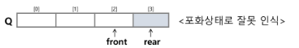

# 선형 자료 구조

# 4. 큐 (Queue)

- **FIFO 원리** : First In First Out, 가장 먼저 들어간 데이터가 가장 먼저 나옴
- CPU 작업을 기다리는 프로세스, 스레드 행렬 또는 네트워크 접속을 기다리는 행렬, 너비우선 탐색, 캐시 등에 사용됨

| 시간복잡도    |   접근    |   탐색     |   삽입     |   삭제    |
| ----------- | --------- | --------- | --------- | --------- |
| **큐**   |    O(n)    |    O(n)    |   O(1)   |   O(1)    |


## 선형 큐
- 배열을 이용한 기본적인 큐 구현 방식
- front, rear 포인터가 한 방향으로만 이동

### 선형 큐 이용시의 문제점

- 삽입과 삭제를 계속할 경우, 배열의 앞부분이 비어서 활용할 수 있는 공간이 있음에도 불구하고 포화상태로 인식하여 더 이상의 삽입을 수행하지 않게 됨



> 그럼 매 연산마다 배열을 앞으로 이동시킬까? → 원소 이동에 많은 시간이 들어 효율성 ⬇


**해결방법** : `원형 큐 사용`

---

## 원형 큐

- front = rear = 0으로 초기화
- front와 rear가 위치의 배열의 마지막 인덱스(n-1)을 가리킨 후,
논리적 순환을 이루어 배열의 처음 인덱스인 0으로 이동하게 함
- 이를 위해 나머지 연산자 `mod` 를 사용
- front 변수 : 공백상태와 포화상태 구분을 위해 front 자리는 사용하지 않고 빈자리로.

```
초기:
[ ][ ][ ][ ][ ]   // front=0, rear=0

enqueue(1)
[1][ ][ ][ ][ ]   // front=0, rear=1

enqueue(2)
[1][2][ ][ ][ ]   // front=0, rear=2

dequeue()
[ ][2][ ][ ][ ]   // front=1, rear=2

enqueue(3)
[ ][2][3][ ][ ]   // front=1, rear=3

enqueue(4)
[ ][2][3][4][ ]   // front=1, rear=4

enqueue(5)
[ ][2][3][4][5]   // front=1, rear=0 (rear가 다시 처음으로 돌아감)

enqueue(6)
// (rear+1)%size == front → 큐 full
```

## 선형 큐 vs 원형 큐
| 구분         | 선형 큐                   | 원형 큐                         |
| ---------- | ---------------------- | ---------------------------- |
| **공간 활용**  | 비효율적 (삭제된 앞 공간 재사용 불가) | 효율적 (앞 공간 재사용 가능)            |
| **구현 난이도** | 쉬움                     | mod 연산 필요 (조금 더 복잡)          |
| **포화 조건**  | rear == size-1         | (rear + 1) % size == front   |
| **사용 예시**  | 간단한 큐 예제               | OS 스케줄러, 네트워크 버퍼, 생산자-소비자 패턴 |


## 배열 큐 vs 연결 리스트 큐
| 구분        | 배열 기반 큐           | 연결 리스트 기반 큐         |
| --------- | ----------------- | ------------------- |
| **크기**    | 고정 (원형 큐로 효율화 가능) | 가변                  |
| **메모리**   | 연속된 공간            | 노드마다 추가 메모리(포인터) 필요 |
| **접근 속도** | 캐시 효율 좋음          | 캐시 효율 낮음            |
| **삽입/삭제** | O(1) (원형 큐)       | O(1)                |
| **랜덤 접근** | 가능 (index 접근)     | 불가능                 |

---

## 우선순위 큐

> 요소들이 각각 우선순위를 가지고 있으며,
> dequeue 시 가장 높은 우선순위를 가진 요소가 먼저 나가는 큐.

- **큐**는 순서대로 처리해야하는 곳에서 등장 (프린트 작업, 프로세스 스케줄링 등)
- 작업마다 중요도가 다를 경우 단순 큐로는 부족
  
- **활용사례**

| 분야        | 활용 예시                               |
| --------- | ----------------------------------- |
| **운영체제**  | 프로세스 스케줄러 (높은 priority 프로세스를 먼저 실행) |
| **네트워크**  | 패킷 스케줄링 (QoS 우선순위)                  |
| **알고리즘**  | 다익스트라 최단경로, A\* 탐색                  |
| **시뮬레이션** | 이벤트 처리 순서 관리                        |


### 우선순위 큐 구현

| 구현방법    |   enqueue (삽입)    |   dequeue (삭제)     |
| ----------- | --------- | --------- |
| **배열**   |    O(1)    |    O(n)    |
| **연결 리스트**   |    O(1)    |    O(n)    |
| **정렬된 배열**   |    O(n)    |    O(1)    |
| **정렬된 연결 리스트**   |    O(n)    |    O(1)    |
| **힙**   |    O(nlogn)    |    O(nlogn)    |

---

## 덱 (Deque, double-ended queue)

> 양쪽에서 삽입과 삭제가 가능한 구조, 스택과 큐의 연산 모두를 지원.

- 스택이나 큐보다 입출력이 자유로우나 중간에 데이터를 넣거나 빼지는 못 함.
- 양끝 삽입/삭제 O(1) 이 필요할 때 매우 유용.
- 스크롤, 문서 편집기 등의 undo 연산, 웹 브라우저 방문 기록 등에 사용됨.

