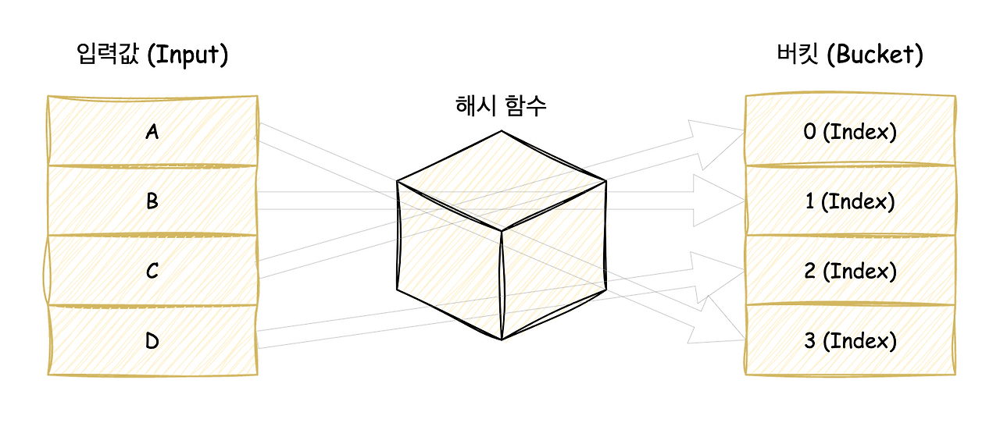
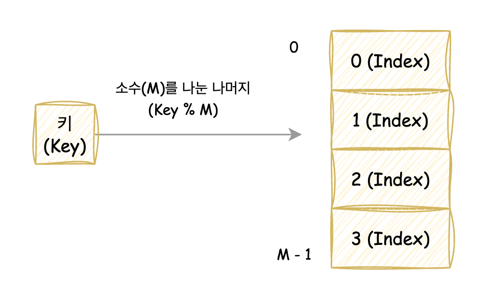
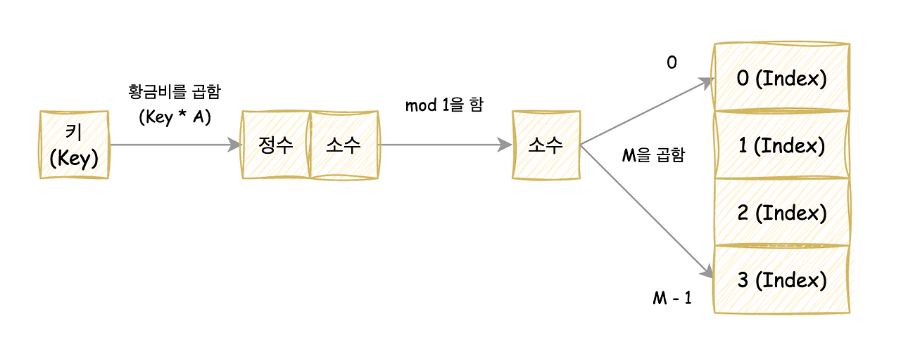

# 해시 테이블

> 무한에 가까운 데이터들을 유한한 개수의 해시 값으로 매핑한 테이블, 자료구조.
> 해시 함수에 의해 생성된 해시 값을 인덱스로 사용하여 key, value를 저장.

- 삽입, 삭제, 탐색 시 평균적으로 `O(1)` 의 시간 복잡도를 가짐
- unordered_map으로 구현

# 해시(Hash)

> 해시 함수를 사용하여 입력 값을 고정된 크기의 해시 값으로 변환하여 매핑하는 것

- 원본 데이터의 크기나 형식 상관없이 해시 값은 일정한 크기를 가짐
- 주로 빠른 데이터 검색, 암호화, 무결성 검증 등 다양한 분야에서 활용

---

# 해시함수

- **해시함수**: 임의의 길이의 데이터를 고정된 길이의 해시 값으로 변환하는 수학적 함수
- 주어진 데이터에 대해 고유하고 예측 불가능한 해시 값을 생성해야 함
- 서로 다른 입력이 동일한 해시 값을 갖는 경우를 최소화 해야 함

## 해시함수 종류

### 1. 나눗셈법

- 주어진 키를 특정 정수로 나누고, 나머지를 해시값으로 사용

`H(X) = X mod M` (M은 소수)
- M이 소수인 이유는 키의 고른 분포를 보장하기 위함.

**장점**
- 가장 간단한 방법 중 하나.

**단점**
- 키의 패턴에 따라 충동 발생 가능. 해시 테이블의 적절한 크기 설정 필수
- 해시 테이블의 크기가 커지면 더 큰 소수가 필요

### 2. 곱셈법

- 키에 특정 상수(황금비)를 곱하여 햇 값을 생성
- 나눗셈법에 비해 해시 값이 더 균등하게 분포되는 경향이 있음

`H(X) = ((X * A) mod 1) * M` (A는 황금비, M은 최대 테이블 사이즈(소수))

**장점**
- 키의 고유한 패턴에 의존하지 않기 때문에 나눗셈법에 비해 더 균일한 해시 값 분포

**단점**
- 해시 값이 항상 최적의 분포를 보장하지는 않음

### 3. 문자열 해싱
- 키 값이 문자열로 주어질 때, 문자열을 아스키 코드 값을 활용하여 해시 값으로 변환하는 방법

`H(S) = (S[0] + S[1] * P + S[2] * P^2 + ... + S[N-1]*P^(N-1)) mod M`
(P는 홀수이면서 메르센 소수, M은 최대 버킷 갯수)

**장점**
- 문자열 패턴을 효율적으로 검색 가능.
- 긴 문자열에서 해시 충돌을 줄이기 위해 사용

**단점**
- 긴 문자열에서 해시 값을 계산하는 데 시간이 걸릴 수 있음.
- 적절한 상수와 모듈러 값을 선택하지 않으면 충돌 발생 가능.

---
# 해시 충돌 (Hash Collision)

> 서로 다른 두 개의 입력 값이 동일한 해시 값을 갖는 상황

- 해시 함수가 다양한 입력을 고정된 크기의 해시 값으로 매핑하기 때문에 불가피하게 발생 가능
- 이를 잘 처리하지 않으면 해시 테이블의 효율성 크게 감소
