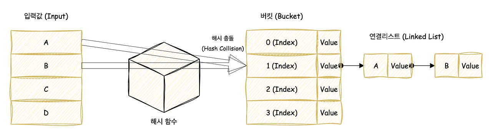
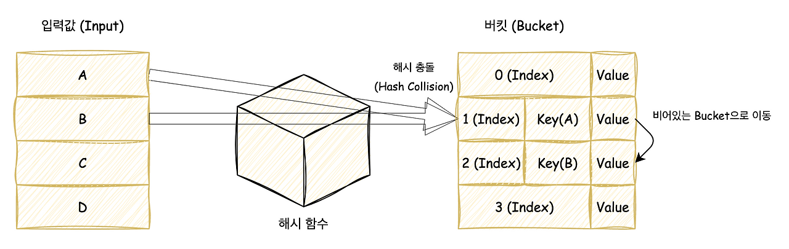

# 해시 테이블

# 해시 충돌 해결방법
---
# 1️⃣ 체이닝 (Chaining)


- 충돌이 발생한 경우, 동일한 해시 값을 갖는 여러 개의 항목을 연결 리스트로 저장
- 표준라이브러리 사용 시, 효율적인 처리를 위해 레드블랙트리로 구현되어 있음

### 장점
- 충돌이 발생할 때마다 간단히 항목 추가 가능 (동적 확장 가능)
- 해시 테이블의 크기를 변경하지 않고도 쉽게 확장 가능

### 단점
- 충돌이 많으면 연결 리스트 한계 때문에 검색 성능이 많이 떨어짐 (랜덤 검색이 안 되기 때문)
- 연결 리스트에 많은 항목이 쌓이면 탐색 시간이 길어질 수 있음 -> `O(n)`
- 추가적인 메모리 공간이 필요


<details>
<summary> c++ 체이닝 </summary>
<div markdown="1">

```cpp
#include <iostream>
#include <list>
#include <vector>

using namespace std;

class HashTable {
    int BUCKET; // 해시 테이블의 크기
    vector<list<int>> table; // 연결 리스트로 이루어진 해시 테이블

public:
    HashTable(int b) : BUCKET(b), table(b) {}

    // 키 값을 해시 테이블에 삽입
    void insertItem(int key) {
        int index = key % BUCKET; // 해시 함수
        table[index].push_back(key);
    }

    // 키 값을 해시 테이블에서 삭제
    void deleteItem(int key) {
        int index = key % BUCKET;
        table[index].remove(key);
    }

    // 해시 테이블 출력
    void displayHash() {
        for (int i = 0; i < BUCKET; i++) {
            cout << i;
            for (auto x : table[i]) {
                cout << " --> " << x;
            }
            cout << endl;
        }
    }
};

int main() {
    // 예제 사용
    int n = 7;
    int keys[] = {15, 11, 27, 8, 12, 18, 14};
    
    HashTable hashTable(n);
    
    for (int key : keys) {
        hashTable.insertItem(key);
    }

    hashTable.displayHash();
    
    return 0;
}
```

</div>
</details>

<details>
<summary> java 체이닝 </summary>
<div markdown="1">

```java
import java.util.*;

public class HashTable {
    private int BUCKET; // 해시 테이블의 크기
    private LinkedList<Integer>[] table; // 각 인덱스는 LinkedList로 구성

    // 생성자: BUCKET 크기로 테이블 초기화
    public HashTable(int b) {
        BUCKET = b;
        table = new LinkedList[b];
        for (int i = 0; i < b; i++) {
            table[i] = new LinkedList<Integer>(); // 각 칸에 빈 LinkedList 생성
        }
    }

    // 키 값을 해시 테이블에 삽입
    public void insertItem(int key) {
        int index = key % BUCKET; // 해시 함수
        table[index].add(key); // 해당 인덱스의 리스트에 추가
    }

    // 키 값을 해시 테이블에서 삭제
    public void deleteItem(int key) {
        int index = key % BUCKET;
        table[index].remove((Integer) key); // key를 Integer로 형변환 후 삭제
    }

    // 해시 테이블 출력
    public void displayHash() {
        for (int i = 0; i < BUCKET; i++) {
            System.out.print(i);
            for (int x : table[i]) {
                System.out.print(" --> " + x);
            }
            System.out.println();
        }
    }

    // main 함수: 사용 예시
    public static void main(String[] args) {
        int n = 7;
        int[] keys = {15, 11, 27, 8, 12, 18, 14};

        HashTable hashTable = new HashTable(n);

        // 키 삽입
        for (int key : keys) {
            hashTable.insertItem(key);
        }

        // 테이블 출력
        hashTable.displayHash();
    }
}
```

</div>
</details>

<br/>

---

# 2️⃣ 개방 주소법 - 선형 탐사 (Open Addressing - Linear Probing)


- 충돌이 발생한 경우, 해시 테이블 내에서 빈 공간을(버킷) 찾아 데이터를 삽입
- **선형 탐사**는 충돌 발생 시 테이블 내에서 순차적으로 다음 빈 공간을 탐색하는 방식
    - ex) 충돌 발생 시, 다음 칸으로 한 칸씩 탐사 = `index = (index + 1) % size`

    > ❗다른 탐사 방법
    >
    > | 방법                    | 탐사 공식              | 장점          | 단점               |
    > | --------------------- | ------------------ | ----------- | ---------------- |
    > | **Linear Probing** (선형)    | index + 1          | 구현 간단       | 클러스터링 심함         |
    > | **Quadratic Probing** (제곱) | index + i²         | 클러스터링 감소    | 충돌이 많으면 탐사 실패 가능 |
    > | **Double Hashing**  (이중 해싱)   | index + i \* hash2 | 충돌 분산 가장 우수 | 구현 복잡            |

<br/>


`H(X, I) = (H(X) + I) mod M`
(X는 키, M은 최대 버킷 갯수(소수), I는 충동시 이동할 버킷 수)

### 장점
- 모든 데이터가 동일한 배열에 저장되어 있어 체이닝보다 메모리 관리가 효율적
- 해시 테이블의 메모리 사용랴이 적음

### 단점
- 해시 충돌이 연속적으로 발생하면 탐색 시간이 길어질 수 있음
- 해시 테이블이 꽉 차면 더 이상 데이터 저장 불가능
- **클러스팅 문제**: 충돌이 많을 경우 인접한 공간이 점점 채워져 성능 저하 발생

<details>
<summary> c++ 개방 주소법 </summary>
<div markdown="1">

```cpp
#include <iostream>
#include <vector>

using namespace std;

class HashTable {
    vector<int> table;  // 해시 테이블을 저장할 벡터 (동적 배열)
    int size;  // 해시 테이블 크기
    int EMPTY;  // 빈 칸을 나타내는 값

public:
    HashTable(int s) : size(s), table(s, EMPTY), EMPTY(-1) {}

    // 키 값을 해시 테이블에 삽입
    void insertItem(int key) {
        int index = key % size;  // 해시 함수
        int originalIndex = index;  // 무한 루프 방지를 위한 시작점 기억

        // 충돌 시 선형 탐사
        while (table[index] != EMPTY) {
            index = (index + 1) % size;   // 선형 탐사 (다음 칸으로)
            if (index == originalIndex) {  // 원래 위치로 돌아오면 가득 참
                cout << "테이블이 가득 찼습니다!" << endl;
                return;
            }
        }
        table[index] = key;  // 빈 칸에 삽입
    }

    // 키 값을 해시 테이블에서 삭제
    void deleteItem(int key) {
        int index = key % size;

        // 선형 탐사로 삭제할 항목 탐색
        while (table[index] != EMPTY) {
            if (table[index] == key) {
                table[index] = EMPTY;
                return;
            }
            index = (index + 1) % size;
        }
    }

    // 해시 테이블 출력
    void displayHash() {
        for (int i = 0; i < size; i++) {
            if (table[i] == EMPTY) {
                cout << i << " --> " << "EMPTY" << endl;
            } else {
                cout << i << " --> " << table[i] << endl;
            }
        }
    }
};

int main() {
    // 예제 사용
    int keys[] = {50, 700, 76, 85, 92, 73, 101};
    int n = 11; // 해시 테이블 크기

    HashTable hashTable(n);

    for (int key : keys) {
        hashTable.insertItem(key);
    }

    hashTable.displayHash();

    return 0;
}
```

</div>
</details>

<details>
<summary> java 개방 주소법 </summary>
<div markdown="1">

```java
import java.util.*;

public class HashTable {
    private int[] table; // 해시 테이블 배열
    private int size;    // 테이블 크기
    private final int EMPTY = -1; // 빈 칸을 나타내는 상수

    // 생성자: 테이블 크기를 받아 초기화
    public HashTable(int s) {
        size = s;
        table = new int[size];
        Arrays.fill(table, EMPTY); // 모든 칸을 EMPTY(-1)로 초기화
    }

    // 키 값을 해시 테이블에 삽입 (Linear Probing)
    public void insertItem(int key) {
        int index = key % size;
        int originalIndex = index;

        // 충돌 시 선형 탐사
        while (table[index] != EMPTY) {
            index = (index + 1) % size; // 다음 칸으로 이동
            if (index == originalIndex) { // 한 바퀴 돌면 테이블이 가득 참
                System.out.println("테이블이 가득 찼습니다!");
                return;
            }
        }
        table[index] = key;
    }

    // 키 값을 해시 테이블에서 삭제
    public void deleteItem(int key) {
        int index = key % size;

        // 선형 탐사로 삭제할 항목 탐색
        while (table[index] != EMPTY) {
            if (table[index] == key) {
                table[index] = EMPTY; // 빈 칸으로 설정해 삭제
                return;
            }
            index = (index + 1) % size;
        }
    }

    // 해시 테이블 출력
    public void displayHash() {
        for (int i = 0; i < size; i++) {
            if (table[i] == EMPTY) {
                System.out.println(i + " --> EMPTY");
            } else {
                System.out.println(i + " --> " + table[i]);
            }
        }
    }

    public static void main(String[] args) {
        int[] keys = {50, 700, 76, 85, 92, 73, 101};
        int n = 11; // 테이블 크기

        HashTable hashTable = new HashTable(n);

        for (int key : keys) {
            hashTable.insertItem(key);
        }

        hashTable.displayHash();
    }
}
```

</div>
</details>