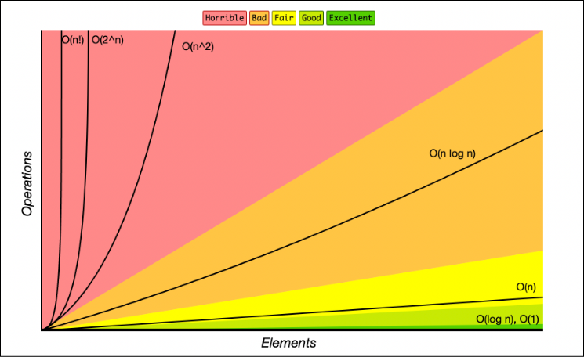

# Big O, Big Ω, Big Θ 표기법

# 1️⃣ 빅 오(Big-O) 표기법

> 알고리즘의 최악의 경우 실행 시간

- 알고리즘의 실행 시간이 입력 크기 n에 따라 **어떻게 증가하는지**를 함수로 표현, 시간 증가율에 따라 성능을 비교 가능
- **가장 영향을 많이 끼치는** 항의 상수 인자를 빼고 나머지 항을 없앤 것.



y축(Operations): 수행시간 / x축(Elements): 데이터의 수


## 주요 시간 복잡도 예시

### O(1) : 상수 시간 복잡도
- 입력 크기와 무관하게 항상 일정한 시간 소요
- 예: 배열의 첫 번째 요소에 접근하기

```python
arr = [1, 2, 3, 4, 5]
print(arr[0])  # 항상 일정한 시간
```

### O(log n): 로그 시간 복잡도
- 입력 크기가 커질수록 실행 시간은 로그 함수에 비례해서 증가
- 예: 이진 탐색 알고리즘

```python
def binary_search(arr, target):
    left, right = 0, len(arr) - 1

    while left <= right:
        mid = (left + right) // 2

        if arr[mid] == target:
            return mid
        elif arr[mid] < target:
            left = mid + 1
        else:
            right = mid - 1

    return -1

arr = [1, 3, 5, 7, 9, 11, 13]
print(binary_search(arr, 7))  # 3
```

### O(n): 선형 시간 복잡도
- 입력 크기에 비례하여 실행 시간이 증가
- 예: 배열에서 특정 요소를 찾기 위해 모든 요소를 확인하는 경우

```python
def linear_search(arr, target):
    for i in range(len(arr)):
        if arr[i] == target:
            return i
    return -1

arr = [4, 2, 7, 1, 3]
print(linear_search(arr, 7))  # 2
```

### O(n²) : 이차 시간 복잡도
- 입력 크기의 제곱에 비례하여 실행 시간이 증가
- 예: 이중 루프를 사용하는 알고리즘 (버블 정렬, 삽입 정렬)

```python
def bubble_sort(arr):
    n = len(arr)

    for i in range(n):
        for j in range(0, n-i-1):
            if arr[j] > arr[j+1]:
                arr[j], arr[j+1] = arr[j+1], arr[j]

arr = [64, 34, 25, 12, 22, 11, 90]
bubble_sort(arr)
print(arr)  # [11, 12, 22, 25, 34, 64, 90]
```

### O(2ⁿ) : 지수 시간 복잡도
- 입력 크기가 증가할 때 실행 시간이 지수적으로 증가
- 예: 피보나치 수열을 재귀적으로 계산하는 알고리즘

```python
def fibonacci(n):
    if n <= 1:
        return n
    return fibonacci(n-1) + fibonacci(n-2)

print(fibonacci(5))  # 5
```

<br />

---

##  주요 공간 복잡도 예시

### O(1) : 상수 공간 복잡도
- 입력 크기에 상관없이 고정된 양의 메모리만 사용
- 예: 단일 변수 사용

```python
def sum_numbers(n):
    total = 0  # 상수 공간 (total 변수만 사용)
    for i in range(1, n+1):
        total += i
    return total

print(sum_numbers(10))  # 55
```

### O(n) : 선형 공간 복잡도
- 입력 크기에 비례하여 메모리 사용량이 증가
- 예: 입력 크기만큼의 추가 배열을 사용하는 알고리즘

```python
def copy_list(arr):
    copied = []  # 입력 크기만큼 공간 사용
    for item in arr:
        copied.append(item)
    return copied

arr = [1, 2, 3, 4, 5]
print(copy_list(arr))  # [1, 2, 3, 4, 5]
```

### O(n²) : 이차 공간 복잡도
- 입력 크기의 제곱에 비례하여 메모리 사용량이 증가
- 예: 2차원 배열을 사용하는 알고리즘

```python
def create_matrix(n):
    matrix = []  # n x n 크기의 2차원 배열
    for i in range(n):
        row = []
        for j in range(n):
            row.append(0)
        matrix.append(row)
    return matrix

matrix = create_matrix(3)
for row in matrix:
    print(row)
# [0, 0, 0]
# [0, 0, 0]
# [0, 0, 0]
```


---

# 2️⃣ 빅 오메가(Big Omega) 표기법

> 알고리즘의 최상의 경우 실행 시간

- 입력 크기가 커짐에 따라 알고리즘의 실행 시간이 **최소한 어느 정도의 속도로 증가하는지**를 표현
- Ω(n)은 입력 크기 n에 비례하여 실행 시간이 최소한 증가한다는 것을 의미

---

# 3️⃣ 빅 세타(Bing Theta) 표기법

> 알고리즘의 평균적인 실행 시간

- 빅 오와 빅 오메가가 같은 경우에 사용되며, 입력 크기에 따라 알고리즘의 실행 시간이 **정확히 어떤 함수 형태를 따르는지** 나타냄
- Θ(n)은 입력 크기 n에 비례하여 실행 시간이 증가하며, 최악과 최상의 경우 모두 동일한 증가율을 보인다는 것을 의미

---
# 차이점

| 표기법       | 의미      | 수학적 정의                   | 설명      |
| --------- | ------- | ------------------------ | ------- |
| **Big O** | 상한선     | T(n) ≤ c·f(n)            | 최악의 경우  |
| **Big Ω** | 하한선     | T(n) ≥ c·f(n)            | 최선의 경우  |
| **Big Θ** | 상하한선 일치 | c₁·f(n) ≤ T(n) ≤ c₂·f(n) | 정확한 성장률 |

<br />

### 빅 오 표기법을 많이 쓰는 이유?

> 알고리즘 분석, 설계, 실무 성능 예측에서 최악의 경우를 보장하는 것이 중요하기 때문.

1. 안정성 보장
    - 서버 응답, DB 쿼리, 알고리즘 처리 속도 등에서 최악의 상황 대비 필수

2. 스케일 업 고려
    - 데이터가 수십만~수억으로 늘어나도, O(log n)인지 O(n²)인지에 따라 실시간 처리가 가능/불가능으로 갈림.

3. 코딩 테스트, 알고리즘 문제 풀이
    - 제한 시간 내에 최악의 입력에서도 통과 가능한지 판단

