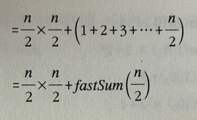

# 분할정복(Divide and Conquer)
> 큰 문제를 작고 독립적인 부분 문제들로 분할하고, 이들을 재귀적으로 해결한 뒤, 그 해답을 결합하여 전체 문제의 해답을 도출하는 알고리즘 설계 패러다임
- 가장 유명한 알고리즘 디자인 패러다임

## 1. 일반적인 재귀호출과 차이점

|   | 재귀 호출                                      | 분할정복                                                   |
|-----|------------------------------------------------|------------------------------------------------------------|
| 구조 | 문제를 더 작은 **한 조각과 나머지 전체**로 나눔 | 문제를 **거의 동일한 크기**의 여러 부분으로 나눔            |
| 목표 | 단순하게 문제를 반복해서 줄여나감               | 작게 쪼개고, 각각 **독립적으로 처리한 뒤**, **결합**         |

분할정복 예시 사진


## 2. 분할정복을 사용하는 알고리즘의 3가지 구성요소
1. 문제를 더 작은 문제로 분활하는 과정(divide)
2. 각 문제에 대해 구한 답을 원래 문제에 대한 답으로 병합하는 과정(merge)
3. 더이상 답을 분할하지 않고 곧장 풀 수 있는 매우 작은 문제(base case)


## 3. 분할 정복의 필요조건
1. 문제를 둘 이상의 부분 문제로 나누는 자연스러운 방법이 있어야 함
2. 부분 문제의 답을 조합해 원래 문제의 답을 계산하는 효율적인 방법이 있어야 함


## 4. 예제 - 수열의 빠른 합과 행렬의 빠른 제곱

### 4.1 1부터 n까지의 합을 구하는 분할 정복 알고리즘
```c++
// 필수 조건 : n은 자연수
// 1+2+...+n을 반환한다.

int fastSum(int n)
{
    // 기저 사례
    if (n == 1) return 1;
    // n이 홀수인 경우 n-1까지 재귀호출로 계산하고 n 을 더해 답을 구하는 방식
    if(n%2 == 1) return fastSum(n-1)+1;
    // n이 짝수인 경우
    return 2*fastSum(n/2) + (n/2)*(n/2);
}
```

### 4.2 식 풀이
> 2*fastSum(n/2) + (n/2)*(n/2)

1. 1부터 n까지의 합을 n개의 조각으로 나눈 뒤, 반으로 잘라 n/2조각들로 만들어진 부분을 2개 만든다.


2. 하지만 두번째 조각이 1부터 n/2 가 아닌 a 부터 b의 형태이기 때문에 첫번째 조각과 동일시 되게 식을 만들어 준다.


3. 공통된 항 n/2를 빼면 1번의 fastSum(n/2)의 구조가 된다.


4. 따라서 마지막의 식은 다음과 같이 나오게 된다.


## 5. 시간복잡도
- 내부에 반복문이 없기때문에 순전히 함수 호출되는 횟수에 비례
- 하지만 분할정복은 절반으로 나눴기 때문에 일반적인 재귀함수에 비해 호출 횟수가 적어 시간이 훨씬 빠르다는 것을 알 수 있음

## 6. 분할정복 종류
- Merge Sort (병합 정렬)
- Quick Sort (퀵 정렬)
- 이진 탐색
- 거듭제곱 알고리즘