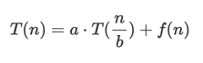
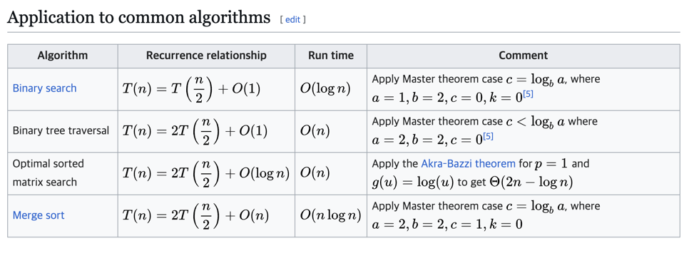

# 마스터정리 (Master Theorem)
> 분할정복 알고리즘의 시간 복잡도를 분석할 때 사용하는 도구
- 분할 정복 알고리즘 
  - 문제를 작은 부분 문제로 나누고(divide) → 각각을 풀고(conquer) → 결과를 합쳐서(combine) 원래 문제를 푸는 방식

## 1. 재귀관계식(recursive relation)
- 분할정복 알고리즘들은 대부분 재귀적인 시간 복잡도를 가짐


  - a: 문제를 몇 개로 나누는지
  - n/b: 문제 크기를 얼마만큼 나누는지
  - f(n): 나눈 결과를 다시 합치는 데 드는 시간

## 2. 마스터 정리를 사용할 수 없는 경우
- 마스터 정리의 세 가지 경우(Case 1, 2, 3)는 각각 재귀적으로 정의된 함수의 f(n) 항이 얼마나 지배적인가에 따라 시간 복잡도를 결정하는 방식
- 즉, a*T(n/b)와 f(n) 중 시간 복잡도를 차지하는 큰 손은 무엇인가?

### 2.1 Case 1
```
f(n) = O(n^{log_b a - ε}) (for some ε > 0)
```
  - 하위차수가 함수인 경우 = f(n)이 n^log_b a보다 차수가 낮은 함수일 때 
  - f(n)이 재귀 호출보다 느리게 증가하면, 재귀 호출이 전체 시간 복잡도를 지배

  ⇒ 대부분의 시간은 문제를 쪼개서 해결하는 데 사용됨


- 시간복잡도
    ```
    T(n) = Θ(n^{log_b a})
    ```


### 2.2 Case 2
```
f(n) = Θ(n^{log_b a} * log^k n) for some k ≥ 0
```
- 같은 차수 함수인 경우
- f(n)이 n^{log_b a}와 성장률이 비슷하거나 살짝 로그 정도 차이일 때, 재귀 호출과 병합 비용이 균형을 이룸

⇒ 분할/병합과 재귀 호출이 비슷한 수준의 연산량을 사용함


- 시간복잡도
    ```
    T(n) = Θ(n^{log_b a} * log^{k+1} n)
    ```

### 2.3 Case 3
```
f(n) = Ω(n^{log_b a + ε}) for some ε > 0
그리고 정규성 조건:
a f(n/b) ≤ c f(n) for some c < 1, sufficiently large n
```
- 상위 차수 함수인 경우
- f(n)이 재귀 호출보다 훨씬 빠르게 증가하면, 병합이나 분할 작업이 전체 복잡도를 지배하게 됨

⇒ 쪼개는 일보다 병합 처리나 기타 작업이 시간을 많이 잡아먹는 상황

- 시간복잡도
    ```
    T(n) = Θ(f(n))
    ```


## 3. 마스터 정리를 적용할 수 없는 수식들


1. `a`가 상수가 아닌 경우  
   예: `T(n) = n T(n/2) + n`
  

2. `f(n)`과 `n^{log_b a}`의 차이가 **비다항(polynomial)**일 때  
   예: `T(n) = 2T(n/2) + n/ log n`


3. `f(n)`이 음수이거나 부호를 갖는 경우  
   예: `T(n) = 64T(n/8) - n² log n`


4. 정규성 조건이 위반된 경우 (Case 3 중 하나처럼 보여도)  
   예: `T(n) = T(n/2) + n(2 − cos n)`


5. 부분 문제 크기가 균등하지 않거나, `T(n - 1)` 형태인 경우 등


## 4. 마스터 정리의 적용 예시



> 같은 문제라도 어떻게 분할하느냐에 따라 시간 복잡도 차이가 커지고, 절반으로 나누었을때 중복되어 계산되면서 시간을 소모하는 부분들이 발생,
> 이에 동적 계획법이 고안된 계기가 됨

---
[참고 : 위키피디아](https://en.wikipedia.org/wiki/Master_theorem_(analysis_of_algorithms))