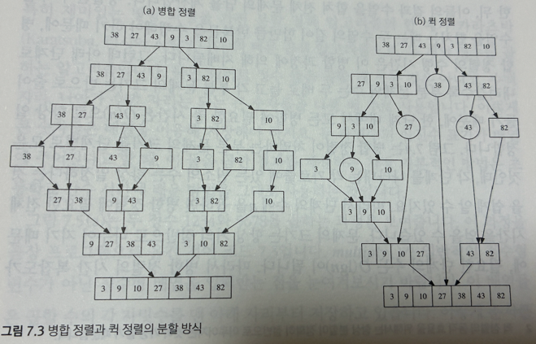

# 대표 알고리즘들
## 1. 병합 정렬(Merge sort)

> 주어진 수열을 비슷한 크기의 수열 2개로 쪼갠 뒤, 재귀호출을 통해 각각을 정렬
> 이 후 정렬된 배열을 다시 합침으로써 정렬된 전체 수열을 반환
- 분할 정복 패러다임을 기반으로 만들어진 것
- 단순하고 효율적
- 시간복잡도 : 쪼개는 시간 O(1) + 병합과정 O(n)

    ⇒ 단순하게 절반으로 쪼개기 때문에 분할하는 데 할애하는 시간은 적음. 다만, 별도의 병합과정이 필요하기에 이에 대한 시간이 걸림

## 2. 퀵 정렬(Quick sort)
> 병합과정이 필요없도록 한쪽의 배열에 포함된 수가 다른 쪽 배열 수보다 항상 작도록 배열을 분할
- 파티션(partition)단계 : 기준수(pivot)를 지정한 후 기준보다 작거나 같은 숫자를 왼쪽, 더 큰 숫자를 오른쪽으로 보내는 과정
- 분할 정복 패러다임을 기반으로 만들어진 것
- 시간복잡도 : 분할과정 O(n) 

    ⇒ 분활과정이 복잡하지만 이미 정렬된 상태로 내려오기 때문에 별도의 병합과정은 필요없음

병합정렬과 퀵 정렬의 분할 방식

- 같은 문제를 해결하는 알고리즘이라도 어떤 식으로 분할하느냐에 따라 다른 알고리즘이 될 수 있음 

## 3. 거듭제곱
> 복잡해 보이는 문제를 더 작고 관리하기 쉬운 부분 문제로 나누고, 이를 재귀적으로 해결한 다음, 결과를 조합하여 최종 해답을 도출

- 
## 3.1 일반적이 거듭제곱과 분할정복을 사용한 거듭제곱의 시간복잡도 비교
- 거듭제곱 : (O(n)), 가장 직관적인 거듭제곱 계산 방법은 (a)를 (n)번 곱하는 것
- 분할정복을 사용한 거듭제곱 : (O(\log n))
- 예시 : 32번 곱셈 vs 5번 곱셈

## 3.2 장점

1. 스택 오버플로우 발생 가능성 낮음
   - 추가적인 메모리 사용 없이 계산 수행 가능. 
   - 현대 컴퓨터의 스택 크기는 거듭제곱 계산 요구를 충분히 수용할 수 있음. 

2. 코드 간결성
    - 재귀적 접근 방식은 알고리즘의 구현을 명확하고 간결하게 만들어, 코드의 가독성과 유지 보수성을 향상

3. 분할 정복을 사용한
```C++
long long iterative_power(long long a, long long n) {
    long long result = 1;
    while (n > 0) {
        // n이 홀수인 경우, 결과에 a를 곱하고 n을 하나 감소
        if (n % 2 == 1) {
            result *= a;
            n -= 1;
        }
        // a를 제곱하고 n을 반으로 줄임
        a *= a;
        n /= 2;
    }
    return result;
}

```
