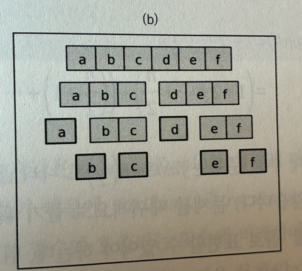

# 동적 계획법(Dynamic Programming)
> 복잡한 문제를 작은 문제로 분해하여 해결하는 알고리즘 디자인 기법 중 하나

## 1. 동적 계획법(동적 프로그래밍)의 조건

- 최적 부분 구조(Optimal Substructure)
  - 전체 문제의 최적해가 부분 문제의 **최적해**로부터 구해질 수 있어야 함
  - 즉, 큰 문제를 해결하려면 작은 문제들을 해결한 후 그 결과들을 조합하는 방식으로 접근할 수 있어야 함
  

- 중복되는 부분 문제(Overlapping Subproblems)
  - 부분 문제가 중복되어 여러번 반복 계산되어야 함
  - 동적 프로그래밍에서는 동일한 부분 문제가 여러 번 계산되는 상황이 발생. 이때 매번 계산하는 것이 비효율적이기 때문에, 계산한 결과를 저장해서 중복 계산을 피하는 방식(메모이제이션)을 사용해야 함
  - 이때 계산한 값을 저장해 두는 메모리 장소를 캐시(cache)라고 함

> 주어진 문제가 최적 부분 구조 (Optimal Substructure)를 갖고, 문제들이 중첩되는 (Overlapping Subproblem) 정도가 높을 때 적용

## 2. 분할정복(Divide and Conquer)과 비교

### 2.1 분할 정복(Divide & Conquer) 부연설명
- 가장 유명한 알고리즘 디자인 패러다임
- 주어진 문제를 둘 이상의 부분 문제로 나눈 뒤 각 문제에 대한 답을 재귀 호출을 이용해 계산하고, 각 부분 문제의 답으로부터 전체 문제의 답을 계산

> 둘은 비슷하지만 문제를 나누는 방식에서 차이

 알고리즘 유형 | 분할정복                                             | 동적 계획                                                   |
|---------|--------------------------------------------------|---------------------------------------------------------|
| 특징      | 분할된 부 문제들이 서로 독립적임                               | 분할된 부 문제들이 서로 의존적임                                      |
| 나누는 방식  | 문제를 균등하게(혹은 적절하게) 두 개 이상의 하위 문제로 나누고, 각 하위 문제를 독립적으로 해결한 후 결과를 합침 | 문제를 하위 문제들로 나누고, 각 하위 문제들이 서로 의존하며, 중간 계산 결과를 저장하여 재사용함 |
| 예시      | 퀵 정렬, 합병 정렬, 이진 탐색                               | 피보나치 수열, 최단 경로 문제, 배낭 문제, 이항계수계산법                       |

#### 분할정복 나누는 방식 사진 참고

    
## 3. 구현 방식
- Memoization(하향식 접근 풀이)
- Tabulation(상향식 접근 풀이)

---
#### 부연설명
- 동적 계획법(동적 프로그래밍)은 프로그래밍 대회 문제에 가장 자주 출연
- 동적 계획법(Dynamic Programming)이란는 말은 최적화 문제를 연구하는 수학 이론에서 왔으며, 전삭학 전반에서 일반적으로 사용하는 동적(dynamic), 프로그래밍(programming)이란 단어와는 아무관려이 없음. 그렇기에 적절한 번역은 동적 프로그래밍이 아닌 동적 계획법
- 동적 계획법의 고안자인 벨만은 dynamic이라는 단어가 멋있어서 선택했다고 함

참고: 알고리즘 문제 해결전략 1