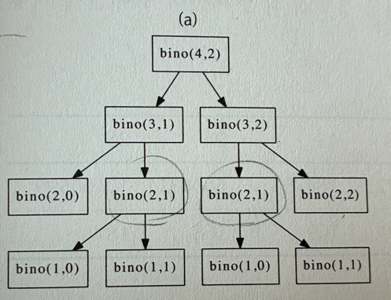

# Memoization & Tabulation

> Dynamic programming 의 대표적인 구현법

## 1. 이항계산

- 동적 계획법의 대표적인 예시
```c++
<C++>
int bino(int n, int r)
{
    // 기저 사례 : n=r(모든 원소를 다 고른 경우), r=0(고를 원소가 없는 경우)
    if(r == 0 || n == r) return 1;
    return bino(n-1, r-1) + bino(n-1, r);
}
```

- 위와 같이 n개의 서로 다른 원소 중에서 r개의 원소를 순서없이 골라내면 중복이 발생
  - bino(4, 2)를 구하려고 할 때, bino(3, 1)과 bino(3, 2)를 각각 구합니다.
  - 그런데 bino(3, 1)과 bino(3, 2)를 구하는 과정에서 다시 bino(2, 1)을 두 번 호출하거나, 다른 중복되는 계산이 이루어지게 됩니다.
  
  
⇒ 이 문제를 동적계획법인 **메모이제이션(Memoization)** 또는 **Tabulation 방식**을 이용하여 이미 계산된 값을 저장하고 재사용함으로써 불필요한 계산을 줄일 수 잇음

## 2. Memoization 
> 재귀적 함수 호출에서 중복 계산을 방지하기 위해, 함수의 결과를 저장하여 동일한 입력이 들어왔을 때 다시 계산하지 않고 저장된 값을 재사용하는 최적화 기법.
- 재귀함수로 구현
- Top down
- 메모이제이션은 한 가지 패턴을 정해두고 항상 같은 형태로 구현하기로 하면 작성하기도, 버그를 찾기도 쉬움

### 2.1 이항계수 계산을 위한 메모이제이션 적용
- 함수는 매번 호출될 때마다 **배열에 접근**해 값이 저장되어있는 지를 확인한 뒤, 저장이 되어있다면 값을 반환

```c++
<C++>
#include <iostream>
using namespace std;

int cache[30][30];  

int bino2(int n, int r) {
    // 기저 사례: n == r 또는 r == 0인 경우
    if (r == 0 || n == r) return 1;

    // 이미 계산된 값이 있다면 그대로 반환
    if (cache[n][r] != -1)
        return cache[n][r];  

    // 값이 없으면 계산하여 저장
    return cache[n][r] = bino2(n - 1, r - 1) + bino2(n - 1, r);
}

int main() {
    // cache 배열을 -1로 초기화
    for (int i = 0; i < 30; i++)
        for (int j = 0; j < 30; j++)
            cache[i][j] = -1;

    cout << bino2(5, 2) << endl;  // 10 출력
    return 0;
}

```

### 2.2 메모이제이션 적용 가능한 경우
- 참조적 투명 함수의 경우에만 적용이 가능 (*하단, 용어설명 참고)
- 전역 변수, 입력 파일 과 같은 외부요소에 따라 다른 값이 반환 된다면 캐싱을 할 수 없기 때문

### 2.3 메모이제이션 시간복잡도 
- (존재하는 부분 문제의 수) x (한 부분 문제를 풀 때 필요한 반복문의 수행 횟수)
- O(n^2) x O(1) = O(n^2)


- O(n^2) 
  - bino(n,r)의 경우 n과 r의 값을 이용해 계산. 
  - n은 최대 n까지 가능하고, r 역시 최대 n까지 가능. 
  - 따라서 2차원 배열로 cache[n][r]를 저장하게 되며, 가능한 부분 문제의 수는 n과 r의 모든 조합이므로 O(n²)가 됨

- O(1)
  - 각 부분 문제를 계산할 때 반복문이 없기 때문에 O(1)이 됨
  
## 3. Tabulation
> 작은 문제부터 차례대로 해결하여, 큰 문제로 올라가면서 결과를 저장하는 방식
- 반복문으로 구현
- Bottom up
- 모든 부분을 연산 수행해야할 때 적합
- 메모이제이션과 비슷하게 중복 계산을 피하고 최적화하는 방법이지만, 값을 미리 계산하여 반복문을 통해 문제를 풀어나간다는 점에서 차이가 있음

## 3.1 이항계수 계산을 위한 Tabulation 적용
- 배열을 채워가며 계산을 진행하고, 모든 작은 문제의 결과가 채워지면, 큰 문제의 답을 얻을 수 있음
```c++
<C++>
#include <iostream>
using namespace std;

int cache[30][30];  // cache 배열 선언

void bino_tabulation(int n, int r) {
    // 초기화: 모든 값은 0으로 시작
    for (int i = 0; i <= n; i++) {
        for (int j = 0; j <= i; j++) {
            if (j == 0 || j == i) {
                cache[i][j] = 1;  // 기저 사례: C(n, 0) = 1, C(n, n) = 1
            } else {
                cache[i][j] = cache[i - 1][j - 1] + cache[i - 1][j];  // 이전 값들을 기반으로 계산
            }
        }
    }
}

int main() {
    int n = 5, r = 2;
    bino_tabulation(n, r);
    cout << cache[n][r] << endl;  // 10 출력
    return 0;
}

=> 예시가 없어 gpt 예시 참고
```

---
#### 용어
- 참조적 투명성(referential transparency) : 함수의 반환 값이 그 입력 값만으로 결정되는지에 대한 여부
- 참조적 투명함수 : 입력이 고정되어 있을 때 그 결과가 항상 같은 함수들을 뜻함