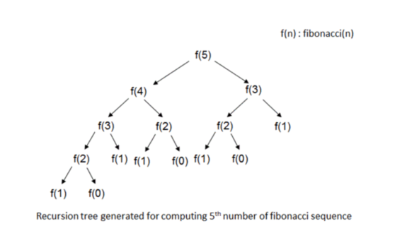

# 피보나치 수열(Fibonacci Sequence)
- 문제 번호 : 백준 24416번
- 문제 설명 : 피보나치 수열의 n번째 항을 구하는 문제입니다. 이 문제는 재귀적 방법과 동적 프로그래밍을 사용한 방법을 비교하는 문제로, 주어진 n에 대해 피보나치 수열의 n번째 항과 재귀호출 횟수를 구하시오.


```c++
<C++>
#include <iostream>
using namespace std;

int dp[41];
int dpCnt = 0;

int fibo(int n)
{
  if (n == 1 || n == 2)
    return 1;
  
  if(dp[n] != 0)
    return dp[n];
  
  ++dpCnt;  // 계산이 이루어진 시점만 카운트
  dp[n] = fibo(n-1) + fibo(n-2); 
  return dp[n];
}

int main()
{

  int n;
  cin >> n;
  cout << fibo(n) << '\n' << dpCnt << '\n';

  return 0;
}
```
```Java
<java>
import java.io.BufferedReader;
import java.io.InputStreamReader;
import java.io.IOException;

public class Main {

    static int code1Cnt,  code2Cnt; //코드1, 코드2의 실행 횟수 저장 변수

    static int[] f; //동적 프로그래밍에서 사용하는 의사코드
    public static void main(String[] args) throws IOException {
        BufferedReader br = new BufferedReader(new InputStreamReader(System.in));

        int n =  Integer.parseInt(br.readLine()); //입력 값(n)
        f = new int[n]; //동적 프로그래밍에서 사용하는 배열 초기화

        br.close();

        /* 카운트 변수 초기화 */
        code1Cnt = 0;
        code2Cnt = 0;

        fib(n);
        fibonacci(n);

        System.out.println(code1Cnt + " " + code2Cnt);

    }

    //피보나치 수 재귀 호출 코드
    static int fib(int n){
        if(n == 1 || n == 2){
            code1Cnt++; //1이 몇번 더해졌는지 구하면 되기 떄문에 if문 안에
            return 1;
        }
        else return (fib(n-1) + fib(n-2));
    }

    //피보나치 수 동적 프로그래밍 코드
    static int fibonacci(int n){
        f[0] = 1;
        f[1] = 1;

        for(int i = 2; i < n; i++){
            //for문의 반복 횟수가 속도를 결정
            code2Cnt++;
            f[i] = f[i-1] + f[i-2];
        }
        return f[n-1]; //배열은 0부터 시작하므로
    }

}
```
---
[백준 문제 : 동적 계획법 1](https://www.acmicpc.net/step/16)