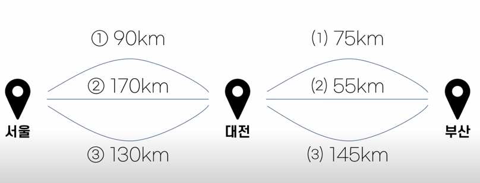

# 그리디 알고리즘(Greedy Algorithm)
> 최적의 값을 구해야 하는 상황에서 사용되는 근시안적인 방법론으로 ‘각 단계에서 최적이라고 생각되는 것을 **선택**’ 해 나가는 방식으로 진행하여 최종적인 해답에 도달하는 알고리즘

- 매순간 마다 최적의 선택을 하여 전역적인 최적의 해답을 만들었다 해서 최적이란 보장은 없음
- 그래서 항상 최적의 값을 보장하는것이 아니라 최적의 값의 ‘**근사한 값**’을 목표, 이를 근사 알고리즘이라고도 함

## 2. 선택의 순간, 최적해
문제 : 루트 노드부터 시작해 거쳐가는 각 노드 값의 합을 최대로 만드는 프로그램을 만들어라!

1. 그리디 방법
   1. 선택의 순간 : **어떤 노드**를 더할지 고려하기
   
      - 매 선택의 순간마다 가장 큰 값을 갖는 자식 노드를 선택
   2. 최적의 해 : **가장 큰 값**을 갖는 노드를 찾는 것
   

## 2. 그리디 알고리즘의 두가지 속성
> 최적의 해를 보장할 수는 없지만 탐욕 알고리즘을 활용해 최적의 해를 찾기 위해서는 아래 두가지 선택 조건을 만족해야함

1. 탐욕적 선택 속성(Greedy Choice Property)
   - **이전**의 최적 선택이 **이후**의 최적 선택에 영향을 주지 않는 속성
   
     - 서울에서 대전까지의 최적해가, 대전에서 부산까지의 최적해를 구하는 데 영향을 미치지 않음

2. 최적 부분 구조(optimal substructure) 
   - 전체 문제의 최적해가 부분 문제의 최적해로 구성되는 속성
    
     - 서울에서 대전까지의 최적해와 대전에서 부산까지의 최적해를 더했더니, 전체 문제의 최적해가 됨
     - (추가) 1번 노드합 예시를 보면 부분의 최적해가 전체문제의 최적해가 되지 않아 그리디 알고리즘으로 적합하지는 않다는 것을 알 수 있음   

## 3. 그리디 알고리즘의 특성 

- 모든 경우를 탐색하는 것보다 시간복잡도에서 우위에 있음 (DP보다 더 빠름)
- 최적해를 떠올린다면 직관적인 풀이가 가능

---
[참고:그리디](https://www.youtube.com/watch?v=_IZuE7NIeW4)