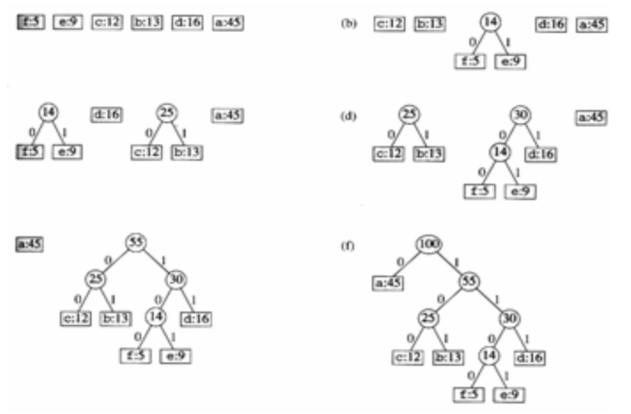
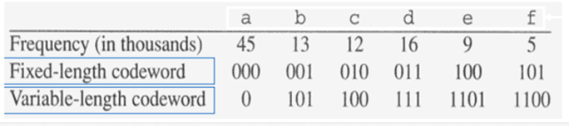

# Huffman Coding Problem
> 전형적인 그리디 알고리즘에 기반한 알고리즘  

> 각 문자를 나타내는 이진 코드의 길이를 최소화하기 위해서 빈도가 높은 문자에 대해 짧은 문자를 할당해 전체 데이터의 압축률을 높이는 알고리즘

## 1. 허프만 코딩이 그리디 알고리즘인 이유

- 탐욕적 선택 속성 : 전체 최적해를 보장하기 위해 매 단계 최선의 선택을 해야하며 이는 이 다음 선택에 영향을 미치지 않음
- 최적 부분 구조 : 전체 최적해가 부분 최적해들로 구성

## 2. 하프만 압축이란?

- 일반적으로 컴퓨터는 문자를 **고정된 길이(예: 8비트의 ASCII 코드)**로 저장
- 예를 들어, 1000자의 텍스트는 8 x 1000 = 8000비트가 필요
- 하지만 어떤 문자는 자주 등장하고, 어떤 문자는 거의 등장하지 않죠.
- 허프만 압축은 빈도가 높은 문자는 짧은 비트 코드, 빈도가 낮은 문자는 긴 비트 코드를 사용함으로써, 전체 파일의 평균 비트 수를 줄이는 것
- 이로 인해 파일을 저장하거나 전송할 때 필요한 공간과 시간을 절약할 수 있음

## 3. 가변길이 코드(variable-length code)
- 자주 등장하는 문자는 짧게, 덜 등장하는 문자는 길게 부여해서 전체 평균 비트 수를 줄이는 방식

## 3. 예시
> 하프만 코딩은 고정길이 인코딩(ASCII)를 빈도 기반의 가변 길이 이진 코드로 바꾸는 과정

| 문자 | a  | b  | c  | d  | e  | f  |
|------|----|----|----|----|----|----|
| 빈도 | 43 | 13 | 12 | 16 | 9  | 5  |

1. 가장 작은 두 노드를 계속 합치면서 이진트리를 만들기
   - f:5  e:9  c:12  b:13  d:16  a:43

2. 작은 두 노드부터 값을 비교하며 트리 만들기

   - 모든 문자가 리프 노드가 되도록 구성
   - 왼쪽 자식 : 0, 오른쪽 자식 : 1
   - 단계가 낮은 노드 우선으로 묶기
     - 먼저, 가장 작은 빈도인 f(7)과 e(9)를 더해 14를 만듦
     - 다음으로 낮은 빈도인 c(12)와 b(13)을 합쳐 25를 만듦
     - 이후에는 이전에 만든 노드 중 빈도가 가장 낮은 14와, 아직 남아있는 문자 중 빈도가 낮은 d(16)을 묶어 30을 만듦

3. 가변길이코드 변환 결과
