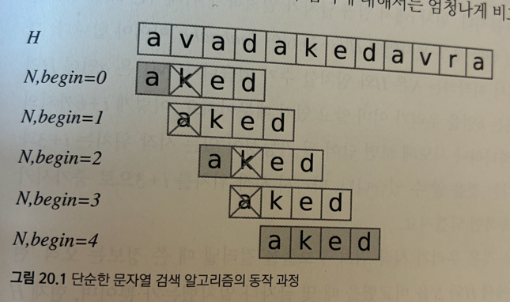

# Brute Force 알고리즘

- 개념: 문자열 검색 알고리즘의 가장 기본적인 방식
- 원본 문자열(text)의 모든 가능한 위치에서 패턴 문자열(pattern)이 일치하는지를 하나하나 전부 비교하는 방식
- 장점: 구현이 간단
- 단점: 시간 복잡도가 매우 큼 (최악의 경우 O(m * n), m: 원본 문자열 길이, n: 패턴 길이)

## 1. 구현방법
    
    1. 원본 문자열의 시작부터 끝까지 탐색
    2. 각 위치에서 패턴의 첫 글자부터 순차적으로 비교
    3. 모든 문자가 일치하면 성공 (매치된 위치를 리턴 등)
    4. 문자 하나라도 다르면, 원본 문자열의 시작 위치를 한 칸 뒤로 이동하고 다시 2번부터 반복


## 2. 단순한 문자열 검색 알고리즘 구현
- 이 알고리즘은 꽤 비효율적이지만, 구현이 단순하다는 장점이 있기 때문에 널리 사용됨
- C++ 무낮열의 string::find(), 자바 문자열의 indexOf()등이 아래와 같은 알고리즘을 사용

```C++
<C++>
// 문자열 H의 부분 문자열로 N이 출현하는 시작 위치들을 모두 반환한다.
vector<int>naiveSearch(const string& H, const string& N)
{
    vector<int> ret;
    // 모든 시작 위치를 다 시도해 본다.
    for(int begin = 0; begin + N.size() <= H.size(); ++begin) {
        bool matched = true;
        for (int i = 0; i < N.size(); ++i)
            if(H[begin + il != N[il) {
                matched = false;
                break;
            }
        if(maatched) ret.push_back(begin);
    }
    return ret;
}
```
```python
def BruteForce(p, t) :
    i= 0 # t의 검색 인덱스
    j= 0 # p의 검색 인덱스
    while i < len(t) and j < len(p):
        if t[i] != p[j]:
            i = i - j
            j= -1
        i += 1 
        j += 1
    if j == len(p):
        return i - len(p)
    else:
        return -1
    
pattern = "Python"
text = "Hello Python World"
print (BruteForce(pattern, text) )
```