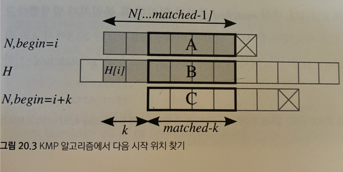

# KMP 알고리즘 (Knuth-Morris-Pratt 알고리즘)

## 1. KMP 필요성

- 브루트 포스 알고리즘 처럼 모든 부분을 비교하지 않고 KMP 알고리즘을 사용하여 일정 부분을 건너 뛰고 패턴 비교하면 시간을 줄일 수 있음

## 2. 용어
1. 접두사(prefix) : 문자열의 첫 부분부터 시작하는 부분 문자열
    - 예를 들어 "abcab"라는 패턴의 접두사는 "*a*bcab", "*ab*cab", "*abc*ab", "*abca*b", "_abcab_" 에서 기울어진 부분
   

2. 접미사(suffix) : 문자열의 마지막 부분으로 끝나는 부분 문자열
   - "abcab"라는 패턴의 접미사는 "abca*b*", "abc*ab*", "ab*cab*", "a*bcab*", "_abcab_" 에서 빨간색인 부분


## 3. KMP 알고리즘

> 문자열 탐색을 건너 뛸 수 있다면, 건너 뛴 후의 부분이 동일해야함


- N: 텍스트, H: 패턴
- 회색 부분 : 현재 텍스트와 패턴이 matched 길이만큼 일치한 상태
- 패턴 내부의 H[0..matched-1] 구간에서 "접두사 == 접미사"인 가장 긴 부분의 길이 k를 미리 구해둔 pi 배열을 통해 알고 있음
- 패턴을 matched - k칸만큼 이동 후 재 확인

## 3.1 pi[]
- 부분 일치 테이블 (partial match table)이라고 하며, N이 어디까지 일치했는지, 다음 시작위치가 어디인지를 말해주는 값

## 4. 구현
```C++
vector<int> kmpSearch(const string& H, const string& N)
{
    int n = H.size(), m = N.size()
    vector<int> ret;
    //pi[i]=N[..i]의 접미사도 되고 접두사도 되는 문자열의 최대 길이
    vector<int> pi = getPartialMatch(N);
    
    // begin= matched=0에서부터 시작하자.
    int begin = 0, matched = 0;
        while(begin < n - m) i {
            // 만약 H의 부분가 N의 해당 글자와 같다면
            if (matched < m && H[begin + matched] = N[matched]) {
                ++matched;
                // 결과적으로 m글자가 모두 일치했다면 답에 추가한다.
                if (matched = m) ret.push_back(begin) ;
            }
            else 
            {
            1/ 예외: matched가 0인 경우에는 다음 칸에서부터 계속
            if (matched = 0)
                ++begin;
            else 
            {
            begin += matched - pi[matched-1];
            // begin을 옮겼다고 처음부터 다시 비교할 필요가 없다.
            // 옮긴 후에도 pilmatched- 1만큼은 항상 일치하기 때문이다.
            matched = pi [matched-1];
            }
        }
    }
    return ret;        
}
```

## 5. 시간복잡도
- while문은 if문 분기 결과에 따라 다른 동작을 하기 때문에 수행시간 분석 어려움
- 반복문 전체 수행 횟수 O(|H|)