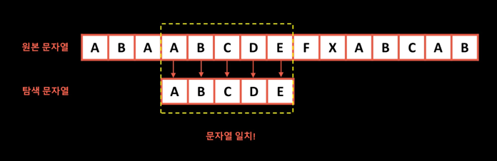
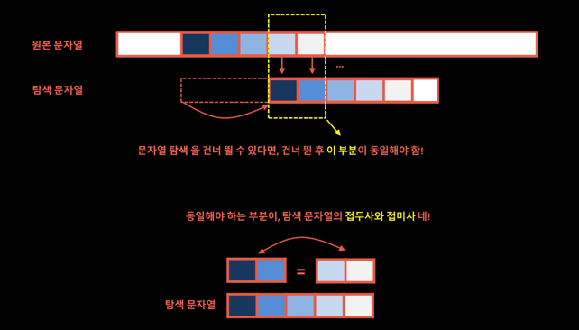

# KMP 알고리즘 (Knuth-Morris-Pratt 알고리즘)

## 1. KMP 필요성

- 브루트 포스 알고리즘 처럼 모든 부분을 비교하지 않고 KMP 알고리즘을 사용하여 일정 부분을 건너 뛰고 패턴 비교하면 시간을 줄일 수 있음

## 2. 용어
1. 접두사(prefix) : 문자열의 첫 부분부터 시작하는 부분 문자열
    - 예를 들어 "abcab"라는 패턴의 접두사는 "*a*bcab", "*ab*cab", "*abc*ab", "*abca*b", "_abcab_" 에서 기울어진 부분
   

2. 접미사(suffix) : 문자열의 마지막 부분으로 끝나는 부분 문자열
   - "abcab"라는 패턴의 접미사는 "abca*b*", "abc*ab*", "ab*cab*", "a*bcab*", "_abcab_" 에서 빨간색인 부분

## 3. KMP 알고리즘

> 문자열 탐색을 건너 뛸 수 있다면, 건너 뛴 후의 부분이 동일해야함

1. 다음 시작 위치를 찾기