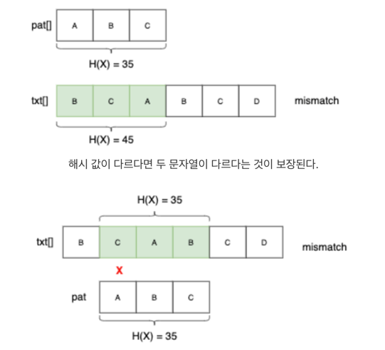
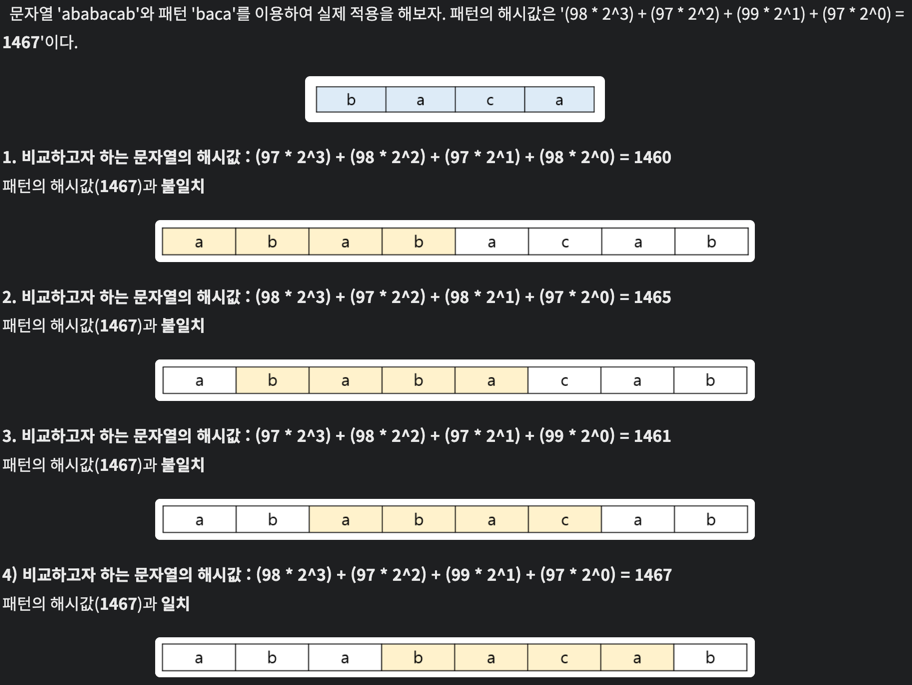
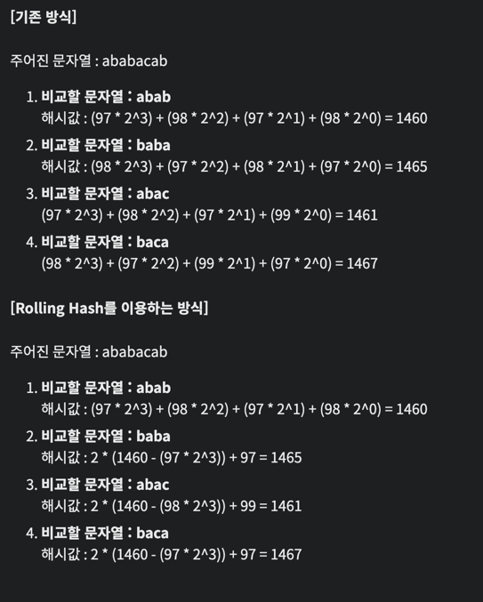

# Rabing-Karp Algorithm
> 해싱(Hashing)을 사용하여 문자열에서 특정 패턴과 일치하는지 찾아주는 알고리즘

## 1. 동작 방법

1. 해시 함수를 설정
2. 해시함수를 이용하여 패턴의 해시값 구하기
3. 비교하고자 하는 문자열의 해시값 구하기
4. 일치하면 패턴과 찾은 문자열을 1:1 비교(해시값이 같다고해서 문자열까지 같은건 아니기 때문!)
5. 일치하지 않으면 비교하고자 하는 문자열을 한칸 뒤로 옮겨서 다시 시작

## 2. 해시함수
> 비교하고자 하는 부분의 해시값을 매번 다시 연산하는 것은 연산량이 낭비!
> 그래서 수학적 특징을 이용

> 해시 함수를 구현하는 방법은 1. 숫자기반 2. 아스키코드 기반이 있음

| 방식                    | 설명                                                           | 예시                                                          |
|-----------------------| ------------------------------------------------------------ | ----------------------------------------------------------- |
| ① 숫자 기반 (Decimal 다항식) | 문자열이 숫자로만 이루어졌을 때 자연스럽게 각 자릿수를 숫자로 사용하여 계산.                  | `"31415"` → `3×10⁴ + 1×10³ + 4×10² + 1×10¹ + 5×10⁰`         |
| ② 아스키코드 기반            | 일반적인 영문자 문자열에 사용. 각 문자를 ASCII 코드로 바꾸고, 어떤 `r` 값을 기준으로 다항식 구성 | `"abcd"` → `97·r³ + 98·r² + 99·r¹ + 100·r⁰` (보통 `r = 31` 등) |

## 2.1 숫자 기반
[참고 : 라빈카프](https://canvas4sh.tistory.com/345)  
- 수학적인 부분이 있어 위 링크를 참고하는 것을 권장

## 2.2 아스키코드 기반
- 각 문자의 아스키코드 값에 2의 제곱 수를 차례대로 곱하여 더해주는 것'을 사용

### 2.2.1 예시

- 'aba'의 해시 값 : '(97 * 2^2) + (98 * 2^1) + (97 * 2^0) = 388 + 196 + 97 = 681'
- 'bab'의 해시 값 : '(98 * 2^2) + (97 * 2^1) + (98 * 2^0) = 392 + 194 + 98 = 684'

- 아스키코드로 변환한 값을 비교

### 2.2.2 Rolling Hash
> 중복되는 해시값은 그대로 두고 업데이트되는 부분만 해시값을 계산해 주는 것

- 예시 : 문자열 "abc" → "bcd"로 이동할 때 해시를 새로 계산하지 않고, 기존 해시에서 첫 문자 'a'의 영향 제거 + 새로운 문자 'd' 추가

# 2. 시간복잡도
- 최악의 시간 복잡도는 O(MN)이지만 평균적으로는 선형에 가까운 빠른 속도를 가지는 알고리즘

---
[참고 : 라빈-카프 해시 알고리즘](https://amenable.tistory.com/75)