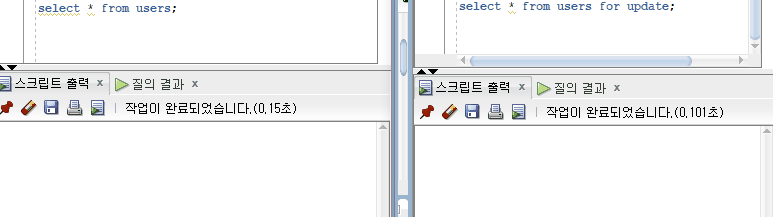

# 6.6 트랜잭션과 동시성 제어
# 6.6.1 트랜잭션의 ACID 특성
---

# 트랜잭션
> 데이터베이스에서 하나의 논리적 기능을 수행하기 위한 작업 단위

</br>

# 트랜잭션의 특성
## 1️⃣ 원자성(Atomincity)
> 트랜잭션의 연산은 데이터베이스에 **모두 반영되도록 완료**되든지 아니면 **전혀 반영되지 않도록 복구**되어야 함

```
채현 : 1000원  | 서린 : 0원

채현이가 서린이 언니한테 500원을 보낸다.

1. 채현이의 잔고를 조회한다.
2. 채현이에게서 500원을 뺀다.
3. 서린이에게 500원을 준다.
```
- 위 이체 과정은 3가지의 operation 단위로 이루어진 과정을 거친다.
- 이 어떤 operation을 볼 수도 참여할 수도 없다.
- 작업이 전부 되거나 일부 operation만 적용되는 경우는 없어야한다.

</br>

## 2️⃣ 일관성(Consistency)
> 트랜잭션이 그 실행을 성공적으로 완료하면 언제나 일관성 있는 데이터베이스 상태로 변환함
- **허용된 방식**으로만 데이터를 변경하는 것을 의미
- 트랜잭션 수행 이전의 송금자와 수금자의 잔액 합이 수행 후 달라지거나, 잔액을 나타내는 자료형이 정수형에서 문자열로 바뀌는 등의 모순이 일어나선 안 된다.

</br>

## 3️⃣ 격리성(Isolation)
> 둘 이상의 트랜잭션이 동시에 병행 실행되는 경우 어느 하나의 트랜잭션 실행중에 다른 트랜잭션의 연산이 끼어 들 수 없음
- 독립성을 통해 사용자들은 여러 트랜잭션이 동시에 수행되고 있는 것처럼 느끼면서 정확한 결과를 얻을 수 있게 된다.
- 트랜잭션이 많아질 수록 대기 시간은 늘어나고 결국 **처리 속도가 느려진다.** 결국, 준수한 처리 속도를 위해서 트랜잭션의 **완전한 격리**가 아닌 **완화된 수준의 격리**가 필요하다. => **격리수준 단계

## 격리수준 단계
> 트랜잭션의 속도와 데이터 정확성에 대한 트레이드 오프를 고려하여 트랜잭션의 격리성 수준을 나눈 것
- DBMS마다 격리 수준에 대한 내용이 다를 수 있고 하단 설명은 **MySQL**기준.

### 🔷 Uncommitted Read
- 가장 낮은 격리 수준
- 다른 트랜잭션이 커밋되지 않은 데이터에 접근할 수 있게 하는 격리 수준.
- 하나의 트랜잭션이 커밋되기 전에 다른 트랜잭션에 노출되는 문제가 있지만 가장 빠름
- 데이터 무결성을 위해 **되도록 사용하지 않는 것**이 이상적
- A 트랜잭션이 수행 중 데이터를 바꾸고 B 트랜잭션이 아직 커밋되지 않은 해당 데이터를 읽어올 수 있는데, A가 롤백된 경우 **데이터 부정합**이 발생할 수 있음 => **더티리드**

> **❓더티리드 (Dirty Read)**
>
> 한 트랜잭션이 실행 중일 때 다른 트랜잭션에 의해 수정되었지만 아직 **커밋되지 않은** 행의 데이터를 읽을 수 있을 때 발생
> 

</br>

### 🔷 Committed Read
- 가장 많이 사용되는 격리 수준
- MySQL을 제외한 대부분의 데이터베이스들이 이를 기본 격리수준으로 설정.
- 다른 트랜잭션이 커밋하지 않은 정보는 읽을 수 없음


</br>

- A 트랜잭션이 데이터를 수정하고 커밋하지 않았는데 B 트랜잭션이 해당 데이터에 접근하여 또 수정할 경우, A가 같은 행을 다시 읽을 때 다른 내용이 발견될 수 있음 => **반복 가능하지 않은 조회**

> **❓반복 가능하지 않은 조회**
>
> 한 트랙잭션 내의 같은 행에 두 번 이상 조회가 발생했는데, **그 값이 다른 경우**.
>
> 

</br>

### 🔷 Repeatable Read
- **반복 가능하지 않은 조회** 문제를 해결하는 격리 수준.
- 하나의 트랜잭션이 수정한 행을 다른 트랜잭션이 수정할 수 없도록 막아줌.
- 자신보다 낮은 트랜잭션 번호를 갖는 트랜잭션에서 커밋한 데이터만 읽을 수 있는 격리수준.


</br>

- 그러나, 다른 트랜잭션이 새로운 행을 추가하는 것은 막지 않음. 그래서 이후에 추가된 행이 발견될 수도 있음. => **팬텀리드**

> **❓팬텀리드**
>
> 한 트랙잭션 내 동일한 쿼리를 보냈을 때 해당 조회 결과가 다른 경우.
> 팬텀리드는 반복 가능하지 않은 조회와 다르게 동일한 SELECT 쿼리에 대해 **결과 레코드** 수가 달라지는 현상
>
> 

</br>

### 🔷 Serializavle
- 가장 고수준의 격리수준.
- 무조건 순차적으로 진행
- 트랙잭션이 동시에 같은 행에 접근할 수 없으니 데이터 부정합 문제는 발생하지 않으나, 동시 처리가 불가능하여 처리 속도가 느려짐.
- 그래서 교착 상태가 일어날 확률도 많고 가장 성능이 떨어지는 격리 수준.

</br>

## 4️⃣ 지속성(Durability)
> 성공적으로 완료된 트랜잭션의 결과는 시스템이 고장나더라도 영구적으로 반영되어야 함
- 데이터베이스는 이를 위해 체크섬, 저널링, 롤백 등의 기능을 제공
    - 체크섬 : 중복 검사의 한 형태, 오류 정정을 통해 송신된 자료의 무결성을 보호하는 단순한 방법
    - 저널링 : 파일 시스템 또는 데이터베이스 시스템에 변경 사항을 반영(commit)하기 전에 로깅하는 것, 트랙잭션 등 변경 사항에 대한 로그를 남기는 것