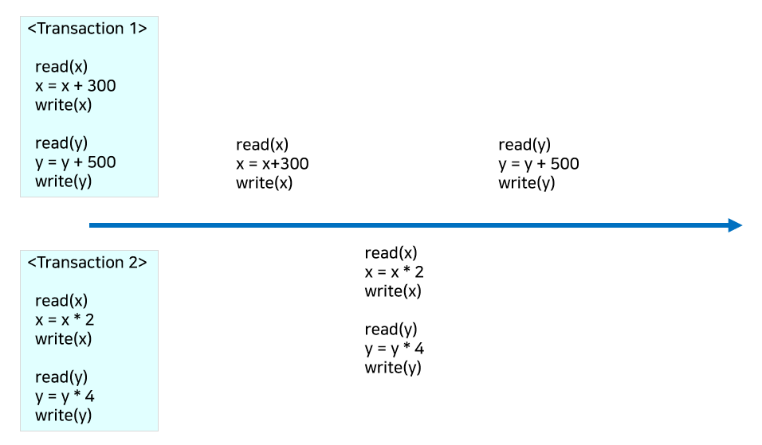
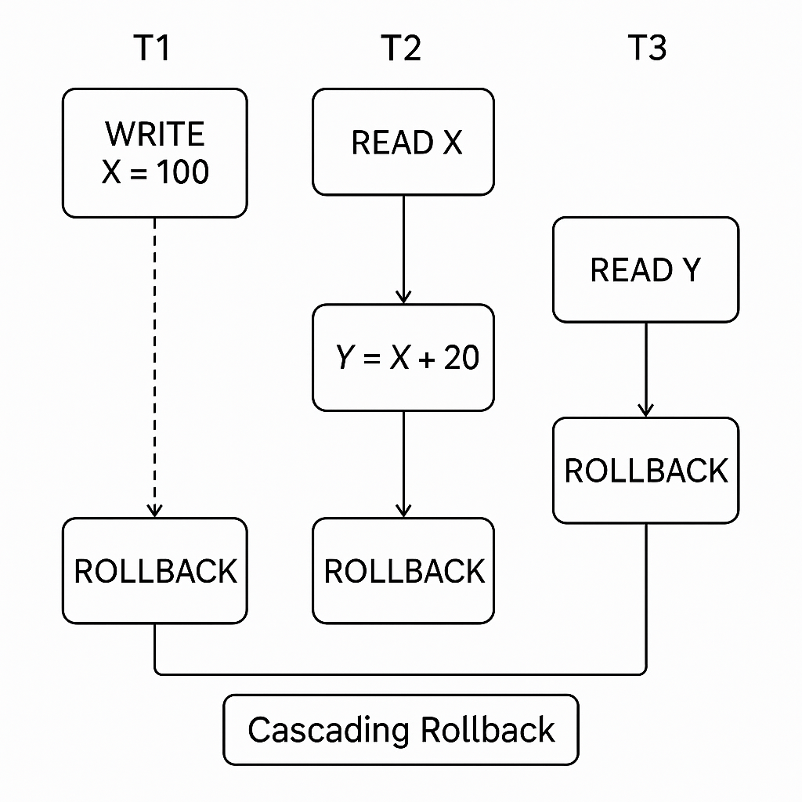

# 6.6 트랜잭션과 동시성 제어
# 6.6.3 동시성 제어의 필요성
---

# 동시성 제어(Comcurrency Control)이 필요한 이유
- **여러 사용자가 동시에 데이터베이스를 조작할 때, 데이터의 일관성과 무결성을 보장하기 위해**
- 여러 트랜잭션이 동시에 수행되면 다음과 같은 문제 발생 가능

## 1개의 트랜잭션은 쓰고, 1개의 트랜잭션은 읽는 경우
| 문제 상황                            | 설명                                        |
| -------------------------------- | ----------------------------------------- |
| **더티리드 (Dirty Read)**       | 한 트랜잭션이 아직 `COMMIT`되지 않은 데이터를 다른 트랜잭션이 읽음 |
| **반복 가능하지 않은 조회 (Non-repeatable Read)** | 같은 데이터에 대해 두 번 읽을 때 값이 다름                 |
| **팬텀리드 (Phantom Read)**         | 조건을 만족하는 행의 개수가 트랜잭션 중간에 달라짐              |

> 문제상황 설명 보러가기 : [6.6.1 트랜잭션의 ACID 특성](./6.6.1%20ACID%20characteristics%20of%20the%20transaction.md)

</br>


## 2개의 트랜잭션 모두 쓰기
| 문제 유형     | 설명                   | 해결 방법                        |
| --------- | -------------------- | ---------------------------- |
| **데이터 손실 (Lost Update)**         | 두 트랜잭션이 같은 데이터를 읽고, 서로의 변경을 덮어씀           | 2PL, 낙관적 제어, 타임스탬프, 격리 수준 조정 |
| **모순성**   | 트랜잭션 병행 실행으로 무결성 위반  | 격리성 보장, 제약 조건, 락             |
| **연쇄 복귀** | 하나의 롤백이 다른 트랜잭션까지 영향 | Strict 2PL, Undo 로그          |
| **교착 상태** | 트랜잭션이 서로를 무한 대기      | 타임아웃, 순서제어, Deadlock 회피 알고리즘 |

---
### 데이터 손실(Lost Update)
> 하나의 트랜잭션이 갱신한 내용을 다른 트랜잭션이 덮어씀으로써 갱신이 무효화 되는 것

```
1. T1: 잔액 1000 → 읽음
2. T2: 잔액 1000 → 읽음
3. T1: 1000 - 100 = 900 → 저장
4. T2: 1000 - 200 = 800 → 저장
```

- 실제로는 100 + 200 = 300이 빠졌어야 하지만, 결과는 800 → **100** 손실됨

### 모순성 (Inconsistency)
> 다른 트랜잭션들이 해당 항목 값을 갱신하는 동안 한 트랜잭션이 두 개의 항목 값 중 어떤 것은 갱신되기 전의 값을 읽고 다른 것은 갱신된 후의 값을 읽게 되어 데이터의 불일치가 발생하는 상황



- 트랜잭션 1이 완료되기 전에 트랜잭션 2 수행.
    1. 트랜잭션 순서를 봤을 때, y에 500을 더한 후 4가 곱해진 값을 기대
    2. 하지만 1이 완료되기 전에 2가 완료됨에 따라 y에 4를 곱하고 500이 더한 값이 나오는 **모순이 발생**
    3. 트랜잭션 2의 입장에서는 일관성이 유지되지만, 트랜잭션 1입장에서는 실행 전후 500만큼이 발생해야하는데 터 큰 차이가 나기 때문에 **데이터의 불일치** 발생


## 연쇄 복귀 (Cascading Rollback)
> 병행 수행되던 둘 이상의 트랜잭션 중 어느 한 트랜잭션에 오류가 발생하여 Rollback 하는 경우 다른 트랜잭션들도 함께 Rollback 되는 현상

1. 트랜잭션 T1이 X를 100으로 임시 변경하고 커밋을 안 함
2. T2가 X의 값 100을 읽고 Y를 120으로 계산
3. T3는 Y값 120을 읽음
4. T1이 실패하여 **Rollback**됨
    - T1이 롤백으로 X는 다시 50
    - 하지만 T2는 잘못된 값 100을 기반으로 계산했으므로 롤백 필요
    - T2가 롤백되면서 T3도 잘못된 값 기반임으로 롤백 필요
5. **결과 : T1 → T2 → T3 모두 롤백됨**

---

# 동시성 제어의 목표
- **일관성 유지**: 동시에 여러 트랜잭션이 실행되어도 DB의 무결성은 유지
- **격리성 확보(Isolation)**: 각 트랜잭션이 마치 독립적으로 수행된 것처럼 보이게 함
- **정당한 병행 실행(Schedule)**: 트랜잭션의 실행 순서를 조정하여 올바른 결과 유도

# 대표적인 동시성 제어 기법
| 기법                     | 설명                                                               |
| ---------------------- | ---------------------------------------------------------------- |
| **로킹(Locking)**        | 데이터를 잠금하여 다른 트랜잭션의 접근을 제한 (예: 2단계 로킹 프로토콜)                       |
| **타임스탬프 순서제어**         | 트랜잭션 시작 시점의 시간 정보로 순서 제어                                         |
| **낙관적 기법(Validation)** | 충돌 가능성이 낮다고 가정하고, 커밋 직전에 충돌 여부 검사                                |
| **다중 버전 제어(MVCC)**     | 각 트랜잭션에게 데이터의 스냅샷을 제공하여 동시성 해결 (PostgreSQL, MySQL InnoDB 등에서 사용) |
