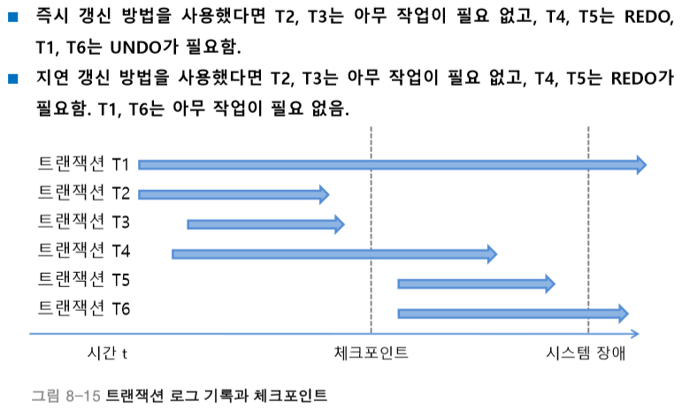

# 6.7 회복(Recovery)
# 6.7.3 체크포인트

</br>

# 검사점 기법(Check point)
> 트랜잭션 실행 중 특정 단계에서 재실행할 수 있도록 갱신 내용이나 시스템에 대한 상황 등에 관한 정보와 함께 **검사점을 로그에 보관**해 두고, 장애 발생 시 트랜잭션 전체를 철회하지 않고 **검사점부터 회복 작업을 수행하여 회복시간을 절약**하도록 하는 기법

- 로그는 그대로 기록을 유지하면서, 회복 관리자가 정하는 일정한 시간 간격으로 검사 시점을 생성하는 것
- 회복 시 많은  양의 로그를 검색하고 갱신하는 시간을 줄이기 위함

## 체크포인트
> 장애 복구 시점을 줄이기 위해, **DBMS가 주기적으로** 트랜잭션의 상태와 로그를 안정된 지점에 저장하는 작업

### 체크포인트 수행시 하는 일
1. 현재 활성화된 트랜잭션 목록 저장
2. 모든 Dirty Page를 디스크로 플러시
3. 로그에 "BEGIN CHECKPOINT", "END CHECKPOINT" 기록
  

```
DBMS->>Log: "BEGIN CHECKPOINT"
    DBMS->>Log: 현재까지 COMMIT된 트랜잭션 ID 기록
    DBMS->>BufferPool: Dirty Page flush (메모리 → 디스크)
    DBMS->>Log: "END CHECKPOINT"
```
  

> **❓ Dirty Page flush**
>
> **Dirty Page**: **버퍼 풀(Buffer Pool)**에 로딩된 데이터 페이지 중에서
변경은 되었지만 아직 디스크에 반영되지 않은 페이지
>
> **Flush**: 그 Dirty Page를 **디스크에 기록(write-back)**하는 작업
>
> ---
> - DBMS는 디스크에서 데이터를 읽어오면 **메모리(버퍼 풀)**에 캐시함
> - 데이터를 수정해도 **바로 디스크에 쓰지 않고, 버퍼 풀에서 먼저 처리**
> - 그래서 성능은 좋아지지만, 변경사항이 디스크에 반영되지 않은 **Dirty Pag**e가 생김

### 체크포인트에서 작업
- **체크포인트 이전에 [Commit] 기록이 있는 경우**: 아무 작업이 필요 없다.
    - 이미 변경 내용이 **데이터베이스에 모두 기록된 후**이기 때문
- **체크포인트 이후에 [Commit] 기록이 있는 경우**: REDO(T)를 진행한다.
    - 체크포인트 이후에 변경 내용이 데이터베이스에 반영되지 않았으므로 REDO를 진행
- **체크포인트 이후에 [Commit] 기록이 없는 경우**: 즉시 갱신 방법 사용시 UNDO(T) 진행
    - **즉시 갱신 방법**을 사용했다면, 갱신 데이터를 로그에 작성하는 과정과 버퍼의 내용을 데이터베이스에 기록하는 작업이 동시에 이루어지므로 **버퍼의 내용이 데이터베이스에 반영됐을 수도 있기 때문에** 원상복구 시켜야하므로 UNDO.
    - **지연 갱신 방법**을 사용했다면, 갱신 데이터를 로그에 작성한 후 commit을 해야 버퍼의 내용을 데이터베이스에 기록하기 때문에 **아무 작업도 해줄 필요가 없음**

</br>



---
# 검사점 기법 장단점
### 장점
- 복구 범위를 줄여 장애 복구 시간 단축
- 오래된 로그 삭제 가능 → 로그 크기 관리

### 단점
- 체크포인트 수행 시 시스템 자원 소모 (Dirty Page flush 등)
- 트랜잭션 중단 없이 체크포인트 수행 시 구현 복잡도↑
- 자체적으로는 회복 불가 (로그 기반 기법이 필요함)