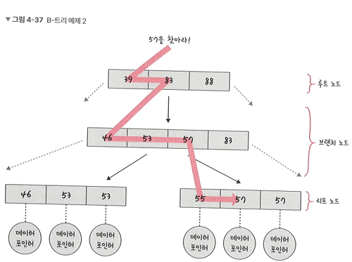

# 6.8 인덱스와 성능 최적화
# 6.8.1 인덱스의 종류(B-Tree, Hash, Bitmap)

</br>

[인덱스란]([../6.4%20SQL(Structured%20Query%20Language)/6.4.6](https://github.com/CS-CookStudy/cook-cs/blob/main/06.%20Database/6.4%20SQL(Structured%20Query%20Language)/6.4.6%20View%20and%20Index.md#2-%EC%9D%B8%EB%8D%B1%EC%8A%A4-index))

</br>

---
# B-Tree
- 보통 인덱스의 자료 구조
- **이진 트리**를 확장해 하나의 노드가 가질 수 있는 자식 노드의 최대 숫자가 2보다 큰 트리 구조 (노드 하나에 여러 키 저장 가능)
- 검색, 삽입, 삭제 모두 O(log n) 성능 유지
- 노드 간 왼쪽 < 현재 < 오른쪽 규칙 유지
- 디스크 기반 시스템에 최적화 (블록 단위 I/O 최소화)

[B-Tree_자료구조](https://github.com/CS-CookStudy/cook-cs/blob/main/04.%20Data%20Structures/4.2%20Non-linear%20Data%20Structures/4.2.2%20BinarySearchTree.md#b-tree)

</br>

```
B-Tree 구조 (간단 예시)

          [40]
        /      \
     [20]      [60, 80]
     /  \      /   |   \
 [10] [30]  [50] [70] [90]

- 각 노드에는 여러 키가 있음
- 항상 왼쪽 < 키 < 오른쪽 구조
- 모든 키는 정렬된 상태
```

## B-Tree 인덱스 특징
- **정렬된 자료구조**: 항상 키 값 기준으로 정렬된 트리 구조 유지
- **균형 트리**: 모든 리프 노드의 깊이가 동일해서 탐색 시간 일정
- **범위 검색 최적화**: `>, <, BETWEEN` 등 범위 조건에 탁월
- **접두어 기반 검색**: `LIKE 'abc%'`는 사용 가능, `%abc`는 불가능
- **중복 값 저장 가능**: 일반 인덱스는 중복 허용 (`UNIQUE` 인덱스는 예외)
- **자동 재조정**: 삽입/삭제 시 자동으로 구조 조정(split/merge) 수행
- **디스크 I/O 최적화**: 디스크 블록 단위로 노드를 구성 → 큰 키 집합도 빠르게 검색 가능

## 인덱스 검색 시 동작 방식
1. 루트 노드부터 시작
2. 현재 노드의 키들을 탐색하여 범위 결정
3. 해당 범위의 하위 자식 노드로 이동
4. 반복적으로 내려가며 최종적으로 리프 노드에서 키 찾기
5. 찾은 키에 연결된 포인터로 실제 테이블 행 접근
  


## 장점
| 장점                    | 설명                                         |
| --------------------- | ------------------------------------------ |
| **빠른 검색**             | O(log N) 성능으로 많은 데이터에서 빠른 탐색 가능            |
| **정렬 유지**             | 항상 정렬된 상태 유지 → 범위 검색, 정렬 최적화 가능            |
| **균형 유지**             | 자동으로 트리의 높이를 최소화하여 안정적인 성능                 |
| **범위 조회 최적화**         | `BETWEEN`, `>`, `<` 조건문에 효과적               |
| **대부분의 RDBMS 기본 인덱스** | InnoDB, PostgreSQL, Oracle 모두 기본 B-Tree 기반 |


## 단점
| 단점                  | 설명                                       |
| ------------------- | ---------------------------------------- |
| **쓰기 성능 저하**        | 삽입/삭제 시 트리 구조 유지 필요 → 쓰기 작업은 느릴 수 있음     |
| **공간 사용량 증가**       | 추가 구조(B-Tree) 저장 공간 필요                   |
| **선형 검색보다 느릴 수 있음** | 전체 테이블 조회 시에는 오히려 Full Scan이 빠름          |
| **선두 컬럼 기준 제한**     | 복합 인덱스의 **첫 번째 컬럼이 조건에 포함되지 않으면** 인덱스 무효 |

</br>


---
# Hash
- 등호 연산에 최적화되어 있으며, key-value 구조로 데이터 저장
- 인덱스에서는 컬럼 값이 key, 저장된 레코드의 물리적 주소가 value
- 해시 함수를 이용해 key를 해시값으로 변환하고, 이를 이용해 빠른 데이터 검색 가능
- 해시 함수를 이용할 때 충돌 발생 시, 일반적으로 해시 테이블은 각각의 슬롯에 연결리스트 사용해서 충돌 처리(Separate Chaining)
- 해시 테이블은 검색 속도가 매우 빠르지만, 범위 검색에는 적합하지 않음
- 범위 검색이 자주 일어나는 경우 B-Tree와 같은 자료구조를 사용하는 것이 좋음
  
[Hash_자료구조](https://github.com/CS-CookStudy/cook-cs/blob/main/04.%20Data%20Structures/4.3%20Hash%20Table/4.3.1%20Hash%20function%20and%20Hash%20collision.md#%ED%95%B4%EC%8B%9Chash)

## Hash 인덱스 특징
- **빠른 탐색 시간**: 평균 O(1), 최악(충돌 시)의 경우 O(n)
- **동등 비교 검색 최적화, 범위 검색에는 비추천**: 해시 테이블은 해시 함수에 의해 무작위로 분산되어 저장되기 때문에 인덱스 정보를 포함하고 있는 데이터가 서로 물리적으로 연속되어 저장(범위 저장)되지 않을 수 있기 때문
    - 지원 안 되는 연산 : <, >, BETWEEN, ORDER BY, LIKE 'abc%'
- **정렬 되지 않음**

## 인덱스 탐색 과정
**예시 테이블**
| id | name    |
| -- | ------- |
| 1  | Alice   |
| 2  | Bob     |
| 3  | Charlie |

  
**Hash 함수**: `hash(name) = ASCII sum % 5`
| 이름      | ASCII 합 | Hash 값      | 버킷 위치               |
| ------- | ------- | ----------- | ------------------- |
| Alice   | 478     | 478 % 5 = 3 | Bucket\[3]          |
| Bob     | 275     | 275 % 5 = 0 | Bucket\[0]          |
| Charlie | 748     | 748 % 5 = 3 | Bucket\[3] (충돌 발생!) |

  
**버킷 배열**
```
Bucket[0]: Bob  
Bucket[1]:  
Bucket[2]:  
Bucket[3]: Alice → Charlie  
Bucket[4]:

✅ 충돌 해결: 체이닝(Chaining) 또는 오픈 주소법 사용
```
  
  
**검색방법**
```
SELECT * FROM users WHERE name = 'Charlie';

hash('Charlie') = 3 → Bucket[3]으로 이동 → Bucket[3]에서 Charlie 탐색
```

## 장점
| 장점                     | 설명                                      |
| ---------------------- | --------------------------------------- |
| **검색 속도 매우 빠름 (O(1))** | 정확한 키를 알고 있을 때는 B-Tree보다 훨씬 빠름          |
| **Equal (=) 조건에 최적화**  | `WHERE name = 'Alice'` 처럼 **동등 비교**에 강함 |
| **구조 간단**              | 연산이 단순하여 오버헤드가 적음                       |
| **충돌만 관리하면 됨**         | 트리 균형 조정 불필요 → 삽입/삭제 간단                 |


## 단점
| 단점                | 설명                                       |
| ----------------- | ---------------------------------------- |
| **범위 검색 불가**      | `BETWEEN`, `>`, `<`, `LIKE 'abc%'` 사용 불가 |
| **정렬 불가**         | 인덱스가 정렬되지 않기 때문에 `ORDER BY` 시 무시됨        |
| **충돌 발생 시 성능 저하** | Hash 값 충돌이 많아지면 성능 급격히 저하                |
| **공간 낭비**         | 해시 버킷이 과하게 할당되면 메모리 낭비                   |
| **해시 함수 설계 민감**   | 해시 함수가 비효율적이면 성능도 나빠짐                    |


</br>

---
# Bitmap
- 인덱스 컬럼의 데이터를 `Bit 값인 0 또는 1로 변환`하여 인덱스 키로 사용하는 방법
- 각각의 칼럼 값에 대해 bitmap을 생성하고, 각 비트는 행의 존재 여부를 나타냄.
- 데이터 값의 종류가 적고, 동일한 데이터가 많을 경우 사용함 (low cardinality)
- 일반적으로 읽기 위주의 시스템에 적합, 트랜잭션이 많은 환경에선 **성능 저하** 가능
    - bit를 사용하기 때문에 비트연산(AND, OR, NOT)이 매우 빠름
    - =, IN, 복합 조건 검색(AND, OR)과 같은 지원 연산 빠름
    - 범위 검색으로는 B-Tree보다 느림(비트 연산이 많아지므로)

  


## Bitmap인덱스 내부 동작
**예시 테이블(성별**)
| row\_id | gender |
| ------- | ------ |
| 1       | M      |
| 2       | F      |
| 3       | F      |
| 4       | M      |
| 5       | F      |
  

### 비트맵 인덱스 구조
➤ 고유 값: M, F
- gender = 'M' 비트맵 벡터:
   - → 1이면 M, 0이면 아님
   - → `[1, 0, 0, 1, 0]`

- gender = 'F' 비트맵 벡터:
   - → `[0, 1, 1, 0, 1]`

```
gender = M : [1 0 0 1 0]  
gender = F : [0 1 1 0 1]
```

### 쿼리 실행 시 예
```sql
SELECT * FROM employees WHERE gender = 'F';
```
- Bitmap 인덱스의 gender = F 벡터 사용
- **결과**: row_id 2, 3, 5 (비트가 1인 위치)

### AND, OR, NOT등의 비트 연산으로 빠르게 검색
```sql
SELECT * FROM employees WHERE gender = 'F' AND dept = 'HR';
```
**→ 각 조건의 비트맵을 AND 연산으로 병합:**
```
gender = F : [0 1 1 0 1]  
dept(예시) = HR : [0 1 0 0 1]  
AND 결과 : [0 1 0 0 1] → row_id 2, 5
```

## 장점
| 장점               | 설명                              |
| ---------------- | ------------------------------- |
| **공간 효율적**       | 0과 1로만 구성되어 저장 크기 작음 (압축 효율 높음) |
| **빠른 AND/OR 검색** | 비트 연산으로 복합 조건 필터링에 탁월           |
| **범주형 컬럼에 적합**   | 성별, 부서, 국가 등 소수의 고정 값에 효과적      |
| **다중 조건 쿼리에 빠름** | WHERE 절에 여러 조건이 있어도 효율적         |


## 단점
| 단점                    | 설명                              |
| --------------------- | ------------------------------- |
| **자주 변경되는 데이터에 비효율적** | 행이 삽입/삭제/수정될 때마다 비트맵 재계산 필요     |
| **병행성 낮음**            | 다중 트랜잭션 환경에서 성능 저하 위험           |
| **고유 값 많으면 오히려 손해**   | 비트맵 벡터 수가 많아지고 메모리 낭비 발생        |
| **읽기 전용에 적합**         | OLTP보단 OLAP 시스템(데이터 분석)에서 주로 사용 |

</br>

---
## 인덱스 종류 비교
| 항목             | 🟫 B-Tree 인덱스                    | 🟪 Hash 인덱스          | 🟨 Bitmap 인덱스                    |
| -------------- | -------------------------------- | -------------------- | -------------------------------- |
| **핵심 구조**      | 정렬된 트리 구조                        | Hash 함수 기반 버킷 구조     | 고유값마다 비트 벡터 생성                   |
| **검색 속도**      | O(log n)                         | O(1) (충돌 시 느려질 수 있음) | O(n) (하지만 AND/OR는 매우 빠름)         |
| **지원 조건**      | `=`, `<`, `>`, `BETWEEN`, `LIKE` | `=` (동등 비교만)         | `=`, `IN`, `AND`, `OR` (복합조건 최적) |
| **범위 검색**      | ✅ 지원                             | ❌ 미지원                | ❌ 비효율적                           |
| **정렬 지원**      | ✅ 지원                             | ❌ 미지원                | ❌ 미지원                            |
| **복합 조건 처리**   | ❌ 느림                             | ❌ 비효율적               | ✅ 빠름 (비트 연산 기반)                  |
| **변경에 대한 효율성** | ✅ 좋음                             | ✅ 좋음                 | ❌ 낮음 (비트 벡터 갱신 필요)               |
| **병행 처리 적합성**  | ✅ 적합                             | ✅ 적합                 | ❌ 낮음 (락 충돌 위험)                   |
| **공간 효율성**     | 중간                               | 중간                   | ✅ 매우 효율적 (압축 가능)                 |
| **적합한 컬럼 타입**  | 정렬, 범위 검색 필요한 숫자/날짜              | 고유값 검색이 많은 키/ID      | 범주형(성별, 부서 등 low cardinality 값)  |
| **대표 사용처**     | 범용 RDBMS 인덱스 (기본값)               | 캐시, 메모리 DB, 키-값 DB   | 데이터 웨어하우스, 통계 분석                 |


## 추천 사용
| 시나리오                  | 추천 인덱스   |
| --------------------- | -------- |
| 정렬이나 범위 조건이 많은 경우     |  B-Tree |
| `=` 조건으로만 빠르게 찾을 경우   |  Hash   |
| 범주형 데이터에 복합 조건이 많을 경우 |  Bitmap |
  

- B-Tree: 정렬과 범위 검색에 강한 범용 인덱스
- Hash: 동등 검색만 빠른 고속 키 인덱스
- Bitmap: 읽기 전용, 복합 조건에 최적화된 비트 기반 인덱스
