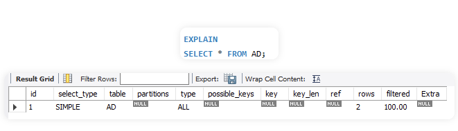
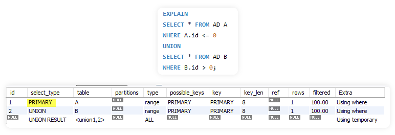
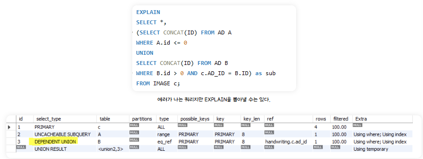

# 6.8 인덱스와 성능 최적화
# 6.8.4 쿼리 실행 계획 분석

</br>

# 쿼리 실행 계획 분석 : `EXPLAIN `

>실행 계획(Execution Plan)은 DBMS가 **SQL 쿼리를 어떻게 처리할지**에 대한 상세한 절차를 나타낸 정보이다.
>
>주로 `EXPLAIN`이나 `EXPLAIN ANALYZE` 명령어로 확인할 수 있으며, **쿼리 성능 최적화의 핵심 도구**이다.

## `EXPLAIN` 명령어란?
1. SQL 문 앞에 `EXPLAIN`을 붙여 실행
2. **DB 옵티마이저가 생성한 실행 계획을 확인**
3. **쿼리 실행은 되지 않음** (예: EXPLAIN SELECT ...)
4. 일부 DBMS는 EXPLAIN ANALYZE로 **실제 실행 시간**까지 측정 가능

## MySQL 기준 `EXPLAIN` 주요 칼럼
| 컬럼              | 의미                                       |
| --------------- | ---------------------------------------- |
| `id`            | 쿼리의 실행 단계 순서 (중첩 서브쿼리 등에서 사용)            |
| `select_type`   | SELECT의 타입 (SIMPLE, PRIMARY, SUBQUERY 등) |
| `table`         | 액세스 대상 테이블명                              |
| `type`          | **접근 방식** (access type) → 성능과 직결됨        |
| `possible_keys` | 사용할 수 있는 인덱스 목록                          |
| `key`           | 실제 선택된 인덱스                               |
| `key_len`       | 사용된 인덱스의 길이 (바이트)                        |
| `ref`           | 인덱스 탐색 시 사용된 컬럼 또는 상수                    |
| `rows`          | 읽을 것으로 예측되는 레코드 수                        |
| `Extra`         | 정렬, 임시 테이블, 커버링 인덱스 여부 등 부가 정보 (index 사용 여부, filesort 등)       |

### 🔶 id
- 각 실행 단계의 순서를 나타냄
- 동일 id는 병렬 혹은 조인된 서브 쿼리 단위로 묶임

### 🔶 select_type
- 쿼리 구조를 나타내는 유형 (예: SIMPLE, PRIMARY, SUBQUERY, DERIVED, UNION 등)

| 유형             | 의미                                       |
| --------------- | ---------------------------------------- |
| `SIMPLE`        | 서브쿼리나 유니온을 사용하지 않은 아주 단순한 쿼리|
| `PRIMARY`       | 유니온이나 서브쿼리가 포함된 쿼리에서 가장 바깥에 실행되는 쿼리|
| `UNION`         | 유니온 연산이 필요한 쿼리                             |
| `UNION RESULT`  | 유니온의 결과를 담아두는 테이블                      |
| `DEPENDENT UNION` | 바깥 쿼리에 의존성을 가지고 있는 유니온 쿼리          |
| `SUBQUERY`        | FROM 절 이외에서 사용되는 서브 쿼리   |
| `DERIVED`       | FROM 절에 사용되는 서브 쿼리 => 파생테이블     |
| `DEPENDENT SUBQUERY`    | 바깥 쿼리에 의존성을 가지고 있는 서브쿼리     |
| `UNCACHEABLE SUBQUERY`  |캐시를 사용하지 못하는 서브 쿼리  |
| `UNCACHEABLE UNION`     | 캐시를 사용하지 못하는 유니온 쿼리  |
  
</br>




</br>

### 🔶 table
- 현재 plan 단계에서 접근하는 테이블 이름
- 테이블 참조가 없는 경우 NULL 표시
- 예: `SELECT * FROM USER user; `는 table = user
    - 단순 `SELECT NOW();`는 table = NULL


### 🔶 type
- MySQL이 테이블을 어떤 방식으로 접근했는지 나타냄

| type     | 의미                                    | 성능       |
| -------- | ------------------------------------- | -------- |
| `system` | 단 1개 행만 있는 테이블                        | 🟢 최고    |
| `const`  | WHERE 절이 **PK = 상수**                  | 🟢 매우 좋음 |
| `eq_ref` | 조인에서 **PK 또는 Unique Key = 외래키**       | 🟢 매우 좋음 |
| `ref`    | 일반 인덱스 사용한 동등 조건                      | 🟡 좋음    |
| `range`  | 인덱스의 범위 조건 사용 (`BETWEEN`, `>`, `<` 등) | 🟡 좋음    |
| `index`  | 인덱스 전체 스캔 (Index Full Scan)           | 🔵 보통    |
| `ALL`    | 테이블 Full Scan                         | 🔴 매우 나쁨 |
  
- 📌 **성능 우선순위**: system > const > eq_ref > ref > range > index > ALL

### 🔶 key
- 실행 계획에서 실제 사용된 인덱스 이름
- 인덱스를 사용하지 못할 경우 NULL

### 🔶 key_len
- 해당 인덱스 키가 몇 바이트 사용되었는지 표시
- 복합 인덱스에서 각 컬럼별 사용 바이트까지 추론 가능

### 🔶 ref
- 인덱스 탐색 시 어떤 값을 사용했는지 (예: 상수 값, 다른 컬럼 등)
- func로 표시되면 타입 변환이 발생 → 성능에 영향 있을 수 있음

### 🔶 rows
- 옵티마이저가 예상한 레코드 검색 수
- 실제와 차이가 있을 수 있음
- `LIMIT` 사용 시도 지나치게 낮은 예상치가 나올 수 있으므로 주의

### 🔶 Extra
- 실행 동작에 대한 추가 설명 및 최적화 표시
- 주요 메시지:
    - `Using index`: **커버링 인덱스 사용**, 테이블 접근 없이 인덱스만으로 결과 반환
    - `Using filesort`: 정렬이 인덱스 없이 메모리 또는 디스크에서 수행됨 → 튜닝 필요
    - `Using temporary`: 임시 테이블 생성됨 → 성능 저하 가능
    - `Using index for group-by`: 인덱스를 이용한 GROUP BY 최적화
    - `Using join buffer`: 조인 버퍼를 이용한 연산
    - `Impossible WHERE`, `Impossible HAVING`, `no matching row`: 조건 자체가 성립 불가능할 때 표시됨
  
---
### 예시
```sql
EXPLAIN SELECT username FROM users WHERE age > 30;
```
| id | select\_type | table | type  | possible\_keys | key      | rows | Extra       |
| -- | ------------ | ----- | ----- | -------------- | -------- | ---- | ----------- |
| 1  | SIMPLE       | users | range | idx\_age       | idx\_age | 120  | Using where |
  

- `type = range`: 인덱스를 이용한 범위 조건 검색
- `key = idx_age`: age에 인덱스 사용
- `rows = 120`: 약 120개의 row를 읽을 것으로 예측
- `Extra = Using where`: WHERE 조건이 실제로 사용됨


### 실행 계획 해석 시 체크리스트
| 항목      | 질문                                                      |
| ------- | ------------------------------------------------------- |
| 사용 인덱스  | `key`에 적절한 인덱스가 선택되었는가?                                 |
| 접근 방식   | `type`이 `ALL`, `index` 등 성능 저하 요소는 아닌가?                 |
| 조건 필터링  | `Using where`는 필수지만, `Using temporary`, `filesort`는 피해야 |
| rows 수  | 너무 많은 row를 읽고 있진 않은가?                                   |
| 커버링 인덱스 | `Using index`로 Index Only Scan을 활용했는가?                  |


### 용어정리

| 용어               | 의미                           |
| ---------------- | ---------------------------- |
| Index Only Scan  | 인덱스만 보고 결과 반환 (테이블 접근 X)     |
| Index Range Scan | 조건절에서 인덱스의 범위 검색 사용          |
| Table Full Scan  | 테이블 전체를 순차 탐색                |
| Filesort         | 메모리나 디스크에 정렬 작업 수행           |
| Temporary Table  | 임시 테이블 생성 (JOIN, GROUP BY 등) |


</br>

출처 : [DB_실행계획분석](https://note-ydg.tistory.com/54)