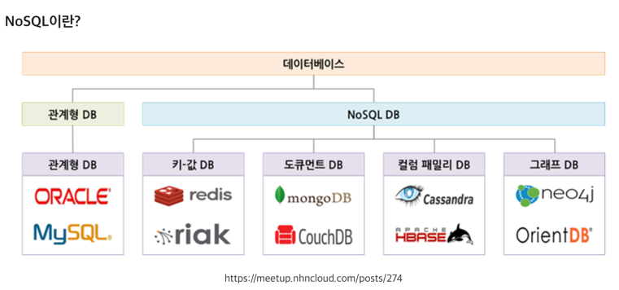

# NoSQL
> Not only SQL  
> (SQL을 사용하지 않는 데이터베이스)

- 비관계형 데이터베이스로, 관계형 데이터 모델(RDBMS)을 **지양**
- 관계형 데이터베이스의 한계를 극복하기 위한 새로운 데이터 저장 방식으로, **정해진 틀 없이 자유롭게 데이터를 저장**할 수 있음

## 1. NoSQL 특징

   1. RDBMS와 달리 데이터 간의 관계를 정의하지 않음 
      - RDBMS는 데이터 관계를 외래키 등으로 정의하고 `JOIN` 연산을 수행할 수 있지만, NoSQL은 `JOIN` 연산이 불가능

   2. RDBMS에 비해 대용량의 데이터를 저장
      - 페타바이트(PB)급의 대용량 데이터를 저장가능

   3. 분산형 구조
      - 여러 곳의 서버에 데이터를 분산 저장해 특정 서버에 장애가 발생했을 때도 데이터 유실 혹은 서비스 중지가 발생하지 않음
      - 대량의 분산된 데이터를 저장하고 조회
   

   4. 고정되지 않은 테이블 스키마를 갖음
      - RDBMS와 달리 테이블의 스키마가 유동적
      - 데이터를 저장하는 칼럼이 각기 다른 이름과 다른 데이터 타입을 갖는 것을 허용
      - 스키마 없이 사용 가능하거나 느슨한 스키마를 제공하는 저장소

## 2. NoSQL 장점
    
    1. RDBMS에 비해 저렴한 비용으로 분산처리와 병렬 처리 가능
    2. 비정형 테이터 구조 설계로 설계비용 감소
    3. Big Data 처리에 효과적
    4. 가변적 구조로 데이터 저장이 가능
    5. 데이터 모델의 유연한 변화가 가능

## 3. NoSQL 단점
    
    1. 데이터 업데이트 중 장애가 발생하면 데이터 손실 발생 가능
    2. 많은 인덱스를 사용하려면 충분한 메모리 필요(인덱스 구조가 메모리에 저장되기 때문)
    3. 데이터 일관성이 항상 보장되지 않음
        - 어떤 사용자가 데이터를 수정하면, 그 변경 사항이 모든 사용자에게 즉시 반영 되어야함
        - 하지만, NoSQL은 분산 저장하기 때문에 즉시 반영이 어려움

## 4. NoSQL의 4가지 타입

| 구분                         | 정의                                                                 | 특징                                     | 종류                     |
|----------------------------|----------------------------------------------------------------------|----------------------------------------|------------------------|
| 문서 저장소 (Document Store) | 데이터 및 메타데이터는 데이터베이스 내의 JSON 기반 문서에 계층적으로 저장됩니다. | 유연한 데이터 구조를 가질 수 있음            | MongoDB, CouchDB       |
| 키-값 저장소 (Key-Value Store) | NoSQL 데이터베이스 중 가장 간단하며, 데이터가 키-값 쌍 컬렉션으로 표시됩니다.     | 단순하고 빠른 읽기/쓰기가 가능               | Redis, Riak            |
| 열 지향 데이터베이스 (Wide-Column Store) | 관련 데이터가 단일 열 내부에 중첩 키/값 쌍 세트로 저장됩니다.                     | 대량의 데이터를 빠르게 처리할 수 있음        | Cassandra, HBase       |
| 그래프 저장소 (Graph Store) | 데이터가 그래프 구조에 노드, 에지 및 데이터 속성으로 저장됩니다.                  | 복잡한 관계를 가진 데이터를 저장하고 조회할 수 있음 | Neo4j, ArangoDB        |

--
[출처: 티스토리](https://adjh54.tistory.com/447)
