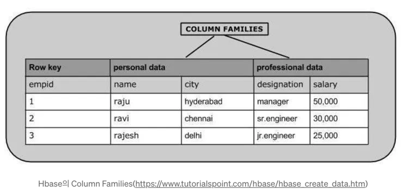

# Column Family(Cassandra, HBase)

## 1. Column Family Database란?
> 대용량 데이터, 읽기와 쓰기 성능, 고가용성을 위해 설계

### 1-1. 특징

    1. 관계형 DB와 유사한 용어 사용
        - Row, Column과 같은 RDBMS와 동일한 용어를 사용
        - 하지만 동작 방식은 다름 (정규화 대신 반정규화 구조 선호)
    
    2. 컬럼을 묶어 구성하는 구조
        - 관련된 컬럼들을 묶어 Column Family로 구성
        - 예:
            이름: first_name, last_name
            연락처: office_phone, mobile_phone
    
    3. 스키마 유연성
        - 사전 정의된 스키마 없이 데이터 입력 시 컬럼을 자유롭게 추가 가능
        - Document DB처럼 동적 컬럼 구성 가능

    4. 조인 미지원
        - RDB처럼 테이블 간 조인 기능이 없음
        - 대신 모든 관련 데이터를 하나의 Row에 저장 → 반정규화 구조

    5. Row 당 수많은 컬럼 가능
        - 한 Row에 수백~수백만 개의 컬럼 저장 가능
        - 이는 폭이 넓은 Row 구조를 의미함

    6. 대규모 분산 환경에 적합
        - 여러 대의 서버로 구성된 클러스터 기반 운영
        - 단일 서버로도 가능하지만, 데이터 규모가 작을 경우 Document/Key-Value DB가 더 적합

### 1-2. 활용

1. 데이터베이스에 쓰기 작업이 많은 애플리케이션
2. 지리적으로 여러 데이터 센터에 분산되어 있는 애플리케이션
3. 복제본 데이터가 단기적으로 불일치하더라도 큰 문제가 없는 애플리케이션
4. 동적 필드를 처리하는 애플리케이션
5. 수백만 테라바이트 정도의 대용량 데이터를 처리할 수 있는 애플리케이션

## 2. Cassandra
> Apache Cassandra는 대용량 데이터를 관리하기 위해 설계된 시스템으로 분산형 오픈소스 NoSQL Database

### 2-1. 특징
    1. CQL ( Cassandra Query Language )
        - SQL과 유사한 Query Interface
    2. 대용량 데이터가 여러 서버에 분산되고 분산된 데이터를 여러 서버에 복제
        - Cluster 중단 없이 수평 확장/축소 가능    
    3. 데이터 모델링은 query-driven 방식을 사용
        - Cassandra 사용 시 가장 중요한 부분
        - WHERE 조건은 Key 만 사용 가능
    4. 단순한 검색 조건으로 대량의 데이터를 검색하기에 적합

### 2-2. 장점

1. 분산화와 집중화
   - 카산드라는 분산형이므로 여러 머신에서 동작하지만, 사용자에게는 통합된 하나로 보인다. 
2. 탄력적인 확장성
   - 중단 없이 노드를 추가하거나 제거 가능 (수평 확장)
3. 고가용성과 결함 허용
   - 장애 노드 교체 시에도 서비스 중단 없음
   - 다중 데이터 센터 복제로 재해 복구 가능

### 2-3. 단점

1. 높은 진입장벽
2. 복잡한 조건의 검색 불가
   - 복잡한 쿼리 지원 부족
   - 조건 검색이 단순한 서비스에 적합
3. 데이터 입력시 자동화 처리가 어려움
   - 자동 트랜잭션/동시 갱신 처리가 어려움

## 3. HBase
> Apache HBase는 오픈소스 NoSQL 분산형 빅 데이터 저장소

> 대규모 실시간 읽기/쓰기에는 좋으나, 복잡한 트랜잭션 처리에는 적합하지 않음

### 3-1. 구조 및 특징
    - HBase 테이블에 데이터가 저장되며, 해당 테이블에 저장된 데이터는 HDFS Block으로 분할되어 클러스터의 여러 Node에 저장
    - 테이블은 rows / columns / column families로 구성
    - 모든 행에는 빠른 검색을 위한 Row Key가 포함(RDBMS의 primary key와 유사한 개념)
    - column은 테이블의 데이터를 보관하며, 특정 column family에 귀속되며, row의 해당 column에 데이터가 있는 경우에만 존재

### 3-2.장점

- 페타바이트 규모의 데이터에 엄격하게 일관되고 무작위의 실시간 액세스가 가능
- 크고 산재된 데이터 세트를 처리하는 데 매우 효과적

### 3-3. 단점
- 자체로는 SQL-Like Language를 제공하지 않아 JRuby 베이스의 HBase shell을 활용해서 쿼리해야 함.
- Java 기반이며 API 중심이로, 진입장벽이 높음
- 실시간 트랜잭션보다는 일괄처리에 강함
- 복잡한 쿼리, 조인, 집계에는 적합하지 않음

---
#### 용어

- Node : 개별 서버 
- Cluster : 작업을 수행하기 위해 여러 Node가 협업하는 그룹
- HFile : Disk 상에 정렬된 key - value로 row를 저장한다. 하나의 HFile은 여러 Block으로 이루어져 있으며 기본 Block의 size는 64KB. 이 size가 작을수록 random access 속도가 증가하며, size가 커질수록 Scan 성능이 향상

---
[참고: Column Family Database](https://jaemunbro.medium.com/nosql-%EB%8D%B0%EC%9D%B4%ED%84%B0%EB%B2%A0%EC%9D%B4%EC%8A%A4-%ED%8A%B9%EC%84%B1-%EB%B9%84%EA%B5%90-c9abe1b2838c)  
[참고 : Cassandra](https://coding-today.tistory.com/98)  
[참고 : Cassandra 장단점](https://goyunji.tistory.com/95)  
[참고 : Hbase](https://newstellar.tistory.com/5)