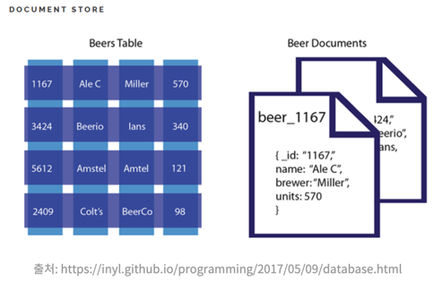

# Document Database : MongoDB

## 1. Document Database 란?

> 도큐먼트 데이터베이스는 애플리케이션 코드에서 사용하는 문서 모델과 동일한 형식으로 데이터를 저장

### 1-1. 특징
    
    1. 유연하고 반구조화된 계층형 JSON/XML/YAML 객체 형태로 데이터(다양한 데이터 저장 형식)를 관리
    2. 문서 단위로 저장되며, 각 문서는 고유 식별자를 가짐
    3. 콘텐츠 관리 시스템, 사용자 프로파일, 카탈로그 등 변동성이 큰 데이터 관리에 적합
    4. B트리 특성 때문에 자주 변하지 않는 정보를 저장하고 조회하는데 적합 (로그, 타임라인, 채팅로그 등)
### 1-2. 장점

1. 복잡한 계층형 데이터 구조 표현 가능
2. 문서 ID 및 속성값 기반 인덱스 생성 가능
3. 직관적이고 강력한 API 제공
4. Range 쿼리, 정렬(Sort), 조인(Join), 그룹화(Grouping) 지원
5. 스키마 없이 동적 컬럼 추가 및 변경 가능

### 1-3. 단점

1. 쿼리 처리 오버헤드
   - 데이터 파싱이 필요해 key-value DB 대비 비용 발생
2. B트리 인덱스를 사용하여 2차 인덱스를 생성 > B트리는 크기가 커질 수록 insert, delete의 성능이 떨어짐

    
## 2. MongoDB

> Binary JSON 형태 (BSON) 로 데이터가 저장되며 와이어드타이거 엔진이 기본 스토리지 엔진으로 장착된 키-값 데이터 모델에서 확장된 도큐먼트 기반의 데이터베이스

### 2-1. 특징
    1. JSON 을 통해 데이터에 접근가능
    2. 도큐먼트 생성 시, 다른 컬렉션에서 중복된 값을 지니기 힘든 유니크한 값(ObjectID) 생성

- 유닉스 시간 기반의 타임스탬프(4바이트), 랜덤 값(5바이트), 카운터(3바이트)

### 2-2. 장점
    
1. 확장성이 뛰어남
   - 빅데이터 저장할 때 성능이 좋고, 고가용성과 샤딩, 레플리카셋을 지원

2. 스키마를 정해놓지 않고 데이터 삽입 가능
   - 다양한 도메인 데이터베이스 기반으로 분석, 로깅 등을 구현할 때 강함

3. 비용이 많이 드는 join을 사용할 필요성을 줄임

### 2-3. 단점

1. SQL에 익숙한 개발자들의 러닝 커브(스키마의 유연함이 초보자에겐 어려움이 될 수 있음)
2. document당 16MB의 용량제한
4. 제한적인 트랜잭션 기능

---
[출처 : document Database](https://armful-log.tistory.com/56)  
[출처 : mongoDB](https://junuuu.tistory.com/949)