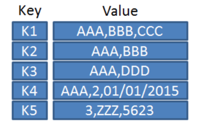
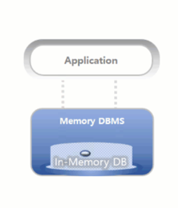

# Key-Value Store(Redis, DynamoDB)

## 1. Key-Value store 란?
> Key–Value DB는 연관 배열(Dictionary), Hash Map 개념에 기반한 NoSQL 데이터베이스의 한 종류 데이터를 고유한 키(Key)와 이에 대응하는 값(Value)의 쌍으로 저장하는 단순하면서 빠른 구조

###  1-1. 구조 및 개념

- 기본 단위 : Key-Value
  - 빠른 조회/ 저장 구조

- Key(K1, K2, ...)는 고유한 식별자 역할
- Value는 하나의 문자열/데이터 덩어리

###  1-2. 특징

    1. 단순한 저장구조를 가지며, 복잡한 조회 연산을 지원하지 않음(고속 읽기와 쓰기에 최적화된 경우가 많음)
    2. 메모리를 저장소로 쓰는 경우, 아주 빠른 get과 put을 지원
    3. 메모리 사용 효율적: 불필요한 placeholder 없이 데이터 저장

###  1-3. 종류

- Redis, Riak, DynamoDB, Voldemort

## 2. Redis

> Remote Dictionary Server

> Key-Value 형태로 데이터를 저장하고 데이터를 '인-메모리 데이터 저장소'에 저장하는 형태를 가지는 데이터베이스

###  2-1. 구조 및 개념

- 기본적인 데이터 타입: 문자열 (string) (최대 512MB 까지 저장)
- 지원 데이터 타입: 셋(set), 해시(hash), 정렬된 셋(sorted set) 등
- 활용 사례:
  - Pub/Sub 기능: 채팅 시스템 구현 
  - 캐싱 계층: 다른 DB 앞단에 위치해 빠른 접근 제공 
  - 세션 관리: 단순 키-값 기반 세션 데이터 저장 
  - 실시간 순위표: Sorted Set을 이용한 랭킹 기능 구현

    
### 2-2. 특징

    1. NoSQL 데이터베이스 중 하나이며 오픈소스 소프트웨어
    2. **‘인 메모리 데이터 저장소’**를 사용하기에 서버의 메인 메모리에 모든 데이터를 저장하므로, 디스크 I/O를 거치는 다른 데이터베이스 시스템보다 훨씬 빠른 성능을 보여줌
    3. 메모리에 저장되는 데이터 베이스는 디스크에 저장하여 휘발성으로 사용되는 데이터를 영구적으로 저장하는 기능을 제공하여 서버가 다운되더라도 데이터를 복구가능
    4. 주로 데이터베이스, 캐시, 메시지 브로커 등 다양한 용도로 사용될 수 있음

### 2-3. 인메모리 데이터 저장소

> 데이터를 디스크가 아닌 메모리에 저장하므로 디스크 접근 없이 매우 빠른 속도를 제공

- 적합한 사용 사례: 마이크로초 단위 응답이 필요한 게임, 에듀테크 등에서의 순위표, 세션 관리, 실시간 분석 등

- 서비스 예시:
  - Amazon MemoryDB for Redis: Redis 호환, 빠른 읽기/쓰기 지연, 높은 내구성 제공 
  - Amazon ElastiCache: Redis 및 Memcached 호환, 완전관리형 캐시 서비스 
  - DynamoDB Accelerator(DAX): DynamoDB의 읽기 성능을 크게 향상시키는 캐시

## 3. DynamoDB

> DynamoDB는 AWS에서 제공하는 서버리스 기반 Key-Value NoSQL 데이터베이스

### 3.1 특징
    
    1. 반정규화(NoSQL)
    2. HTTP로 통신한다
        - 다른 DB 리소스들은 TCP Connection 기반인데 비해, DynamoDB는 Connectionless
    3. 서버리스(Serverless)
        - 서버리스이기에 DynamoDB를 위한 별도의 서버가 존재하지 않음, 따라서 요청한 만큼만 비용을 지불
        - AWS Lambda 같은 다른 서버리스 기반 서비스와 좋은 시너지를 낼 수 있음
    4. key-value 데이터베이스

-- 
[출처: 위키피디아](https://ko.wikipedia.org/wiki/%ED%82%A4-%EA%B0%92_%EB%8D%B0%EC%9D%B4%ED%84%B0%EB%B2%A0%EC%9D%B4%EC%8A%A4)
[참고: AWS-인메모리데이터베이스](https://aws.amazon.com/ko/nosql/)
[참고: DynamoDB](https://yoo11052.tistory.com/174)
