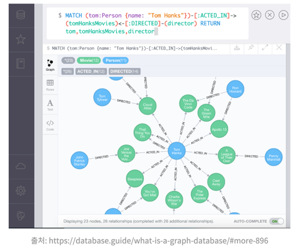

# Graph Database

## 1. Graph Database란?
> 노드, 엣지, 그리고 이들 사이의 관계를 이용하여 데이터를 저장하고 검색하는 데이터베이스 관리 시스템

- 데이터를 노드(파란색,녹색 원)로 표현하며 노드 사이의 관계를 엣지(화살표)로 표현

## 1-1. 특징
    1. 데이터는 노드(Node) 와 엣지(Edge) 형태로 저장되며, 각 엣지는 관계를 의미(관계를 중심으로 데이터를 모델링하고 저장)
    2. key/value store방식이며 모든 노드는 끊기지 않고 연결되어 있어야함
    3. relationship은 direction, type, start node, end node에 대한 속성등을 가짐
    4. 복잡한 조인 작업을 필요로 하는 다양한 쿼리를 간소화, 데이터 간의 연결성을 더 직관적으로 파악가능

1. 노드(node) : 추적 대상이 되는 사람, 기업, 계정 등 의 실체를 대표
2. 엣지(edge) : 그래프(graph)나 관계(relationship)이라고도 하며 노드를 다른 노드에 연결하는 선이며 관계를 표현
3. 프로퍼티(property) : 노드의 정보와 밀접한 관련 (예시 : 위키백과가 노드 중에 하나라면 위키백과의 어떠한 관점이 주어진 데이터베이스에 밀접한 관련이 있느냐에 따라 웹사이트, 참고 문헌, w로 시작하는 낱말과 같은 프로퍼티에 묶여있을 수 있음) 

> 노드는 프로퍼티(키-값 쌍)를 가지고 있으며 노드는 하나 이상의 레이블을 가질 수 있음

## 1-2. 유형

1. 속성 그래프(Property Graph)
   - 노드와 엣지 모두에 속성(키-밸류 쌍)을 가질 수 있는 구조
   - 각 엣지는 방향성을 가질 수 있으며, 두 노드 간 다중 관계를 표현가능
   - 금융 분석, 사기 탐지, 소셜 네트워크 분석, 복잡한 거래 네트워크의 관리 등 다양한 분야에서 활용

2. RDF(Resource Description Framework) 그래프
    - 웹의 데이터를 기술하기 위해 사용되는 표준 모델로, 데이터 간의 의미론적 관계를 표현
    - 데이터 통합, 지식 그래프 구축에 주로 사용
    - 데이터 통합, 세맨틱 웹, 기업 내 지식 관리 시스템에서 사용
   
## 1-2. 장점

1. 고성능
    - 데이터 간의 관계를 빠르게 탐색하여 연결된 데이터 포인트 간의 연결을 신속하게 찾아낼 수 있음

2. 직관적 
   - 복잡한 관계를 자연스럽게 표현
   - 노드(엔티티)와 엣지(관계)로 저장되어, 실제 세계에서 우리가 생각하는 방식을 반영

3. 향상된 맥락 인식
   - 데이터 상호작용의 미묘한 차이를 밝혀내는 것이 가능

## 1-3. 사용사례 
   - 사회 네트워크, 추천 시스템, 사기 감지, 경로 탐색 등 다양한 분야에서 중요한 의사결정을 지원하는 데 역할

## 2. Neo4j
> Neo4j Graph플랫폼은 Neo4j Databases에 그래프 접속을 할 수 있도록 도와주는 툴

- 세계에서 가장 널리 사용되는 그래프 데이터베이스

## 2-1. 특징
    
    1. 인덱스 없는 인접성(Index-Free Adjacency)
        - 노드 간 관계를 직접 연결하여, 인접 노드 탐색 시 빠른 조회 성능 제공
        - 통적인 인덱스 구조 없이도 그래프 확장성과 탐색 성능 우수
    
    2. Graph Engine
        - 디스크와 메모리 캐시를 함께 활용하여 성능 최적화
        - Cypher 쿼리 처리 및 데이터 저장을 위한 고성능 커널 레벨 엔진 제공
    
    3. 화이트보드 모델링
        - 관계형 데이터보다 직관적인 그래프 기반 모델링
        - 동료들과 협업 시 화이트보드에 그리듯 설계 가능
---
[참고 : Graph Database](https://medium.com/@kofsitho/ep-2-graphdb-%EC%82%AC%EC%9A%A9%ED%95%98%EA%B8%B0-feat-neo4j-1504bf3bdf57)  
[참고 : Neo4j](https://wikidocs.net/51746)