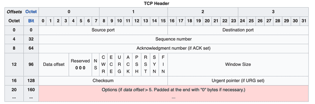
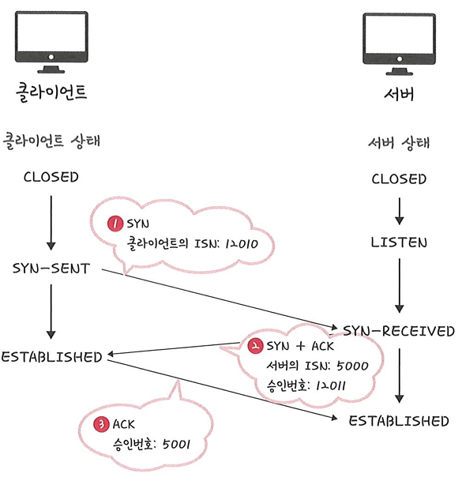
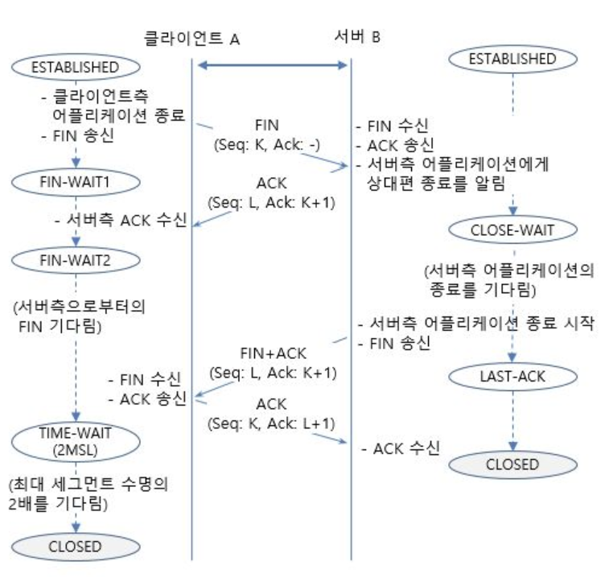

# 7.5 전송계층

# TCP(Transmission Control Protocol)
> OSI 7계층 기준 4계층(전송계층) 에서 동작하는 연결 지향, 신뢰성 보장, 바이트 스트림(Byte-stream) 전송 프로토콜

- **연결 지향**: 3-way handshake로 논리적 연결을 수립하고 4-way(통상)로 종료.
- **신뢰성**: 순서 보장(Sequencing), 재전송(Retransmission), 중복 제거(Dedup).
- **흐름 제어**(Flow control): 수신 측 버퍼(rwnd)에 맞춰 송신 속도 조절.
- **혼잡 제어**(Congestion control): 네트워크 혼잡을 감지/회피(cwnd).
- **전이중**(Full-duplex) 바이트 스트림: 메시지 경계가 없고 양방향 독립 전송.
- **에러 검출**: 강한 체크섬(의사헤더 포함)으로 무결성 검증.

# TCP 헤더 구조

- TCP 세그먼트는 (헤더 + 전송데이터)로 이루어져있으며 헤더의 최소 크기는 20바이트 최대 60바이트이다.

 

| 필드                        | 크기           | 설명                                                                                        |
| ------------------------- | ------------ | ----------------------------------------------------------------------------------------- |
| **Source Port**           | 16비트         | 송신 프로세스(소켓) 식별                                                                            |
| **Destination Port**      | 16비트         | 수신 프로세스(소켓) 식별                                                                            |
| **Sequence Number**(순서번호)       | 32비트         | - 바이트 스트림 상의 **첫 바이트 번호**    - 이를 통해 TCP에서 **신뢰성 및 흐름제어** 기능 제공    TCP 전송데이터의 바이트마다 순서번호 존재   - **ISN(Initial Sequence Number)** :    연결이 처음 맺어질 때 사용되는 시퀀스 번호의 시작 값. 즉, Sequence Number 필드에 들어가는 최초 값.      |
| **Acknowledgment Number**(응답 번호) | 32비트         | - 수신 측이 기대하는 **다음 바이트 번호**= 마지막 수신 성공 순서번호 + 1   - 누적 ACK                                             |
| **Data Offset**           | 4비트          | - TCP 헤더 길이(4바이트 단위). 옵션 포함 시 증가   - 세그먼트 시작 위치를 기준으로 데이터의 시작위치(=헤더의 크기)를 나타냄         |
| **Reserved (RSV)**        | 3비트          | 예약(항상 0, 향후 확장용)                                                                          |
| **Flags**                 | 9비트          | - 종류 : **CWR**, **ECE**, **URG**, **ACK**, **PSH**, **RST**, **SYN**, **FIN**   - TCP 세그먼트 전달과 관련되어 TCP 회선 및 데이터 관리 제어 기능을 하는 플래그   - **관계된 기능** : 흐름제어,연결설정,연결종료,연결리셋,데이터전송모드 |
| **Window Size**           | 16비트         | - 수신 윈도우(rwnd). **Window Scale 옵션**으로 확장 가능    - TCP 흐름제어를 위해 송신자에게 자신의 수신 버퍼 여유용량 크기를 지속적으로 통보   - 버퍼가 수신할 수 없게되면 필드 값을 0으로 지정해 송신프로세스에게 데이터를 수신할 수 없는 상태임을 알려줌                                  |
| **Checksum**              | 16비트         | - TCP 의사헤더(IP 출발지/목적지 포함) + 헤더 + 데이터의 1’s complement 합   - TCP 세그먼트에 포함된 헤더와 데이터의 변형을 검출하기 위해 사용              |
| **Urgent Pointer**        | 16비트         | URG 플래그 사용 시 긴급 데이터의 끝 위치(현대에선 거의 사용 안 함)                                                 |
| **Options**               | 가변(0\~40바이트) | 확장 기능: **MSS, Window Scale, SACK, Timestamp, MPTCP 등**                                    |

## TCP 헤더 플래그
> TCP 헤더에는 9개의 제어 비트(Flags)가 존재하며, 연결 수립/해제, 흐름 제어, 긴급 데이터 처리 등 다양한 역할을 수행.

---

### 1. 혼잡 제어 관련 플래그

* **CWR (Congestion Window Reduced)**

  * 송신 측이 **혼잡 윈도우(cwnd)** 를 줄였음을 알림 (ECN 사용 시).

* **ECE (ECN Echo)**

  * ECN(Explicit Congestion Notification) 사용 시,
    네트워크가 혼잡하다는 사실을 송신자에게 알림.

---

### 2. 데이터 전송 관련 플래그

* **URG (Urgent)**

  * **긴급 데이터(Urgent data)** 가 포함됨을 알림.
  * `Urgent Pointer` 필드가 유효해지며, 긴급 데이터의 마지막 바이트 위치를 가리킴.
  * 일반 데이터보다 우선적으로 처리됨.
  * 사용 예시: 텔넷(Telnet)에서 긴급 종료 키 입력 등.

* **ACK (Acknowledgement)**

  * **확인 응답 번호(Acknowledgment Number)** 필드가 유효함을 알림.
  * 1 → 확인번호 유효, 0 → 무시됨.
  * **SYN 교환 이후 전송되는 모든 TCP 세그먼트에는 반드시 ACK=1**.

* **PSH (Push)**

  * 수신 측에게 데이터를 **즉시 상위 애플리케이션에 전달**하라는 의미.
  * 버퍼가 차기를 기다리지 않고 곧바로 애플리케이션에 넘김.
  * 사용 예시:

    * Telnet 세션에서 `q` 입력 시 즉각 세션 종료 전달
    * 서버가 더 이상 보낼 데이터가 없음을 표시

---

### 3. 연결 관리 플래그

이하 3개는 TCP 연결의 생성과 종료에 **핵심적으로 사용**됩니다.

* **RST (Reset)**

  * 연결을 **강제로 초기화**.
  * 비정상 상태나 반-개방 연결, 포트 닫힘 등 문제 상황에서 송신됨.
  * 수신 측은 연결을 끊고 **CLOSED 상태**로 전이.

* **SYN (Synchronize)**

  * 연결 설정 시 **순서 번호(ISN) 동기화**.
  * **3-Way Handshake**에서 사용됨.

    * 연결 요청: `SYN=1, ACK=0`
    * 연결 허락: `SYN=1, ACK=1`
    * 연결 완료: `ACK=1`

* **FIN (Finish)**

  * 더 이상 보낼 데이터가 없음을 의미 → 연결 종료 요청.
  * **4-Way Handshake**에서 사용됨.

    * 종결 요청: `FIN=1`
    * 종결 응답: `FIN=1, ACK=1`

---

 

| 플래그     | 이름                        | 역할                           |
| ------- | ------------------------- | ---------------------------- |
| **CWR** | Congestion Window Reduced | 혼잡 윈도우를 줄였음을 알림              |
| **ECE** | ECN Echo                  | 네트워크 혼잡 신호 (ECN)             |
| **URG** | Urgent                    | 긴급 데이터 포함, Urgent Pointer 유효 |
| **ACK** | Acknowledgement           | Acknowledgment Number 유효     |
| **PSH** | Push                      | 데이터를 즉시 애플리케이션에 전달           |
| **RST** | Reset                     | 연결 강제 초기화                    |
| **SYN** | Synchronize               | 연결 시작, 순서 번호 동기화             |
| **FIN** | Finish                    | 연결 종료 요청                     |

---
# TCP 3-way Handshaking
> TCP 통신 쌍방 간에 처음으로 이루어지는 TCP 연결 설정 과정

## 🔹1단계 — **SYN (연결 요청, 초기 동기화 패킷)**

* **TCP 제어 플래그 비트**

  * SYN = 1
* **TCP 헤더 필드**

  * 순서번호(SEQ) = **ISN(클라이언트)**
  * ACK 번호, 윈도우 크기: 정의되지 않음
* **특징**
  * 클라이언트 측에서 접속 요청 메세지를 전송함.
  * 데이터는 전송하지 않지만, **순서번호 하나를 소비** (클라이언트의 ISN 송신)
  * 옵션: MSS(Maximum Segment Size) 포함
* **TCP 상태 전이**
  * **클라이언트**: `CLOSED` → **`SYN-SENT`**

---

### 🔹2단계 — **SYN+ACK (연결 허락)**

* **TCP 제어 플래그 비트**

  * SYN = 1, ACK = 1
* **TCP 헤더 필드**

  * 순서번호(SEQ) = **ISN(서버)**
  * 확인응답번호(ACK) = **클라이언트 ISN + 1**
  * 윈도우 크기: 정의됨
* **특징**
  * 접속 요청을 받은 서버가 요청을 수락, 접속 요청을 프로세스인 클라이언트 측도 **포트를 열어달라는 메세지 전송** (SYN + ACK)
  * 데이터는 전송하지 않지만, **순서번호 하나를 소비** (서버의 ISN 송신)
  * 옵션: MSS 포함
* **TCP 상태 전이**

  * **서버**: `LISTEN` → **`SYN-RECEIVED`**
  * 이 상태를 **Half-Open(절반 개방)** 상태라고 부름

---

### 🔹3딘계 — **ACK (연결 설정 완료)**

* **TCP 제어 플래그 비트 **

  * ACK = 1
  * (이미 연결 설정 중이므로 SYN 불필요)
* **TCP 헤더 필드**

  * 승인번호(ACK) = 서버 ISN + 1
  * 확인응답 번호: (이전 SYN+ACK의 승인번호 복사)
* **특징**
  * 마지막으로 접속 요청을 클라이언트가 수락 확인을 보내 연결을 맺음
  * 일반적으로 데이터 전송 없음
  * **순서번호 소비 없음**
  * 옵션 없음(비어 있음)
* **TCP 상태 전이**
  * 클라이언트: `SYN-SENT` → **`ESTABLISHED`**
  * 서버: `SYN-RECEIVED` → **`ESTABLISHED`**

---

> **❓ ISN (Initial Sequence Number)**
>
> * 초기 순서번호는 **랜덤 값**을 선택하여 전송
> * 상대방과 **순서번호 동기화**를 위해 사용
> * **TCP는 양방향**이므로, 클라이언트와 서버 각각 독립적인 ISN을 사용

---

## 3-Way Handshake의 주요 목적

1. **연결이 시작되었음을 서로 알리고, 옵션(MSS 등)을 교환**
2. **ISN(랜덤한 초기 순서번호)을 생성하고 교환하여 순서번호 동기화**

 

# TCP 4-way Handshaking
- 연결 종료는 양쪽 호스트 모두 먼저 시도할 수 있음.
- 편의를 위해 양 쪽 Host를 각각 클라이언트, 서버라고 부르고 설명.
    - 연결을 먼저 요청하는 Host ⇒ 클라이언트
    - 연결을 요청받는 Host ⇒ 서버
- 실제로 TCP는 양방향 통신이기에 ‘클라이언트-클라이언트’의 형태가 존재.
- 정상 종료인 경우, 양방향 2개 연결을 각 측이 독립적으로 닫음 => **4-way Handshaking**

 

> **❗TCP 연결 종료 구분** (참고용)
>
>  1. 정상 종료 (Normal Close)
>     - `4단계 핸드세이킹`에 의해 양방향 모두 종료되는 것
>     - 실제로는 자주 있는 경우가 아니고 반 종료 등이 오히려 일상적임
>
>  2. 반 종료 (Half Close)
>     - 양측이 동시에 회선 종료 않고, 한쪽 연결이 열린채로 놔두고 종료하는 것
>     - 즉, 송신은 가능하지만 수신은 불가능 또는 수신은 가능하지만 송신은 불가능
>
>  3. 동시 종료 (Simultaneous Close)
>     - 거의 동시에 양측에서 FIN 세그먼트를 보내는 경우
>
>  4. 강제 종료
>     - TCP Reset 요구(RESET 세그먼트) 기능

 

### 🔹1단계 — **FIN (클라이언트 종료 요청)**

* **TCP 제어 플래그**

  * FIN = 1
* **TCP 헤더 필드**

  * 순서번호(SEQ) = `K` (**마지막 전송 데이터 순서번호 + 1**)
  * 확인응답 번호(ACK) = 없음
* **특징**

  * 클라이언트가 능동적으로 연결 종료를 요청
  * 이때 클라이언트는 **`FIN-WAIT-1`** 상태로 전이

---

### 🔹2단계 — **ACK (서버 응답)**

* **TCP 제어 플래그**

  * ACK = 1
* **TCP 헤더 필드**

  * 순서번호(SEQ) = `L`
  * 확인응답 번호(ACK) = `K+1`
* **특징**

  * 서버는 클라이언트의 종료 요청(FIN)을 확인
  * 서버는 아직 데이터를 전송할 수 있음 (Half-Close 상태)
  * 서버는 **`CLOSE-WAIT`**, 클라이언트는 **`FIN-WAIT-2`** 상태

---

### 🔹3단계 — **FIN+ACK (서버 종료 알림)**

* **TCP 제어 플래그**

  * FIN = 1, ACK = 1
* **TCP 헤더 필드**

  * 순서번호(SEQ) = `L`
  * 확인응답 번호(ACK) = `K+1`
* **특징**

  * 서버가 자신도 연결 종료를 원함을 알림
  * 서버: `CLOSE-WAIT` → **`LAST-ACK`**
  * 클라이언트는 여전히 **`FIN-WAIT-2`** 상태

---

### 🔹4단계 — **ACK (클라이언트 최종 확인)**

* **TCP 제어 플래그**

  * ACK = 1
* **TCP 헤더 필드**

  * 순서번호(SEQ) = `K`
  * 확인응답 번호(ACK) = `L+1`
* **특징**

  * 클라이언트가 서버의 FIN을 확인
  * 클라이언트: `TIME-WAIT` 상태로 진입
  * 서버: 연결 종료 → **`CLOSED`**
  * 클라이언트는 `2MSL` 시간 동안 대기 후 **`CLOSED`**

 

> **❓연결을 그냥 닫으면 되지, 왜 `TIME_WAIT`(2MSL)이 있을까?**
>
> 1. **지연 패킷이 발생할 경우를 대비하기 위함**
>   - 패킷이 뒤늦게 도달하고 이를 처리하지 못하면 데이터 무결성 문제가 발생
> 2. **두 장치가 연결이 닫혔는지 확인하기 위함**
>   - 만약 `LAST-ACK` 상태에서 닫히게 되면 다시 새로운 연결을 하려고 할 때 장치는 줄곧 `LAST-ACK`로 되어있기 때문에 접속 오류가 나타날 수 있음.

---

## FIN 플래그와 순서번호 동작

* FIN 플래그가 설정된 세그먼트도 **데이터 1바이트 전송한 것처럼 순서번호를 하나 소비**.
* 따라서 종료 메시지에도 **SEQ, ACK 동기화**가 필요.

## 4-Way Handshake의 주요 목적

1. **양방향 독립적인 종료 보장**

   * TCP는 전이중 통신이므로, 송신/수신 채널을 각각 독립적으로 닫아야 함.
2. **데이터 무손실 종료 보장**

   * 한쪽이 FIN을 보낸 후에도, 다른 쪽은 남은 데이터를 모두 전송한 뒤 FIN을 보낼 수 있음.

 

---

### 3-way handshake 간단 흐름

* TCP/IP 프로토콜을 사용해 통신을 진행할 때, 두 종단간 정확한 데이터 전송 보장하기 위해 연결을 설정
* SYN (Synchronize Sequence Number)
* ACK (Acknowledgement)

1. **클라이언트 → 서버** : 서버 접속 요청 **SYN 패킷** 보냄
2. **서버 → 클라이언트** : 요청 수락 응답 **ACK 패킷**과 포트 열어달라는 **SYN 패킷** 보냄
3. **클라이언트 → 서버** : 확인 응답으로 **ACK 패킷** 보냄

---

### 4- way handshake 간단 흐름

* 연결 설정 해제함

1. **클라이언트 → 서버** : 연결 해제하겠다는 **FIN 패킷** 보냄
2. **서버 → 클라이언트** : 응답으로 **ACK 패킷** 보냄
3. **서버 → 클라이언트** : 처리해야 할 모든 통신 끝내고 연결 종료하겠다는 **FIN 패킷** 보냄
4. **클라이언트 → 서버** : 확인 응답으로 **ACK 패킷** 보냄
