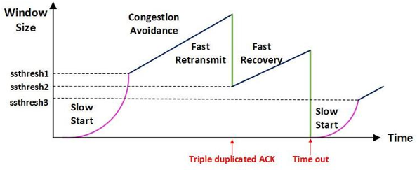

# 7.5 전송계층

# 흐름 제어(Flow Control)와 혼잡 제어(Congestion Control)
- **흐름 제어** (endsystem 대 endsystem)
    - 송신측과 수신측의 **데이터 처리 속도 차이**를 해결하기 위한 기법
        - 특히 송신 측의 속도가 빠른 경우
    - Flow Control은 receiver가 packet을 지나치게 많이 받지 않도록 조절하는 것
    - 기본 개념은 receiver가 sender에게 현재 자신의 상태를 feedback 한다는 점

- **혼잡제어**
    - **송신측의 데이터 전달과 네트워크의 데이터 처리 속도 차이**를 해결하기 위한 기법
    - 라우터(네트워크 계층)가 처리할 수 있는 양을 초과하면 큐가 차고 드롭이 발생. 송신자는 이를 **손실로 오인해 재전송을 늘려** 혼잡을 악화시키므로, 네트워크 수준의 전송 속도 제어가 필요

---
# 흐름제어 해결방법

## 1️⃣ stop and wait
> 매번 전송한 패킷에 대해 확인 응답(ACK)를 받으면 다음 패킷을 전송하는 방법

- 그러나, 패킷을 하나씩 보내기 때문에 비효율적인 방법


## 2️⃣ Sliding Window (Go-Back-N/Selective Repeat의 기반)
> 수신측에서 설정한 윈도우 크기만큼 송신측에서 확인응답(ACK) 없이 세그먼트를 전송할 수 있게 하여 데이터 흐름을 동적으로 조절하는 제어기법

</br>

> **❓윈도우?**
>
> **송신, 수신 스테이션 양쪽에서 만들어지는 TCP 버퍼의 크기**
> - 네트워크 통신을 수행할 때 송신 측은 버퍼에 TCP 세그먼트를 보관후 순차적으로 전송하며 수신 측은 도착한 TCP 세그먼트를 애플리케이션이 읽을 때까지 TCP 버퍼에 저장함.
> - 즉, 송/수신 과정에서 일시적으로 TCP 세그먼트를 보관하는 공간이 **TCP 버퍼이자 윈도우**
> - 윈도우 크기는 **ACK 신호를 보낼 때** TCP 헤더에 담아 보냄으로써 조절

- 수신자가 정한 윈도우 크기 내에서는 ACK 없이도 연속 전송 가능. ACK이 도착하면 윈도우를 앞으로 “슬라이드” 하여 다음 데이터를 보냄. 

- 윈도우 크기는 3-way handshake 시 협상된 값을 초기값으로 하고, 이후 수신 버퍼 여유에 따라 동적으로 변함(ACK에 실려 옴).


**동작 과정**
1. 최초로 수신자는 윈도우 사이즈를 7로 정한다.
2. 송신자는 수신자의 확인 응답(ACK)을 받기 전까지 데이터를 보낸다.
3. 수신자는 확인 응답(ACK)을 송신자에게 보내면, 슬라이딩 윈도우 사이즈을 충족할 수 있게끔 윈도우를 옆으로 옮긴다
4. 이후 데이터를 다 받을 때까지 위 과정을 반복한다.

## 3️⃣ 재전송 & 윈도우 업데이트
- 타임아웃 등으로 ACK이 지연되면 송신자는 재전송을 고려.
- 단, 손실이 아니라 수신측 버퍼 부족일 수도 있으므로 수신자는 최신 rwnd를 광고하여 송신 속도 조절을 유도
    - **rwnd (Receive Window)**: 수신자 버퍼 여유 공간
    - 송신자는 `보낸 데이터량 ≤ rwnd` 조건을 지켜야 함

</br>

---
# 혼잡제어 해결방법


## 1️⃣ AIMD (Additive Increse/Multicative Decrease)
> 처음에 패킷을 하나씩 보내고 이것이 문제없이 도착하면 window 크기(단위 시간 내에 보내는 패킷의 수)를 1씩 증가시켜가며 전송하는 방법


- 정상 전송(매 RTT)마다 `cwnd ← cwnd + 1 MSS` (선형 증가)
    - **cwnd** (Congestion Window): 송신자가 네트워크 혼잡을 고려해 자체 제한하는 윈도우
- 혼잡 신호 감지 시 `cwnd ← cwnd / 2` (곱 감소)

- 패킷 전송에 실패하거나 일정 시간을 넘으면 패킷의 보내는 속도를 절반으로 줄임.
- 공평한 방식으로, 여러 호스트가 한 네트워크를 공유하고 있으면 나중에 진입하는 쪽이 처음에는 불리하지만, 시간이 흐르면 평형상태로 수렴하게 되는 특징이 존재.
- 문제점
    - 초기에 네트워크의 높은 대역폭을 사용하지 못하여 **시간이 오래걸림.**
    - **네트워크가 혼잡해지는 상황을 미리 감지 못 함**: 네트워크가 혼잡해지고 나서야 대역폭을 줄임

## 2️⃣ Slow Start (느린 시작)
> Slow Start 방식은 AIMD와 마찬가지로 패킷을 하나씩 보내면서 시작하고,
>
> 패킷이 문제없이 도착하면 **각각의 ACK 패킷마다 window size를 1씩 늘려줌.**
>
> 즉, 한 주기가 지나면 window size가 2배가 됨.

- AIMD 방식이 네트워크의 수용량 주변에서는 효율적으로 작동하지만, 처음에 전송 속도를 올리는데 시간이 오래 걸리는 단점이 존재
- Slow Start는 윈도우의 크기를 1, 2, 4, 8, ...과 같이 지수적으로 증가시키다가 **혼잡이 감지되면 윈도우 크기를 1로 줄이는 방식**
- 처음에는 네트워크의 수용량을 예상할 수 있는 정보가 없지만, 한번 혼잡 현상이 발생하고 나면 네트워크의 수용량을 어느 정도 예상할 수 있음.

## 3️⃣ 빠른 재전송 (Fast Retransmit)
> 수신자가 **중복 ACK 3개**를 보내면(중간 손실 가정) 타임아웃을 기다리지 않고 즉시 재전송

- 패킷을 받는 수신자 입장에서는 세그먼트로 분할된 내용들이 순서대로 도착하지 않는 경우가 생길 수 있음
- 수신 측에서는 순서대로 잘 도착한 마지막 패킷의 다음 순번을 ACK 패킷에 실어서 보냄
    - -> **이런 중복 ACK를 3개 받으면 재전송**
- 송신 측은 자신이 설정한 타임 아웃 시간이 지나지 않았어도 바로 해당 패킷을 재전송할 수 있기 때문에 보다 빠른 재전송률을 유지

## 4️⃣ 빠른 회복 (Fast Recovery)
> 혼잡한 상태가 되면 window size를 1로 줄이지 않고 반으로 줄이고 선형증가시키는 방법
- 이 방법을 적용하면 혼잡 상황을 한 번 겪고나서부터는 AIMD 방식으로 동작

</br>

---
# 오류 제어
> TCP 통신 중 데이터가 유실되거나 잘못된 데이터가 수신되었을 경우 대처하는 제어 방식

- 흐름 제어와 혼잡 제어는 송신하는 패킷의 양을 조절하는 제어 기능이었다면, </br> **오류 제어는 패킷이 중간에 소실되었을 경우 소실된 패킷이 무엇인지를 파악한 뒤 해당 패킷을 재전송**하는 다른 성격을 가진 제어 방식

## TCP가 다루는 오류의 범위
- **비트 오류**(드물지만 존재) → 체크섬으로 검출
- **손실**(드롭/버퍼 오버플로) → 재전송으로 복구
- **중복 수신**(재전송/라우팅 이슈) → 시퀀스/ACK로 제거
- **순서 뒤바뀜**(reordering) → 수신 버퍼에 임시 보관 후 누적 ACK으로 정렬 보장

> TCP는 바이트 스트림을 순서/무중복/무손실로 복구하는 ARQ(Automatic Repeat reQuest) 계열의 신뢰 전송 프로토콜.

## 오류 검출 방식
1. **송신 측이 ACK 신호를 받지 못함**
    - 송신한 패킷이 통신 중 소실
    - 패킷이 정상적으로 처리되어 수신 측이 ACK 신호를 보냈지만 ACK 신호가 중간에 소실
2. **중복된 ACK를 받음**
    - 혼잡 제어 때 이를 활용
    - 동일한 ACK 번호를 가진 패킷을 3번 이상 받으면 패킷이 정상적으로 송신되지 않았다고 판단
3. **수신 측이 NAK 신호를 보냄**
    - TCP 헤더에 저장된 값으로 수신 측에서 특정 패킷이 도착하지 않았으므로 해당 패킷을 다시 보내달라고 NAK(또는 NACK)를 통해 요청하는 것
    - ACK 만으로도 오류 검출이 충분히 가능하기 때문에 잘 사용되지 않음

---

# 오류제어 해결방법

## 1️⃣ Stop and Wait ARQ
> 매번 전송한 패킷에 대해 확인 응답(ACK)를 받으면 다음 패킷을 전송하는 방법

- ACK 신호를 일정 시간이 지나도 받지 못하면 Timeout이 발생했다고 판단하여 오류가 발생했다고 인지
- 구현이 매우 간단하나, **한 번에 하나의 패킷만을 처리**해서 네트워크 활용도가 낮음.
- 대역폭이 클 경우, 효율성이 크게 떨어질 수 있음.

> **❓ARQ**
>
> - Automatic Repeat reQuest
> - ARQ는 전송되는 데이터의 정확성과 순서를 보장하는 역할을 하는 프로토콜

## 2️⃣ Go-Back-N ARQ(GBN)
> 연속으로 패킷을 보내다 오류가 발생했다고 판단되는 지점 이후의 모든 프레임을 재전송하는 오류 제어 방식


- 데이터를 연속적으로 보낸 후(슬라이딩 윈도우) 한 개의 ACK나 NACK만을 사용하여 수신 측의 처리 상황을 파악할 수 있음
- 에러가 발생함을 감지하면, 수신측은 Loss가 발생한 **이후의 모든 패킷을 폐기**
- 송신측에서 NACK을 받고 나면 다시 **이전 ACK 응답 받은 이후로** 데이터를 재전송
- 윈도우를 활용하여 **여러 패킷을 연속적**으로 보낼 수 있어 네트워크 활용도 향상
- 잘못된 패킷 하나 때문에 여러 패킷을 재전송 => 패킷 손실이 빈번히 일어나는 환경에서는 비효율절

## 3️⃣ Selective Repeat ARQ
> 선택적으로 '어떠한 부분을 받지 못했음'이라고 알리는 프로토콜


- **단점**
    - 수신 측의 버퍼에 쌓인 데이터가 연속적이지 않음
    - 순서와 상관없이 도착한 패킷들에 대해 항상 재정렬 해야함 => **연산량이 큼**
- **👉 재전송이 좀 더 이득인 상황에서는 Go Bank N 방식을, 재정렬이 좀 더 이득인 상황에서는 Selective Repeat 방식을 사용**


</br>

---
# TCP 재전송
> 오류(패킷 손실,지연,중복,순서역전 등)라고 믿어지는 즉, 확인응답되지 않은 데이터를 재전송

-  한편, `재전송`,`흐름제어`,`혼잡제어` 셋 모두가 함께 연관되므로 같이 고려되어야 함
     - 재전송이 흐름제어의 일부 기능이지만, 많아지면 오히려 혼잡을 악화시키는 등 


## RTT, RTO와 타임아웃 재전송

### RTT (Round Trip Time)

* **송신 → 수신 → ACK 회신까지 걸린 시간**
* RTT는 네트워크 상태에 따라 **가변적** → 고정값으로는 안 됨.

### RTO (Retransmission Timeout)

* **RTT 기반으로 계산한 재전송 타임아웃 시간**
* RTO 만료 시 → ACK 안 받은 세그먼트를 **모두 재전송**
* 공식(RFC 6298):

  ```
  SRTT = (1 - α) * SRTT + α * RTT_sample
  RTTVAR = (1 - β) * RTTVAR + β * |RTT_sample - SRTT|
  RTO = SRTT + max(G, K * RTTVAR)
  ```

  * SRTT: 가중 이동 평균 RTT
  * RTTVAR: RTT의 편차 추정
  * α ≈ 1/8, β ≈ 1/4, K=4
  * G: clock granularity

### Karn’s Algorithm

* **재전송된 세그먼트의 RTT 샘플은 무효**
  (어느 전송본에 대한 ACK인지 불명확하기 때문)
* **Exponential Backoff**: 타임아웃 발생 시 RTO × 2
  → 혼잡 완화, 네트워크 보호

---

## Fast Retransmit (빠른 재전송)

### 중복 ACK (dupACK)

* 손실 발생 시 수신측은 **같은 ACK 번호 반복**
* 송신측은 **3개의 dupACK** 수신 시, 손실로 판단

### Fast Retransmit

* **RTO 기다리지 않고** 누락된 세그먼트 즉시 재전송
* 지연 최소화, 신속한 복구

---

## Fast Recovery (빠른 회복)

* Fast Retransmit 후, 혼잡은 있지만 심각하지 않다고 가정
* **cwnd를 1로 리셋하지 않고 절반으로 줄임 → 선형 증가로 회복**
* **Reno** 방식: dupACK 동안 cwnd를 약간 inflate, 복구 ACK 오면 정상화
* **Tahoe**: cwnd=1로 리셋, 다시 Slow Start → 느림

---

## 선택적 재전송 (SACK, Selective Acknowledgment)

###  문제

* 누적 ACK 방식만으로는 **어디가 손실인지 명확히 알기 어려움**
* 다중 손실 시 비효율적 (불필요 재전송)

### SACK 옵션

* 수신측이 **받은 범위/빠진 범위**를 명시적으로 알려줌
* 송신측은 **정확히 빈 구간만 재전송**
* 대역폭 큰 링크, 다중 손실 상황에서 성능↑

### DSACK

* Duplicate SACK
* 중복 패킷을 수신했음을 알려주어, 송신측이 불필요 재전송을 감지

---

# 현대 TCP 재전송 기법 보완

### TLP (Tail Loss Probe)

* 스트림의 **마지막 구간 손실**은 dupACK가 나오기 어려움
* ACK이 오지 않을 때, **추가 probe 세그먼트**를 보내 손실 감지 유도

### RACK (Recent ACK)

* 최근 ACK 도착 시간을 이용해 **손실/재정렬 구분**
* **ACK가 늦게 오면 손실로 추정**, dupACK 의존 줄임
* Linux 최신 TCP 스택 기본 채택

---

## 7. 보조 타이머 (재전송 관련)

* **Persist Timer**: 수신측이 rwnd=0으로 막을 때 Deadlock 방지 (ZWP 보내 확인)
* **Keep-Alive Timer**: 유휴 연결 생존 확인
* **Delayed ACK Timer**: ACK를 묶어서 전송, 불필요한 ACK 폭주 방지 (단, 지연-재전송 상호작용 주의)

---

### TCP 재전송 기법

| 기법                  | 트리거         | 동작                | 특징            |
| ------------------- | ----------- | ----------------- | ------------- |
| **RTO 기반 재전송**      | 타이머 만료      | 미확인 세그먼트 재전송      | 보편적, 느림       |
| **Fast Retransmit** | dupACK ≥ 3  | 누락 세그먼트 즉시 재전송    | 빠름, 재정렬 오탐 가능 |
| **Fast Recovery**   | Fast Rtx 이후 | cwnd 절반 감소, 선형 증가 | Reno 효율↑      |
| **SACK**            | 옵션 협상       | 빈 구간만 선택 재전송      | 다중 손실에 강함     |
| **TLP**             | 꼬리 손실 의심    | probe 세그먼트 송신     | tail loss 대응  |
| **RACK**            | ACK 시간 기반   | 지연·손실 구분, 재전송     | 최신 리눅스 기본     |

