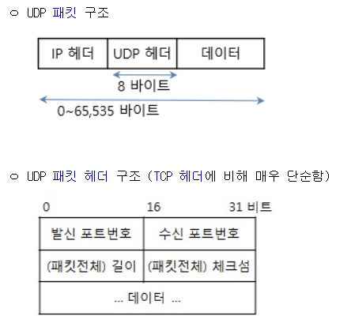

# 7.5 전송계층

# UDP ((User Datagram Protocol))
> TCP/IP 프로토콜 중 트랜스포트 계층의 통신 프로토콜의 하나.
> 신뢰성이 낮은 프로토콜로써, 완전성을 보증하지 않으나, 가상회선을 굳이 확립할 필요가 없고, 유연하며 실시간적 응용의 데이타 전송에 적합

- 전송 방식은 너무 단순해서 서비스의 신뢰성이 낮고, 데이터 그램 도착 순서가 바뀌거나, 중복되거나, 통보 없이 누락시키기도 함.
- UDP는 일반적으로 오류의 검사와 수정이 필요 없는 애플리케이션에서 수행할 것으로 가정

## 특징
- **비연결성** (Connectionless)
  - 연결 설정(Handshake) 필요 없음
  - 독립적인 Datagram 단위로 전송
- **신뢰성 없음** (Unreliable)
  - 전송 보장 X (ACK 없음)
  - 순서 보장 X (순서 번호 없음)
  - 흐름 제어 X
  - 오류 제어 최소화 (Checksum만 제공 → 나머진 애플리케이션 계층에서 처리해야 함)
- **속도**: 오버헤드가 적어 실시간 응용(VoIP, 스트리밍, DNS 등) 에 적합
- **단순성** (Simple): 헤더 길이가 고정 8바이트

좋습니다 👍 주신 내용을 바탕으로, **UDP 주요 특징**을 공부/정리용으로 깔끔하게 요약해드릴게요.

---

# UDP 주요 기능 및 특징

---

## 기본 특성

* **비연결성 (Connectionless)**

  * 연결 설정(Handshake) 필요 없음
  * 독립적인 **Datagram 단위**로 전송
* **신뢰성 없음 (Unreliable)**

  * 전송 보장 X (ACK 없음)
  * 순서 보장 X (순서 번호 없음)
  * 흐름 제어 X
  * 오류 제어 최소화 (Checksum만 제공 → 나머진 애플리케이션 계층에서 처리해야 함)

---

## 성능적 장점

* **실시간 응용에 적합**

  * 지연 적음, 빠른 요청-응답 구조
  * 예: RTP(Real-time Transport Protocol)
* **멀티캐스팅 지원**

  * 1:多 전송 가능 (여러 수신자에게 동시에 데이터 전달)
* **전송속도 제한 없음**

  * TCP처럼 혼잡 제어·흐름 제어에 얽매이지 않음 → 속도 ↑

---

## 단순한 헤더

* 고정 **8바이트 헤더** (TCP는 최소 20바이트)
* 필드: Source Port, Destination Port, Length, Checksum
* 단순 구조 → 처리 속도 빠름

---

## 데이터 단위

* UDP: **메시지(Message)**
* TCP: **세그먼트(Segment)**

---

## 최대 전송 크기

* **65,507 바이트**
  \= IP 패킷 최대(65,535) - IP 헤더(20) - UDP 헤더(8)

---

## 대표적인 활용 예시

* **애플리케이션 프로토콜**:

  * TFTP, SNMP, DHCP, NFS, DNS, RIP, NTP, RTP 등
* **응용 분야**:

  * 스트리밍, 온라인 게임, 화상 회의, 음성 통화(VoIP)

---

# UDP 포맷 구조
- 기본적으로, 1개 IP에 1개 UDP 만 수용

- 총 4개 필드, 각각 16비트(2바이트)
- 합계 = 8바이트

### Source Port (16비트)

- 송신 애플리케이션의 포트 번호
- 발신 측 프로세스를 식별
- 응답이 필요 없는 경우에는 **0으로 설정 가능**

### Destination Port (16비트)

- 수신 애플리케이션의 포트 번호
- 예: 53(DNS), 67/68(DHCP), 161(SNMP) 등

### Length (16비트)

- **UDP 헤더 + 데이터 총 길이** (바이트 단위)
- 최소값: 8 (헤더만 있을 경우)
- 최대값: 65,535 (IP 패킷 최대 크기와 동일)

### Checksum (16비트)

- **오류 검출용 필드**
- 계산 방식:
  - UDP 헤더 + 데이터 + **의사헤더(Pseudo Header: IP src/dst, 프로토콜, UDP length)**
- IPv4에서는 **0(미사용)도 허용**, IPv6에서는 필수

 

---

# TCP vs UDP 비교 정리표
| 구분            | **TCP (Transmission Control Protocol)**                                                           | **UDP (User Datagram Protocol)**                    |
| ------------- | ------------------------------------------------------------------------------------------------- | --------------------------------------------------- |
| **계층**        | OSI 7계층 **전송 계층**                                                                                 | OSI 7계층 **전송 계층**                                   |
| **연결 방식**     | 연결지향(Connection-oriented) → **3-way Handshake**로 연결 설정, **4-way Handshake**로 종료                | 비연결(Connectionless) → Handshake 없음               |
| **신뢰성**       | **신뢰성 보장** (무손실, 무중복, 순서 보장)                                                                      | **신뢰성 없음** (손실/중복/순서 뒤바뀜 허용)                        |
| **오류 제어**     | 체크섬 + SEQ/ACK 기반 **재전송(RTO, Fast Retransmit, SACK)**                                              | 체크섬만 제공 (IPv4에서는 선택, IPv6에서는 필수)                    |
| **흐름 제어**     | 지원 (**수신 윈도우, rwnd**)                                                                             | 없음                                                  |
| **혼잡 제어**     | 지원 (**cwnd, AIMD, Slow Start, Fast Rtx/Recovery**)                                                | 없음                                                  |
| **순서 보장**     | **Sequence Number + ACK**으로 순서 보장                                                                 | 없음 (순서 번호 필드 자체 없음)                                 |
| **데이터 단위**    | **세그먼트(Segment)**                                                                                 | **데이터그램(Datagram)**                                 |
| **헤더 크기**     | **최소 20바이트** (옵션 포함 시 가변)                                                                         | **8바이트 고정**                                         |
| **헤더 필드**     | Source Port, Dest Port, Seq, Ack, Offset, Flags(SYN/ACK/FIN 등), Window, Checksum, Urgent, Options | Source Port, Dest Port, Length, Checksum            |
| **속도**        | 느림 (연결 관리 + 제어 오버헤드)                                                                              | 빠름 (헤더 단순, 제어 없음)                                   |
| **전송 방식**     | **스트림(Stream)** 전송 → 바이트 단위로 연속적 전송                                                            | **메시지(Message)** 단위 전송 → 경계 유지                   |
| **최대 데이터 크기** | 이론상 4GB까지 가능(32bit SEQ) 실제는 MSS, 윈도우 크기에 따라 다름                                                 | 65,507바이트 (=65,535 - IP헤더20 - UDP헤더8)            |
| **멀티캐스팅**     | 직접 지원 X (멀티캐스트는 IP 레벨에서만)                                                                         | 직접 지원 O (1\:N 전송 가능)                                |
| **지연/실시간성**   | 상대적으로 지연 ↑ → 실시간성 낮음                                                                              | 지연 ↓ → 실시간성 요구 서비스 적합                               |
| **사용 예시**     | 웹(HTTP/HTTPS), 이메일(SMTP, IMAP, POP3), 파일 전송(FTP), 원격 접속(SSH, Telnet)                              | DNS, DHCP, TFTP, SNMP, NTP, RTP, 온라인 게임, 스트리밍, VoIP |
| **장점**        | 신뢰성, 순서 보장, 안정적 전송                                                                                | 속도 빠름, 오버헤드 적음, 실시간/멀티캐스트 가능                        |
| **단점**        | 오버헤드 큼, 지연 ↑, 속도 ↓                                                                                | 신뢰성 부족, 오류 제어/흐름 제어 없음                              |

- **📌TCP**: 느리지만 안전하고 정확 (웹, 이메일, 파일전송 등)

- **📌UDP**: 빠르지만 신뢰성 없음 (게임, 스트리밍, 실시간 통신 등)