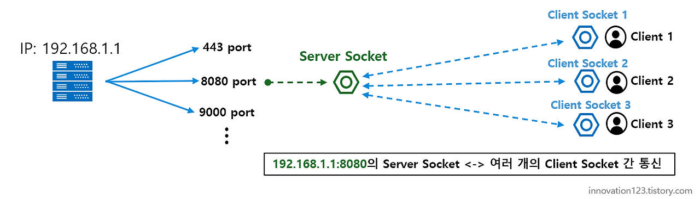
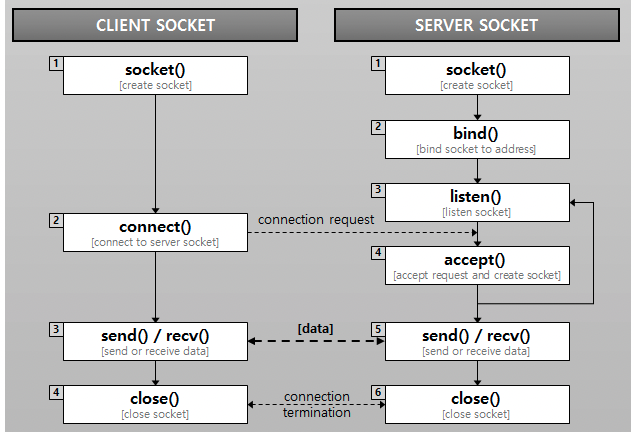

# 7.5 전송계층

# 포트 (Port)
> 운영체제 통신에서의 네트워크 연결이 시작되고 끝나는 논리적인 접속 지점

- 사실상, 포트는 컴퓨터 내의 프로세스를 구별/식별하는 수단임

## 1. 포트 번호
> 전송계층(TCP/UDP)에서 **프로세스를 식별하기 위한 16비트 논리적 주소**

- **IP 주소**가 "호스트"를 식별한다면, **포트 번호**는 "호스트 내 프로세스(응용 프로그램)"를 식별
- 이 포트 번호를, 패킷 내 UDP 헤더 또는 TCP 헤더 부분에, 포함시키게 됨
- 실제 통신은 `(IP 주소 + 포트 번호)` 조합으로 식별됨
- 포트 번호는 16비트의 논리적 할당으로 0~65536번까지 존재

## 2. 범위와 분류
- **IANA (Internet Assigned Numbers Authority)** 에 의해 관리

### 🟢 0번 ~ 1023번: well-known port
- **잘 알려진 서비스나 프로토콜을 위해 예약되어 있는 포트 번호**
- 공인 서비스용, 시스템에서 예약됨

| 포트 번호 | 프로토콜 | 통신 프로토콜 | 설명             |
|-----------|-----------|----------------|------------------|
| 80        | HTTP      | TCP            | 웹서버 접속      |
| 443       | HTTPS     | TCP            | 웹 서버 접속(SSL) |
| 22        | SSH       | TCP            | 원격 로그인      |
| 110       | POP3      | TCP            | 메일 읽기        |
| 25        | SMTP      | TCP            | 메일 전송        |
| 53        | DNS       | UDP            | DNS 질의         |
| 20        | FTP       | TCP            | 데이터 전송      |
| 21        | FTP       | TCP            | FTP 제어         |

- 웹 서버를 하나 더 사용하고 싶은 경우에는 관습적으로 8080 포트에 연결
  - Spring Boot 프로젝트를 띄우면 기본적으로 8080 포트를 사용하는 이유

### 🟢 1024번 ~ 49151번: Registered Port
- **특정 애플리케이션이나 벤더를 위해 등록**

| 포트 번호 | 설명                      |
|-----------|---------------------------|
| 8080      | 대체 HTTP 포트 (웹 서버)  |
| 5432      | PostgreSQL DB             |
| 3306      | MariaDB (MySQL)           |
| 6379      | Redis                     |
| 27017     | MongoDB                   |


### 🟢 49152번 ~ 65535번: Dynamic or Private Port
- **클라이언트 측에서 임시로(동적으로) 사용하는 포트**
- 클라이언트가 서버에 연결할 때 운영체제가 자동으로 할당

</br>

## 3. 역할: `Multiplexing & Demultiplexing`
- **Multiplexing (다중화)**
  - 송신 측 → 여러 애플리케이션 데이터가 전송계층을 공유할 수 있도록 각 포트 번호로 태깅

- **Demultiplexing (역다중화)**
  - 수신 측 → 수신된 세그먼트를 포트 번호를 기준으로 올바른 애플리케이션 프로세스에 전달

```
브라우저(포트 50000) → 서버(80)
게임 클라이언트(포트 50001) → 서버(27015)
→ 모두 같은 IP, 다른 포트로 구분됨
```

## 4. 포트 번호 충돌과 보안
- **충돌**: 하나의 포트에 두 프로세스가 동시에 바인딩 시도 불가
- **보안 이슈**: 포트 스캐닝(Port Scanning)을 통해 서비스 탐지 가능
- 따라서 서버는 불필요한 포트를 닫고, 방화벽에서 관리 필요


## 5. 포트와 소켓
 - IP와 Port가 정해지면, 이 두가지를 결합하여 소켓을 형성
    - 예) IP 주소 :  192.168.1.1, 포트 번호가 8080인 경우
        - 소켓 주소 :  192.168.1.1:8080


</br>

---

# 소켓 (Socket)
> 원격 및 동일 호스트 간 프로세스 대 프로세스 통신(IPC) 기능을 범용화시킨 추상적인 포트

- 네트워크 통신의 **종단점(Endpoint)**
- 통신 세션을 설정하고 데이터를 송수신 하는데에 사용
- 서버 측과 클라이언트 측 (양 끝단)에 소켓을 각각 생성하고, 해당 소켓 간에 통신을 하여 데이터를 송수신
- **서버측 소켓(ServerSocket)은 하나의 포트 당 하나만 생성**할 수 있고, **클라이언트 측 소켓은 여러 개를 생성**하여 하나의 ServerSocket과 통신하여 데이터를 주고받을 수 있음
- TCP/UDP 같은 전송계층 프로토콜 위에서 동작



## 1. 소켓 주소
> IP Address 및 Port Number 를 조합한 것
> `Socket address = IP Address + Port Number`

## 2. 소켓의 식별자
- 전송계층에서 소켓은 보통 **5-튜플**(5-tuple) 로 식별
- `<Source IP, Source Port, Destination IP, Destination Port, Transport Protocol>`
- 예시 (HTTP 요청)
  ```
  클라이언트: (192.168.0.10, 55000, 142.250.206.46, 80, TCP)
  서버: (142.250.206.46, 80, 192.168.0.10, 55000, TCP)
  ```

## 3. TCP 소켓 vs UDP 소켓
- 전달 주체(TCP,UDP)에 따라, TCP 소켓, UDP 소켓으로 다르게 식별

| 항목     | TCP 소켓                                          | UDP 소켓                               |
| ------ | ----------------------------------------------- | ------------------------------------ |
| 연결 방식  | 연결 지향 (3-way Handshake 후 생성)                    | 비연결 (Datagram 단위)                    |
| 데이터 단위 | 바이트 스트림 (Segment)                               | 메시지 (Datagram)                       |
| 신뢰성    | 신뢰성 보장 (SEQ/ACK, 재전송, 혼잡/흐름 제어)                 | 없음 (애플리케이션이 직접 처리해야 함)               |
| 식별자    | 5-튜플                                            | (IP, Port, UDP) 조합                   |
| 시스템 콜  | `socket()`, `connect()`, `listen()`, `accept()` | `socket()`, `sendto()`, `recvfrom()` |

## 4. 소켓 통신 (!= 웹 소켓)
- 소켓 통신은 TCP 통신, HTTP 통신에 비해 낮은 수준의 통신
- **클라이언트와 서버가 특정 포트를 통해 양방향 통신을 하는 방식**
- HTTP 처럼 데이터 전달 후 연결을 끊는 Connetionless 방식이 아닌, **계속해서 연결을 유지**하는 방식이기 때문에 HTTP에 비해 많은 리소스를 소모



### 서버 측 소켓
- 소켓 생성 `socket()`: 클라이언트의 연결 요청을 대기하기 위한 소켓 생성
- Binding(주소 할당): IP 주소와 Port 번호를 할당받는다.
- Listening: 연결되지 않은 소켓을 대기모드로 전환한다.
- accept(): 클라이언트가 연결 요청을 하면, 수락 후 실질적인 통신을 위한 소켓을 생성한다.
- 데이터 송수신: 연결이 설정되면, 클라이언트와 서버가 소켓을 통해 `send(), recv()`로 데이터를 주고받는다.
- 연결 종료: 소켓을 닫는다.

### 클라이언트 측 소켓
- 소켓 생성 `socket()`: 서버에 연결하기 위한 소켓을 생성
- 서버에 연결 `connect()`: 서버가 설정한 IP, Port로 연결을 시도한다.
- 서버가 accept()로 클라이언트의 요청을 수락하면 클라이언트의 socket descriptor가 반환되고 데이터를 송수신할 준비가 된다.
- 데이터 송수신: `send(), recv()`로 데이터를 주고받는다.
- 연결 종료: 소켓을 닫는다.

</br>

---

# 소켓 통신 vs TCP 통신 vs HTTP 통신
| 특징       | 소켓 통신                          | TCP 통신             | HTTP 통신                                    |
|------------|-----------------------------------|----------------------|---------------------------------------------|
| 통신 수준  | 네트워크 계층/전송 계층            | 전송 계층            | 애플리케이션 계층                           |
| 프로토콜   | TCP, UDP 등 다양한 프로토콜        | TCP                  | TCP 기반, HTTP/1.x, HTTP/2, HTTP/3          |
| 연결 방식  | 유연성 (연결 지향/비연결 지향)     | 연결 지향적          | 비연결성 (HTTP/1.x)<br>연결 유지 (HTTP/2, HTTP/3) |
| 신뢰성     | 사용자 정의                        | 신뢰성 보장          | TCP의 신뢰성에 의존                         |
| 데이터 형식| 사용자 정의                        | 스트림 기반          | 요청-응답 모델, 표준화된 메시지 형식        |
| 상태 관리  | 사용자 정의                        | 상태 유지            | 비연결성 (HTTP/1.x)<br>연결 유지 (HTTP/2, HTTP/3) |
| 사용 예시  | 다양한 네트워크 애플리케이션       | 파일 전송, 이메일, 원격 접속 등 | 웹 브라우징, API 통신, 웹 서비스 |
