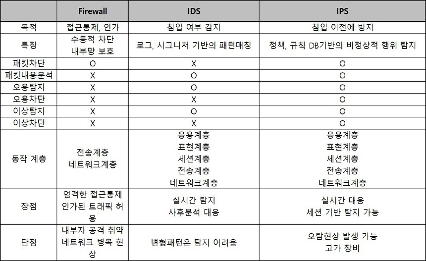

# 7.9 네트워크 보안

# 🧱 방화벽 (Firewall)
> 네트워크 내부와 외부 간의 트래픽을 필터링하여 보안 정책에 따라 허용하거나 차단하는 보안 장비. 네트워크 보안의 1차 방어선으로 사용됨.

## 특징
- **설치 위치**: 외부망과 내부망의 연결통로
- **외부 공격 차단**: 해킹, 악성 코드, 무단 접근 등 외부 위협으로부터 네트워크를 보호
- **접근 제어**: 승인된 사용자나 IP, 포트만 접근이 가능하도록 설정
- **프록시를 통한 접근통제**: 제한된 서버 등 만을 허용함으로써, 네트워크 외부로부터 내부 위치를 감추는 등의 효과를 줌
- **트래픽 모니터링 및 로깅**: 들어오고 나가는 트래픽을 기록하여 보안 분석에 활용
- **내부 정보 유출 방지**: 내부에서 외부로 나가는 민감한 데이터 흐름을 제어
- **보안 정책의 일관된 적용**: 네트워크 전반에 걸쳐 통일된 보안 규칙을 적용

## 고려해야할 점
- **정책 설정의 복잡성**: 잘못된 룰 설정 시 정상 트래픽도 차단할 수 있고 보안적으로 취약점이 생길 수 있음
- **성능 저하 가능성**: 트래픽 검사로 인해 지연이나 속도 저하가 발생할 수 있음
- **암호화된 트래픽 처리 한계**: HTTPS와 같은 암호화된 트래픽 내부까지 분석하기 어렵움
- **단일 장비 의존 위험**: 방화벽 하나만으로 모든 보안을 담당하게 될 경우, 공격에 대한 방어 실패 시 전체 네트워크가 위험해질 수 있음
- **정기적인 업데이트 필요**: 새로운 공격 방식이나 취약점에 대비해 방화벽 소프트웨어 및 룰 업데이트는 필수

## 유형 및 기술
| 종류                             | 설명                                                                   |
| ------------------------------ | -------------------------------------------------------------------- |
| 패킷 필터링 (Packet Filtering)      | IP 주소, 포트 번호, 프로토콜 등 패킷 헤더 정보 기반으로 필터링. 속도 빠르지만 애플리케이션 계층 공격 탐지 어려움. |
| 상태 기반 검사 (Stateful Inspection) | 세션 정보를 추적하여 상태 기반의 트래픽 제어 가능. TCP 연결의 상태를 고려. 더 정교한 검사 가능.           |
| 애플리케이션 게이트웨이 (Proxy Firewall)  | 응용 계층에서 트래픽 중계 및 필터링. 웹, 메일 등 특정 서비스 단위로 제어 가능. 보안성 뛰어나지만 성능 저하 우려.  |

 

---

# 침입 탐지 시스템 (IDS: Intrusion Detection System)
> 시스템이나 네트워크를 모니터링하여 비정상적이거나 악의적인 활동을 탐지하는 보안 시스템.
> ‘탐지’에만 집중하며 차단은 수행하지 않음.

## 침입 탐지 시스템 구분
### 호스트 기반 (HIDS : Host-based IDS)
- 내부 로그 파일, 시스템 콜, 사용자 행동 등의 **시스템 내부 활동을 모니터링**하는 데 중점.
- 일반적으로 **개별 워크스테이션이나 서버에 설치**.
- **OS 수준의 사용자 활동** 감시 가능 (로그인, 파일 접근, 설정 변경 등).
- 네트워크 트래픽은 직접 탐지하지 못함.
- 공격자가 이미 시스템에 침투한 이후의 행동(트로이목마, 백도어 등)을 탐지하는 데 유리.
- 대표 예시: `Tripwire`, `OSSEC`, `AIDE` 등.

### 네트워크 기반 (NIDS : Network-based IDS)
- **네트워크 트래픽을 실시간으로 모니터링**하여 패턴 분석 및 침입 탐지.
- 보통 **무차별(promiscuous) 모드**의 NIC(Network Interface Card)에 설치되어 **지나는 모든 트래픽 수집 가능.**
- 네트워크 상의 악성 활동 탐지(스캔, 포트 스캐닝, DoS 등)에 효과적.
- 감지기는 **스위치의 미러 포트(SPAN 포트)**나 **탭(TAP)**을 통해 트래픽 수집.
- 암호화된 트래픽 분석은 어려움 (SSL/TLS 등).
- 공격 성공 여부 자체는 알 수 없음 → 호스트 내부 반응까지는 감지 불가.
- 대표 예시: `Snort`, `Suricata`, `Bro/Zeek` 등.

 

| 항목    | HIDS                 | NIDS                 |
| ----- | -------------------- | -------------------- |
| 설치 위치 | 호스트(서버/PC) 내부        | 네트워크 외부 (스위치, 라우터 등) |
| 감시 대상 | 파일, 로그, 프로세스 등 내부 정보 | 네트워크 트래픽             |
| 탐지 범위 | 침투 후 내부 이상행위         | 침투 시도 등 외부 트래픽 기반 공격 |
| 장점    | 상세한 내부 정보 감지 가능      | 광범위한 네트워크 모니터링 가능    |
| 단점    | 네트워크 전반 감시 불가        | 내부 시스템 상태는 알 수 없음    |
| 탐지 예시 | 트로이목마, 루트킷 등         | 포트 스캐닝, DDoS, 웜 유포 등 |

 

## IDS와 방화벽의 차이
- 어플리케이션 계층에서 단순 필터링 보다는 **심화된 분석을 수행**한다는 점
    - 통상, 방화벽은 단지 IP 주소 및 포트 번호 만으로 차단 여부를 결정함
- 또한, 수동적이어서 차단 보다는 탐지하고 이를 알려주는데에 촛점을 맞춤

 

---
# 침입 방지 시스템 (IPS: Intrusion Prevention System)
> IDS의 기능 + 실시간 차단 기능이 결합된 시스템. 비정상적 트래픽 탐지 후 자동으로 차단함.

- 공격탐지를 뛰어넘어 탐지된 공격에 대한 웹 연결 등을 **적극적으로 막아주는 솔루션**
- 침입탐지 기능을 수행하는 모듈이 패킷을 일일히 검사하여 해당 패턴을 분석한 후, 정상적인 패킷이 아니면 **방화벽 기능을 가진 모듈로 차단**
- 일반적으로 **IPS는 방화벽 내부에** 설치 (방화벽과 연동하여 공격을 탐지할 수 있기 때문)

 

