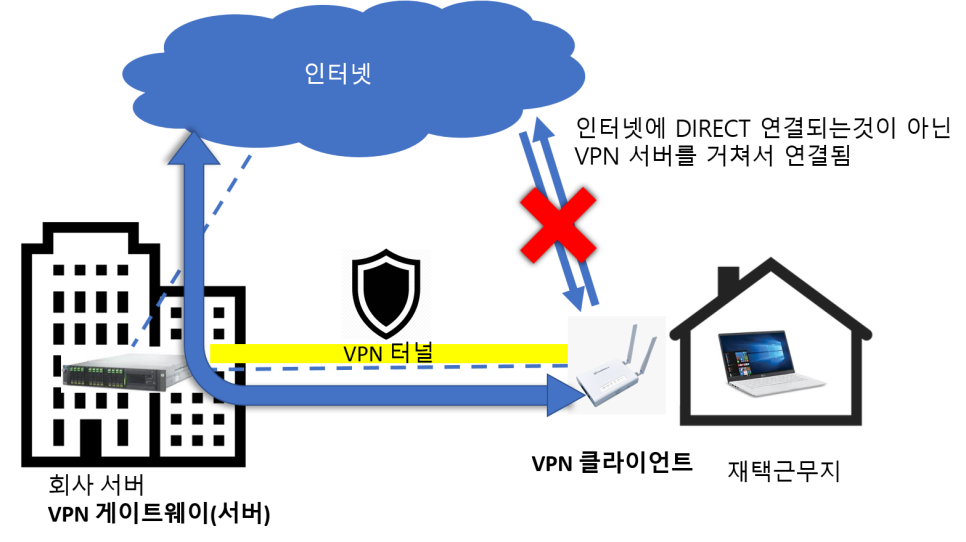
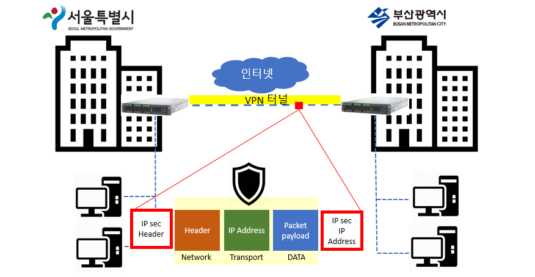
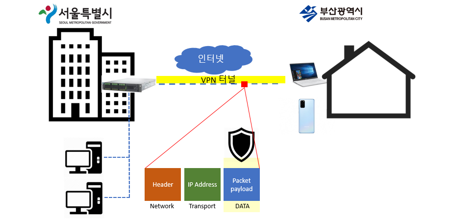

# 7.9 네트워크 보안

# VPN(Virtual Private Network)
> 공중망(주로,인터넷)을 통해 가상으로 구현된(확장시킨) 사설 네트워크

- 네트워크 망을 암호화해서 다른 지역에서도 인터넷으로 사설망을 안전하게 접근할 수 있게 하는 기술
- 공중망을 마치 확장된 전용 사설망 처럼 사용
- 공중망을 통해 사적인 트래픽을 비교적 안전하게 통과시키게 됨

## 주요 목적
- **보안성 확보**: 암호화로 인해 데이터 도청 및 변조 방지
- **원격 접속**: 외부에서 회사 내부망 접근 가능
- **IP 우회**: 지역 제한 콘텐츠 우회 및 프라이버시 보호
- **네트워크 확장성**: 지사 간 통신 시 사설망처럼 구성 가능
- **익명성**: VPN 서버를 통해 사용자의 **IP 주소를 숨길** 수 있어 익명성 보장

## 작동원리
1. VPN 클라이언트 프로그램을 통해 **VPN 서버**에 접속
2. 클라이언트와 서버 간 **암호화된 터널**이 생성되어 데이터가 안전하게 전송
3. 터널 내부의 데이터는 암호화 되어있어 중간에 가로채기 어려움

## VPN의 장단점

### 장점

* **IP 주소 마스킹으로 온라인 프라이버시 강화**

  * 실제 IP를 숨겨 익명성을 확보하고 추적을 방지함

* **공용 Wi‑Fi에서도 안전한 접속 보장**

  * 데이터 암호화를 통해 도청 방지 및 보안 유지

* **지리적 제한 콘텐츠 우회 가능**

  * 스트리밍, 서비스 지역 제한을 VPN 서버 위치 변경으로 회피

* **ISP의 대역폭 제한(Throttling) 회피**

  * 트래픽을 암호화해 패턴을 숨기므로 ISP의 속도 제한 회피

* **원격 근무 및 외부 접속 시 보안성 확보**
  * 외부에서 사내 시스템/애플리케이션에 안전하게 접근 가능

* **검열 및 감시 회피**

  * VPN이 IP 및 트래픽을 숨겨 인터넷 자유를 실현

---

### 단점

* **속도 저하 (Latency 증가)**

  * 암호화 및 경유 서버 경로로 인해 인터넷 속도 감소 가능

* **신뢰성 문제 — 무료 VPN의 데이터 수집 및 판매**

  * 일부 VPN은 사용자의 데이터를 수집하거나 제3자에 판매할 수 있음

* **VPN 업체의 로그 정책에 따른 개인정보 노출 가능성**

  * VPN 제공자가 트래픽 로그를 저장하면 익명성 보장이 어려워짐

* **국가에 따라 VPN 사용이 불법인 경우 존재**

  * 중국, 러시아 등 일부 국가는 VPN 사용을 제한하거나 금지함

* **비용 문제**

  * 프리미엄 VPN은 매달 비용 발생 (월 약 \$10 수준)

* **VPN만으로는 완전한 보안 보장 불가**

  * 악성코드, 피싱, 로그 기록 등 다른 위협은 별도의 대응 필요

## VPN 종류(유형)
**주요 터널링 프로토콜**

| 프로토콜                                         | 특징                             |
| -------------------------------------------- | ------------------------------ |
| **PPTP** (Point-to-Point Tunneling Protocol) | 빠르나 보안 취약 (구버전 Windows 사용)     |
| **L2TP/IPsec**                               | 보안성 높음. UDP 포트 500 사용          |
| **OpenVPN**                                  | **오픈소스** 기반. SSL 사용. 방화벽 우회 가능 |
| **IKEv2/IPsec**                              | 모바일 친화적. 빠른 재접속 지원             |
| **SSL VPN**                                  | 웹 기반 접속에 유리. 포트 443 사용         |

> **❓터널링**
> 공용 네트워크(인터넷)를 통해 **사설 데이터를 안전하게 전송**하기 위해, **기존 프로토콜 내부에 다른 프로토콜을 캡슐화하여 전송**하는 방식
>
> - 원래는 IP 패킷(내부망 데이터)이 그냥 전송되면 도청, 변조 위험이 있음
> - 그래서 IP 패킷을 **암호화**하고, 이를 **다른 외부 IP 패킷에 실어서** 전송 => `터널링`
> ➡️ 터널링 = 캡슐화(encapsulation) + 암호화 + 안전한 경로 설정

 

---
# IPSec VPN
> IP 계층(네트워크 계층)에서 작동하는 보안 프로토콜로, 네트워크 계층의 모든 트래픽을 보호

- VPN 게이트웨이(서버) 장비 2개를 서로 연결함으로써 네트워크와 네트워크를 연결하는 VPN
- Site-to-Site VPN이나 고정 사무실 간의 보안 연결에 사용
- 보안성이 부족한 기존 IP 프로토콜을 보완하기 위한 보안 기술
- 기존 IPv4에서는 보안이 필요한 경우에만 선택적으로 사용되었지만, IPv6에서는 기본 스펙
- **IPsec VPN터널을 통해 이동하는 패킷은 헤더, IP주소, 데이터 부분이 모두 암호화 처리되어 전달**

## 구조
- 크게 세 가지 주요 프로토콜로 구성

| 구성요소                                     | 설명                     |
| ---------------------------------------- | ---------------------- |
| **AH (Authentication Header)**           | - 무결성, 인증 제공. **암호화는 하지 않음**   - 데이터 패킷이 신뢰할 수 있는 소스에서 왔으며 데이터 변조 확인을 보장 |
| **ESP (Encapsulating Security Payload)** | - 무결성 + 인증 + 암호화까지 제공   - 페이로드란 암호화된 데이터가 저장되는 공간    - 전송모드를 사용하지 않는 한 패킷의 IP 헤더와 페이로드를 암호화  |
| **SA (Security Association)** | - 키 협상 및 알고리즘에 사용되는 프로토콜의 집합   - 보안 프로토콜 각각에 대한 보안 매개변수를 정의하며 보안 방법을 관리   |

## 동작 모드

### 전송(Transport) 모드
- **데이터 패킷의 페이로드만 암호화하고 IP 헤더를 원래 형식으로 유지.**
- **End-to-End 통신** (주로 클라이언트-서버)
- 암호화되지 않은 패킷 헤더를 통해 라우터는 각 데이터 **패킷의 대상 주소를 식별**할 수 있음
- 두 컴퓨터 간의 직접 연결을 보호하는 경우처럼, **가깝고 신뢰할 수 있는 네트워크**에서 사용

### 터널(Tunnel) 모드
- **전체 원본 IP 패킷이 캡슐화**되어 새 IP 패킷의 페이로드가 됨.
- **Gateway-to-Gateway 통신** (Site-to-Site VPN)
- **권한이 없는 당사자로부터의 데이터 보호를 강화**하므로, 퍼블릭 네트워크의 데이터를 전송하는 데 적합
- 컴퓨터가 페이로드와 헤더를 포함한 모든 데이터를 암호화하고, 데이터에 새 헤더를 추가

### 참고) 사용 알고리즘
- 암호화: AES, 3DES
- 무결성: HMAC-SHA1, HMAC-SHA256
- 키 교환: Diffie-Hellman (IKEv1/IKEv2 사용)
- 인증: Pre-shared key(PSK) 또는 디지털 인증서 (X.509)

 

> **❓왜 네트워크 계층에서 동작할까?**
>
> - **모든 애플리케이션의 트래픽을 암호화** 가능
> - TCP/UDP뿐 아니라 ICMP, OSPF 같은 **비애플리케이션 트래픽**도 보호 가능
> - 하지만 **세션 단위 통제가 어렵고**, 클라이언트 환경 설정 복잡함

 

---
# SSL VPN
> TLS(Transport Layer Security) 기반으로 암호화된 통신을 제공하는 VPN 방식

- 주로 **웹 브라우저를 통해 접속 가능**
- 사용자 친화적이고, **원격 접속**에 적합
- VPN 장비가 하나만 있으면 되기 때문에 IPsec VPN에 비해 저비용
- OSI 7계층 중 6계층인 **표면 계층**에서 동작 (TCP 프로토콜 사용)
- SSL VPN은 **TCP 포트 443**을 사용하며, 이는 HTTPS와 동일하여 **방화벽 우회가 쉬움**

- SSL VPN터널을 통해 이동하는 패킷은 **데이터 부분만 암호화** 처리되어 전달
- 나머지 부분은 일반적인 TCP 프로토콜을 통해 동신하는 데이터처럼 통신

## 구성
- 클라이언트: 웹 브라우저 또는 경량 클라이언트
- 서버: SSL VPN 게이트웨이 (접속 인증, 트래픽 암호화)

### 참고) 사용 알고리즘
- TLS 1.2/1.3 프로토콜 사용
- **비대칭키(공개키 기반)**로 세션 키 교환 → 이후 대칭키로 데이터 암호화
- 알고리즘: RSA, ECDSA, AES-GCM, ChaCha20 등

 

---

### 🔐 IPSec VPN vs SSL VPN

| 항목          | **IPSec VPN**                                                                        | **SSL VPN**                                 |
| ----------- | ------------------------------------------------------------------------------------ | ------------------------------------------- |
| **정의**      | IP 계층에서 보안을 제공하는 **인터넷 프로토콜 보안 (IPSec)** 기반의 VPN                                     | 웹 브라우저를 기반으로 한 **SSL/TLS 암호화** 통신을 사용하는 VPN |
| **작동 계층**   | OSI 3계층 (Network Layer)                                                              | OSI 7계층 (Application Layer)                 |
| **접속 방식**   | 전용 VPN 클라이언트 필수                                                                      | 웹 브라우저만으로도 가능 (클라이언트 설치 불필요)                |
| **보안 프로토콜** | AH (Authentication Header), ESP (Encapsulating Security Payload), IKE (Key Exchange) | SSL/TLS (HTTPS 기반 암호화)                      |
| **터널링 방식**  | 전체 트래픽 (All IP packets) 암호화                                                          | 선택적 애플리케이션(웹/메일 등) 트래픽만 암호화                 |
| **사용 예시**   | 기업 내부망 전체 접속 (전체 IP대역, 내부 시스템)                                                       | 재택근무, 웹메일, CRM 등 웹 앱 기반 시스템 접속              |
| **인증 방식**   | 주로 사전 공유 키(PSK) 또는 인증서 기반                                                            | 인증서, 2FA, OTP, SSO 등 다양하게 지원                |
| **방화벽 우회**  | 방화벽에서 포트(UDP 500, ESP) 열어야 함 → 방화벽에 의해 막힐 수 있음                                       | HTTPS 포트(443) 사용 → 방화벽 우회 쉬움                |

 

---

## ✅ IPSec VPN 장단점

### ✅ 장점

* **전체 트래픽 보호**: 모든 네트워크 트래픽을 암호화해 안전하게 보호함
* **고성능, 고신뢰성**: 기업 전용망처럼 **정적이고 고정된 연결**에 적합
* **IP 필터링 가능**: 특정 서브넷/IP에 대해 접속 제어 가능
* **모든 애플리케이션 지원**: 웹이 아니더라도 모든 내부 자원에 접근 가능

### ❌ 단점

* **방화벽과 NAT traversal 어려움**: IP/ESP 포트 차단 시 연결 실패 위험
* **VPN 클라이언트 필요**: 전용 설정 및 소프트웨어 필요
* **유연성이 떨어짐**: BYOD 환경, 모바일 환경에 부적합
* **설정이 복잡**: 키 교환, 보안 정책, 인증서 등 복잡한 설정 필요

---

## ✅ SSL VPN 장단점

### ✅ 장점

* **브라우저 기반 사용 가능**: 추가 소프트웨어 없이 HTTPS만으로 접속
* **유연하고 모바일 친화적**: 임시 사용자, 외부 근무자, 다양한 디바이스에 적합
* **방화벽 우회 가능**: HTTPS 포트(443)를 사용하므로 거의 모든 환경에서 접속 가능
* **세분화된 접근제어**: 특정 앱/포트/서비스에만 접근 허용 가능

### ❌ 단점

* **웹 중심 제한**: 웹 기반 리소스 외에는 기본적으로 접근 불가 (전체 네트워크 접근 불가능)
* **전체 트래픽 보호 어려움**: IP 전체 터널링은 복잡하며 기본적으로는 일부 트래픽만 보호
* **보안 취약 가능성**: 브라우저 환경 특성상 **피싱/스크립트 공격** 취약점 발생 우려
* **세션 관리**: 클라이언트 없이 구현할 경우, 세션 유지를 위한 별도 관리 필요

---

## 📌 언제 어떤 VPN을 선택해야 하나?

| 상황                              | 적합한 VPN   |
| ------------------------------- | --------- |
| 사내 모든 내부 시스템에 접근 필요             | IPSec VPN |
| 외부 협력자, 모바일 사용자의 웹 기반 접근        | SSL VPN   |
| 강력한 터널 보안과 전체 IP 암호화 필요         | IPSec VPN |
| 유연성, 빠른 구축, 사용자 편의성 중요          | SSL VPN   |
| BYOD (Bring Your Own Device) 환경 | SSL VPN   |
