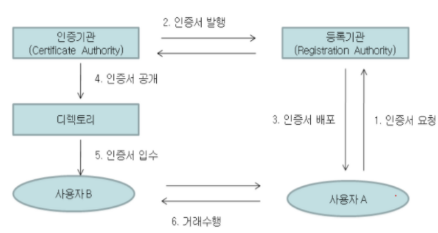

# 7.9 네트워크 보안

# 암호화와 디지털 인증서

---
# 암호화

## 🔄️ 대칭키 암호화 (Symmetric Key Encryption)
> **하나의 키**로 데이터를 암호화하고 복호화하는 방식

* 송신자와 수신자가 **같은 키를 공유**해야 함
  - 보안적으로 문제가 됨(키 배송 문제)
  - 키 배송 문제 : 사전에 키를 공유하지 않으면 암호화/복호화 불가
      - : 중간에 탈취 당하면 데이터의 정보 보안이 되지 않음

### 대표 알고리즘

| 알고리즘                                   | 설명                            |
| -------------------------------------- | ----------------------------- |
| **AES** (Advanced Encryption Standard) | 128/192/256-bit 블록 암호, 빠르고 안전 |
| **DES** (Data Encryption Standard)     | 56-bit 키, 현재는 보안에 취약          |

### 특징

* 암호화/복호화 속도 **빠름**
* 키 분배가 **어려움** (Key Distribution Problem)

### 장단점

| 장점           | 단점                                        |
| ------------ | ----------------------------------------- |
| 연산 속도가 빠름    | 키 관리 문제: 키가 유출되면 보안 실패                    |
| 알고리즘 구조가 간단함 | 사용자 수 증가 시 키 수가 급증 (n명 간 n(n-1)/2개의 키 필요) |

---

## 🔀 비대칭키(공개키) 암호화 (Asymmetric Key Encryption)

>  **공개키(Public Key)** 와 **개인키(Private Key)** 를 사용하는 암호 방식

* **공개키로 암호화**, 개인키로 복호화 (or 개인키로 서명, 공개키로 검증)
- 공개키는 공유, 개인키는 생성자만 소유
- **중간자 공격의 위험** (암호키 교환에 개입하여 암호화에 사용되는 키를 빼낼 수 있음)
  - → 인증서를 이용한 SSL/TLS라는 인터넷 통신 암호화 방식을 통해 해결
- 배포하는 곳에서 비밀키까지 유출시킬 위험
  - → 제 3의 인증기관 CA에 인증서를 요구

### 대표 알고리즘

| 알고리즘                                  | 설명                       |
| ------------------------------------- | ------------------------ |
| **RSA**                               | 소인수분해의 어려움 기반, 암호화와 전자서명 |
| **ECC** (Elliptic Curve Cryptography) | 타원곡선 기반, 낮은 연산량에 높은 보안성  |

### 특징

* 키 분배 문제 해결
* 암호화/복호화 속도 느림 (대칭키보다 느림)

### 장단점

| 장점                 | 단점                |
| ------------------ | ----------------- |
| 키 분배가 안전함 (공개키 배포) | 연산 복잡도 높음, 속도 느림  |
| 전자서명 가능            | 키 길이 커지면 속도 저하 발생 |

</br>

---

## 해시 함수 (Hash Function), 해싱
> 임의 길이의 데이터를 고정 길이로 **매핑**하는 함수

* **일방향성**(복호화 불가), 충돌 최소화가 핵심
- 주로 데이터 무결성(=파일이 수정되었는지) 확인이 필요한 데이터를 저장하는 용도로 사용

### 대표 알고리즘

| 알고리즘                         | 설명                    |
| ---------------------------- | --------------------- |
| **SHA-2 (SHA-256, SHA-512)** | 현재 가장 널리 쓰임           |
| **MD5**                      | 충돌 발생 가능성 ↑ → 보안성 약화됨 |

### 주요 특징

* 입력이 같으면 항상 출력 동일 (Deterministic)
* 출력 길이는 고정
* 무결성 보장 → 데이터 위변조 여부 확인 가능

### 장단점

| 장점            | 단점                   |
| ------------- | -------------------- |
| 무결성 확인에 탁월    | 해시 충돌이 발생할 수 있음      |
| 일방향성 → 복호화 불가 | 최신 해시 알고리즘 아니면 보안 취약 |

### 해싱이 필요한 곳
- 비밀번호 저장
- 데이터 무결성 검사
- 디지털 서명

</br>

> **❗해싱 VS 암호화**
>
> - **해싱**은 원본 데이터를 되돌릴 필요가 없고 **데이터 무결성**이 더 중요할 때 사용
> - **암호화**는 **민감한 데이터를 보호**하고 필요할 때 **다시 복구**해야될 때 사용

</br>

---
# 디지털 인증서 (Digital Certificate)
> 공개키와 소유자의 신원을 **제3자인 CA가 보증한 전자 문서**

- 공개키가 진짜 누구의 것인지 신뢰성 확보
- X.509 형식의 구조화된 파일 => **CA가 발급**

### 디지털 인증서 포맷
| 필드                      | 설명                              |
| ----------------------- | ------------------------------- |
| **Subject**             | 인증서 소유자 정보 (CN, OU, O, C 등)     |
| **Issuer**              | 인증서 발급자(CA) 정보                  |
| **Public Key**          | 공개키 자체                          |
| **Valid From / To**     | 유효 기간                           |
| **Signature Algorithm** | 디지털 서명 알고리즘 (ex. SHA-256 + RSA) |
| **Digital Signature**   | 발급자(CA)의 개인키로 서명한 값             |

</br>

---

## 🏛️ PKI (공개키 기반 구조, Public Key Infrastructure)
> 디지털 인증서를 기반으로 공개키를 안전하게 관리하는 **인증 인프라**

- 공개키 암호 기술이 현실에서 안전하게 작동하도록 만들어놓은 인프라(시스템 전체)
* 사용자 신원과 공개키의 정합성 보장



### 구성 요소

| 구성 요소                           | 설명                              |
| ------------------------------- | ------------------------------- |
| **CA** (인증기관)                   | 인증서를 발급하는 핵심 기관                 |
| **RA** (Registration Authority) | 인증 전에 **사용자 확인** 담당             |
| **디지털 인증서**                     | CA가 발급한 전자 문서 (공개키+서명+기타 정보 포함) |
| **CRL** / **OCSP**              | 폐지된 인증서 목록 or 실시간 검증            |
| **사용자/서버/클라이언트**                | 인증서를 사용하는 주체                    |


### 인증서 발급 절차

1. 사용자 → 공개키로 **CSR(Certificate Signing Request)** 생성
2. RA가 사용자 정보 확인
3. CA가 디지털 인증서 발급 (서명 포함)
4. 사용자 인증서 사용 시작

### 인증서 구조 (X.509)

* 버전, 일련번호
* 발급자 정보 (Issuer)
* 사용자 정보 (Subject)
* 공개키, 유효기간
* 서명 알고리즘 및 서명값

### PKI의 목적
- **공개키가 진짜 누구 것인지 보장**
- **전자서명과 암호 통신**이 가능한 신뢰 체계 제공

---

## 🔐 CA (Certificate Authority, 인증기관)
> **디지털 인증서의 발급 및 관리 주체**로, 사용자와 서버 간의 신뢰를 구축하는 데 핵심적인 역할

- 공개키가 진짜 해당 사용자에게 속해 있다는 것을 검증해서 인증서로 보증해주는 기관

### 역할
| 기능                   | 설명                                   |
| -------------------- | ------------------------------------ |
| **인증서 발급 (Issue)**   | 인증 요청을 검토하고, 공개키에 디지털 서명한 인증서를 발급    |
| **인증서 갱신 (Renewal)** | 인증서 만료 전에 사용자 요청에 따라 재발급             |
| **인증서 폐지 (Revoke)**  | 유출/탈취/만료된 인증서를 **CRL/OCSP**로 등록해 무효화 |
| **서명 확인**            | 사용자가 받은 인증서가 위조되지 않았는지 확인하는 데 사용됨    |

### 인증서 발급 과정
1. 사용자: 키 쌍 생성 (공개키, 개인키)
2. 사용자 → CA: CSR (인증서 서명 요청, Certificate Signing Request) 전송
3. CA → 사용자 신원 검증 (RA가 담당할 수도 있음)
4. CA: 사용자 공개키 + 사용자 정보에 디지털 서명
5. CA → 사용자: 인증서 발급 (X.509 인증서)

> **❓CSR(Certificate Signing Request)**
>
> - 공개키 + 식별자 정보 + 서명으로 구성된 요청
> - 사용자가 CA에 인증서 발급을 요청할 때 보내는 문서

### CA의 계층 구조 (신뢰 체계)

```
[ 루트 CA ]  ← 브라우저/OS에 저장된 최고 권위
     ↓
[ 중간 CA ] ← 루트 CA가 서명한 인증서로 운영
     ↓
[ 최종 엔티티 인증서 ] ← 실제 사용자/서버 인증서
```

1. **루트 CA**
  - **브라우저나 OS에 사전 신뢰된 형태로 탑재**됨
  - 직접 발급하면 보안 위험이 커서 거의 하지 않음

2. **중간 CA**
  - 루트 CA로부터 인증받은 **하위 기관**
  - 실제 인증서 발급 담당 (보안 책임 분산 목적)

3. **최종 인증서**
  - 사용자가 실제로 발급받은 인증서

### 예시
- Let's Encrypt (무료)
- DigiCert, Sectigo, GlobalSign 등 (상용)

</br>

> **❓브라우저는 어떻게 사이트를 믿을까?**
>
> 1. 사용자가 https://example.com 접속
> 2. 서버는 **SSL 인증서**를 브라우저에게 전달
> 3. 브라우저는 그 인증서의 **서명자(CA)**가 자신이 **신뢰하는 루트 CA 체계**에 포함돼 있는지 확인
> 4. ✅ 신뢰 체계에 포함되었다면, HTTPS 연결을 수립함

</br>

---

## 5. 디지털 서명 (Digital Signature)

### 📌 정의

* 전자 문서의 **무결성과 송신자 인증**을 위한 서명
* **비대칭키 기반**: 개인키로 서명, 공개키로 검증

### 🔁 동작 원리

```plaintext
1. 송신자: 메시지 → 해시 → 개인키로 서명 생성
2. 수신자: 메시지 → 해시 → 공개키로 서명 검증
3. 해시값 비교 → 일치 여부 판단
```

### 📌 사용 목적

* 위변조 방지
* 송신자 인증
* 부인방지 (non-repudiation)

### 🔍 장단점

| 장점                | 단점                 |
| ----------------- | ------------------ |
| 송신자 인증, 위변조 방지 가능 | 복잡한 연산 과정          |
| 부인방지 기능 제공        | 인증서 신뢰 체계 필요 (PKI) |

---

## 6. 암호화 기술 비교 요약

| 항목      | 대칭키       | 비대칭키       | 해시 함수  | 디지털 서명       |
| ------- | --------- | ---------- | ------ | ------------ |
| 키 종류    | 하나 (공통 키) | 공개키/개인키    | 없음     | 공개키/개인키      |
| 속도      | 빠름        | 느림         | 매우 빠름  | 느림           |
| 복호화 가능성 | 가능        | 가능         | 불가능    | 불가능          |
| 주요 목적   | 데이터 암호화   | 안전한 통신, 서명 | 무결성 확인 | 송신자 인증, 부인방지 |
