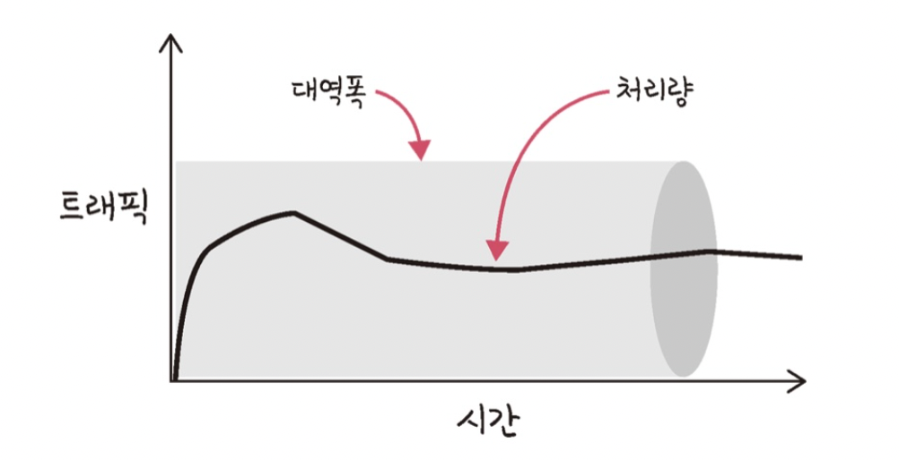

# 7.10 성능과 최적화

# 네트워크 성능 지표
> 데이터 통신의 품질과 효율성을 평가하기 위한 기준
> 시스템 병목 현상 분석, 최적화 전략 수립, 트러블슈팅에 중요한 지표로 사용

- '좋은' 네트워크란, **많은 처리량**을 처리할 수 있고, **지연 시간이 짧고** 장애 빈도가 적으며 좋은 보안을 갖춘 네트워크

</br>

| 성능 지표                     | 정의                      | 단위                   | 설명                    |
| ------------------------- | ----------------------- | -------------------- | --------------------- |
| **대역폭 (Bandwidth)**       | 링크가 전송할 수 있는 최대 용량      | bps (bit per second) | 초당 몇 비트를 보낼 수 있는지 나타냄 |
| **지연시간 (Latency, Delay)** | 데이터가 도착지에 도달하는 데 걸리는 시간 | ms                   | 여러 요소로 구성됨            |
| **처리량 (Throughput)**      | 실제로 전송된 데이터 양           | bps                  | 대역폭 대비 실사용량           |
| **지터 (Jitter)**           | 패킷 도착 간 시간의 변화량         | ms                   | 실시간 통신 품질에 영향         |
| **패킷 손실률 (Packet Loss)**  | 전송 중 손실된 패킷 비율          | %                    | 혼잡, 장애로 인한 데이터 유실     |

</br>

---
# 지연시간(Latency)
> 요청이 처리되는 시간
>어떤 메시지가 두 장치 사이를 **왕복하는 데** 걸린 시간

- 매체 타입(무선, 유선), 패킷 크기, 라우터의 패킷 처리 시간에 영향을 받음

### 지연시간 구성요소

| 구성 요소                          | 설명                                          |
| ------------------------------ | ------------------------------------------- |
| **처리 지연 (Processing Delay)**   | 라우터/호스트에서 헤더 처리 및 경로 결정 시간                  |
| **대기 지연 (Queuing Delay)**      | 전송 대기 중 대기열에서 기다리는 시간                       |
| **전송 지연 (Transmission Delay)** | 데이터를 비트로 변환하여 링크에 올리는 시간<br>(= 패킷 크기 / 전송률) |
| **전파 지연 (Propagation Delay)**  | 전기 신호가 매체를 따라 전파되는 시간<br>(= 거리 / 전파 속도)     |

> ⏱️ 전체 지연 = 처리 + 대기 + 전송 + 전파 지연

### 지연시간 최적화 방법

1. **네트워크 인프라 개선**: 고속 라우터와 스위치를 사용하고, 네트워크 장비의 성능을 높임.

2. **CDN(Content Delivery Network) 활용**: 전 세계적으로 분산된 서버를 통해 사용자와 가까운 위치에서 데이터를 제공하여 지연시간을 줄임.

3. **데이터 전송 경로 최적화**: 불필요한 홉을 줄이고, 가장 효율적인 경로를 선택하여 데이터 전송 속도를 높임.

4. **QoS(Quality of Service) 설정**: 중요 데이터 패킷에 우선 순위를 부여하여 지연시간을 최소화.

5. **주기적인 성능 모니터링**: 지연시간을 지속적으로 모니터링하고, 문제 발생 시 즉각 대응할 수 있는 시스템을 구축.

---


# 처리량(Throughput)
> 링크 내에서 성공적으로 전달된 데이터의 양을 말하며 보통 얼만큼의 트래픽을 처리했는지 나타냄



- 처리량은
  - 사용자들이 많이 접속할 때마다 커지는 트래픽
  - 네트워크 장치 간의 대역폭
  - 네트워크 중간에 발생하는 에러
  - 장치의 하드웨어 스펙
에 영향을 받음

# 대역폭(Bandwidth)
> 주어진 시간 동안 네트워크 연결을 통해 흐를 수 있는 최대 비트 수를 말함(최대 트래픽)

### 대역폭 vs 처리량

| 항목  | 대역폭 (Bandwidth)           | 처리량 (Throughput) |
| --- | ------------------------- | ---------------- |
| 의미  | **이론상 최대 전송 속도**          | **실제로 전송된 양**    |
| 단위  | bps                       | bps              |
| 비유  | 도로의 너비                    | 실제 통과한 차량 수      |
| 관련성 | 대역폭이 커도 혼잡하면 처리량은 낮을 수 있음 |                  |

> 💡 **처리량 ≤ 대역폭**
> 혼잡, 지연, 오류 등으로 인해 처리량은 항상 대역폭보다 작거나 같다.

---

## 지터(Jitter)의 의미

* **지터(Jitter)**: 패킷이 목적지에 도착하는 간격이 일정하지 않은 현상.
* 실시간 스트리밍, VoIP에서 **음성 끊김, 영상 끊김** 등 품질 저하를 일으킴.
* 지터 보정을 위해 **버퍼링(지연 재생)**이 필요.

### 지터를 관리하고 최소화하기 위한 방법


1. **QoS(Quality of Service) 설정**: 중요 트래픽에 우선 순위를 부여하여 지터를 줄임.

2. **네트워크 용량 증대**: 대역폭을 증가시켜 혼잡을 줄이고, 데이터 흐름을 원활하게 함.

3. **전문적인 모니터링 툴 사용**: 위에서 언급한 지터를 지속적으로 모니터링하고, 문제가 발생할 경우 즉각적으로 대응할 수 있는 시스템을 구축.

4. **라우팅 최적화**: 패킷이 최적인 경로를 통해 전송되도록 라우팅 경로를 조정.

5. **하드웨어 업그레이드**: 성능이 낮은 장비를 교체하거나 업그레이드하여 네트워크 성능을 개선.

---

## 패킷 손실(Packet Loss)

* 패킷이 중간에서 **유실되거나 폐기**되는 현상.
* 원인:

  * 네트워크 혼잡
  * 하드웨어 오류
  * 무선 환경의 간섭
* TCP의 경우 재전송을 유발 → 처리량 감소, 지연 증가

### 패킷 로스를 줄이기 위한 전략

1. **QoS 설정**: 중요 트래픽에 우선 순위를 부여하여 패킷 로스를 줄임.

2. **네트워크 용량 증대**: 대역폭을 늘려 혼잡을 줄이고 패킷이 원활하게 전송되도록 함.

3. **하드웨어 업그레이드**: 성능이 낮은 라우터와 스위치를 교체하여 패킷 처리 능력을 향상.

4. **정기적인 네트워크 모니터링**: 패킷 로스를 지속적으로 감시하고, 문제가 발생할 경우 즉시 조치.

5. **적절한 라우팅 경로 설정**: 패킷이 최적의 경로를 통해 전송될 수 있도록 라우팅을 최적화.

6. **신뢰성 있는 프로토콜 사용**: TCP와 같은 신뢰성 있는 프로토콜을 사용하여 패킷 손실 시 자동으로 재전송.

---

## 관계 도식

```mermaid
flowchart LR
    A[대역폭(Bandwidth)] -->|최대 전송 용량| T[처리량(Throughput)]
    D[지연(Latency)] -->|시간 증가 시| T
    L[패킷 손실] -->|재전송 증가| T
    J[지터(Jitter)] -->|실시간 품질 저하| U[사용자 경험↓]
```

---

### 트레이드오프 및 실제 사례

| 지표 간 트레이드오프   | 설명                           |
| ------------- | ---------------------------- |
| 대역폭 ↑ vs 지연 ↑ | 고속 링크 사용 시, 지연이 반드시 줄어들지는 않음 |
| 처리량 ↑ vs 지터 ↑ | 빠른 처리로 인해 간격이 불규칙해질 수 있음     |
| QoS 고려        | 실시간 서비스에서는 지연, 지터, 손실 모두 중요함 |

</br>

 **예시**:

* **Zoom/Teams 회의**: 처리량은 낮아도 지터, 지연이 크면 영상/음성 품질 저하
* **스트리밍**: 지연보다 **지터와 버퍼링**이 중요
* **FTP/파일전송**: 지연보다 **처리량**이 중요

---

## 9. 요약 정리

| 항목   | 핵심 포인트                  |
| ---- | ----------------------- |
| 대역폭  | 링크의 최대 용량 (이론적)         |
| 지연시간 | 여러 지연 요소의 합, 응답 시간      |
| 처리량  | 실제 전송된 데이터 양 (성능 실질 지표) |
| 지터   | 도착 간 시간 변동성 (실시간 영향)    |
| 손실률  | 유실된 패킷 비율, 신뢰성 영향       |