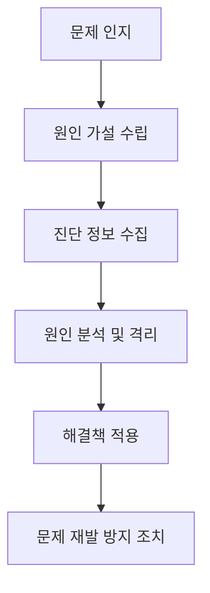

# 7.10 성능과 최적화

# 네트워크 모니터링과 트러블슈팅

## 네트워크 모니터링 (Network Monitoring)

> 네트워크 장비, 트래픽, 성능, 상태를 **지속적으로 관찰**하고 **이상 징후를 탐지**하기 위한 활동.
>
> ⇒ 사전 예방, 품질 보장(QoS), 보안 유지에 중요.

### 네트워크 모니터링의 주요 목적:
1. **성능 문제 해결**: 네트워크 지연, 대역폭 부족, 패킷 손실 등 성능 저하의 원인을 파악하고 해결. 
2. **장애 탐지 및 예방**: 네트워크 장비 또는 서비스 장애 발생 시 신속하게 탐지하고 대응하여 서비스 중단을 최소화. 
3. **보안 위협 탐지**: 악성 트래픽, 비정상적인 접근 패턴 등을 감지하여 보안 위협으로부터 네트워크를 보호. 
4. **용량 계획 및 최적화**: 네트워크 트래픽 패턴을 분석하여 미래 수요를 예측하고 네트워크 용량을 효율적으로 관리. 
5. **규정 준수**: 네트워크 활동을 기록하고 분석하여 관련 규정 준수 여부를 확인. 

### 네트워크 모니터링 구성 요소

| 구성 요소       | 설명                                                     |
| ----------- | ------------------------------------------------------ |
| **모니터링 대상** | 네트워크 장비(CPU, 메모리), 트래픽, 포트, 서비스 상태 등                   |
| **수집 방식**   | SNMP, NetFlow, Syslog, Ping, Agent                     |
| **분석 방식**   | 대시보드 시각화, 알림 설정, 이벤트 기반 로깅                             |
| **도구**      | Wireshark, Zabbix, PRTG, SolarWinds, Nagios, Grafana 등 |

### 모니터링 프로토콜 및 기술

| 기술/프로토콜                                       | 설명                                                     |
| --------------------------------------------- | ------------------------------------------------------ |
| **SNMP (Simple Network Management Protocol)** | 네트워크 장비 정보를 가져오는 표준 프로토콜 → 장비 상태, 트래픽 등 실시간 모니터링 가능 |
| **Syslog**                                    | 장비에서 발생한 이벤트/로그를 수집 (서버로 전송)                           |
| **NetFlow / sFlow**                           | 트래픽 흐름을 수집하고 분석 (패킷의 출발지/목적지 등)                        |
| **Ping / ICMP**                               | 호스트의 응답 속도 및 연결 유무 확인                                  |
| **RMON (Remote Monitoring)**                  | SNMP의 확장 기능으로 트래픽 이상 감지에 특화                            |

 

---
## 트러블슈팅 (Troubleshooting)

> 발생한 네트워크 문제를 **진단하고 해결**하기 위한 절차적 접근 방법.
> ⇒ 네트워크 장애 발생 시 원인 분석 및 복구.

### 트러블슈팅 절차 (문제 해결 단계)

### 예시 절차

1. **문제 인지**: 서비스 지연, 접속 불가 등 알림 수신
2. **원인 가설**: DNS 문제일지, 라우팅 문제일지 추정
3. **데이터 수집**: traceroute, ping, interface log 등
4. **원인 분석**: 특정 구간에서 TTL 지연 확인
5. **조치 수행**: 장비 재시작, 설정 복구, 재라우팅
6. **사후 검토**: SLA 위반 여부 확인 및 보고서 작성

### 주요 트러블슈팅 도구

| 도구                       | 용도           | 특징                      |
| ------------------------ | ------------ | ----------------------- |
| **Wireshark**            | 패킷 캡처 및 분석   | OSI 계층별 분석 가능           |
| **traceroute**           | 경로 추적        | 어느 지점에서 지연/끊김이 발생했는지 확인 |
| **ping**                 | 연결 확인        | ICMP 응답으로 연결 지연 및 손실 확인 |
| **netstat**              | 연결 상태 확인     | TCP 연결, 포트 확인           |
| **ipconfig / ifconfig**  | IP 설정 확인     | 주소, DNS, 게이트웨이 정보 확인    |
| **nslookup / dig**       | DNS 테스트      | 도메인 → IP 매핑 확인          |
| **Zabbix, PRTG, Nagios** | 대시보드 기반 모니터링 | 알람, 자동화, 로그 연계          |

 

---

### 실무에서의 모니터링 사례

| 상황                 | 사용 도구                | 분석 예                |
| ------------------ | -------------------- | ------------------- |
| 사용자 갑자기 웹사이트 접속 불가 | traceroute / ping    | DNS 문제 or 라우팅 중단 추정 |
| 갑작스러운 트래픽 폭주       | NetFlow / Zabbix     | 특정 IP에서 DoS 발생 확인   |
| 서버 CPU 지속 100%     | SNMP / Syslog        | 백엔드 서비스 무한 루프 확인    |
| VoIP 음성 끊김 발생      | jitter 측정 / QoS 모니터링 | 네트워크 혼잡 구간 분석       |

---

### 네트워크 장애 원인 분류

| 원인      | 설명                  |
| ------- | ------------------- |
| 하드웨어 장애 | 스위치/라우터/서버 다운 등     |
| 설정 오류   | ACL, NAT, DNS 설정 오류 |
| 회선 문제   | ISP 라인 단절, 광케이블 손상  |
| 보안 위협   | DDoS, 악성코드 트래픽      |
| 과부하     | 대량 트래픽, 자원 소진 등     |