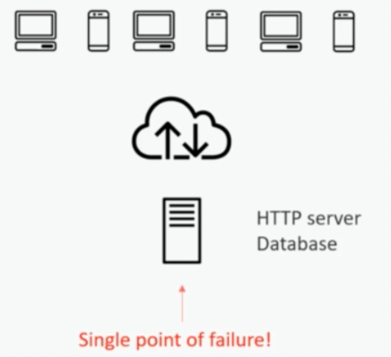
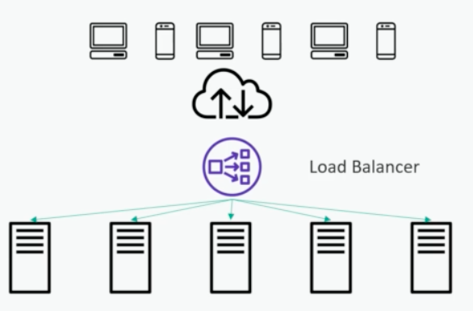

# 수직 확장 vs 수평 확장(vertical Scaling vs Horizontal Scaling)
- 목적 : 많은 트래픽에 대응하기 위한 확장성

## 1. 확장성이 없는 단일 서버(Single Server)

- 주요 용도 : 개인 웹사이트와 같이 트래픽이 많지 않고, 서버가 일시적으로 다운되어도 크게 상관이 없는 경우 유용한 설계
- 고려할 점 : 상업 서비스와 같이 한 번에 수백만 명의 트래픽을 감당해야 하는 서버에 대해서는 확장성을 고려
- 문제점 : 단일 서버 방식은 서버가 다운되면 전체 서비스가 중단되어 버리는 단일 장애점(SPOF, Single Point Of Failure)가 발생가능 

 

> 확장성을 늘리는 방식에는 수직 스케일링과 수평 스케일링 방식이 존재

## 2. 수직 확장 (Vertical Scaling)

- 주요 용도 : 더 크고 비싼 하드웨어를 사용해 트래픽을 감당할 수 있도록, 단순히 서버의 성능을 높이는 방식
- 장점 : 서버의 개수가 늘어나지 않으므로 관리해야 할 포인트가 적어 유지보수가 편리
- 단점 : 
  - 하드웨어 성능의 한계
  - 여전히 서버가 다운되면 전체 서비스가 중단되는 단일 장애점이 되므로 일반적인 서비스의 운영환경에서 사용할 수 없음
  
## 3. 수평 확장

- 주요 용도 : 
  - 대부분의 대규모 아키텍처 설계에서 최신 시스템 설계에 가장 적절한 방식
  - 서버의 성능을 높이는 것이 아닌, 여러 대의 서버를 두고 트래픽을 각 서버에 분산시켜주는 로드 밸런서를 앞에 두어 일정하게 부하를 분산하는 방식
- 장점 : 
  - 한 서버가 다운되었을 때, 해당 서버로 트래픽을 보내지 않고 살아있는 다른 서버로 트래픽을 분산해줄 수 있으므로 각 서버는 단일 장애점가 되지 않음
  - 또한, 수직 스케일링과 달리 한계 없이 서버의 개수를 계속 확장해 확장성을 가져갈 수 있음
  - 더 많은 서버를 배치할 수록 트래픽을 더 많이 감당할 수 있음
- 단점 : 
  - 서버의 개수가 늘어나는 만큼 유지보수가 더 어려워짐
- 고려할 점 : 무상태(Stateless)
  - 서버가 여러 대 존재해 이전의 요청에 대해 다음 요청이 똑같은 서버로 요청된다는 보장이 없으므로 각 서버는 이전 상태에 의존해 다음 요청을 처리하면 안되고 무상태로 설계되어야 함
  - 이전의 요청에 대해 다음 요청이 같은 서버로 요청되어야 한다는 규제가 생긴다면 이는 트래픽을 일정하게 분산하는 수평 스케일링의 장점을 온전히 가져가지 못한다는 의미
