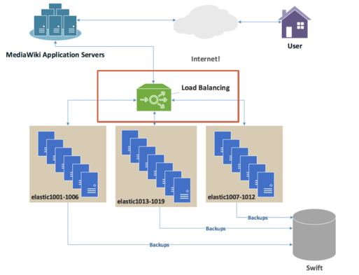

# 로드밸런싱

## 1. 로드밸런싱이란? 
> 애플리케이션을 지원하는 리소스 풀 전체에 네트워크 트래픽을 균등하게 배포하는 방법

- 예시 : 
  - 모든 사람들이 12월 31일 23시 59분 59초에 메신저로 친구들을 포함한 지인들에게 새해 인사를 한다고 가정
  - 한낱 한시에 메신저를 보내면 한꺼번에 많은 트래픽이 몰리게 되고 서버는 그 트래픽을 감당해내기가 어려워 부하를 받게 됨
  - 이를 방지하기 위해 우리는 동일한 서버를 여러 대 구비해놓고 서버 중 트래픽이 몰리는 것을 방지하고 여러 서버에 적절하게 분산 시켜주는 기술인 **로드 밸런싱** 사용
  
  
## 2. 종류
### 2.1 L4 로드밸런싱

- L4는 전송계층(Transport Layer) 프로토콜의 헤더를 부하 분산에 이용
- L4 스위치는 전송 계층을 처리하는 기기로 IP 와 포트를 기반으로 (특히 포트를 기반으로) 트래픽을 분산.(URL이나 쿠키에 따라 분산하는 것은 불가능)

### 2.2 L7 로드밸런싱

- L7은 애플리케이션 계층에서 로드를 분산하는데 패킷의 내용을 확인하고 그 내용에 따라 로드를 특정 서버에 분배하는 것이 가능(이미지는 이미지 서버로, 비디오는 비디오서버로 보내는 것이 가능)

## 3. 장점
    
    1. 가용성 : 로드 밸런서는 서버 문제를 자동으로 감지하고 클라이언트 트래픽을 사용 가능한 서버로 리디렉션하여 시스템의 내결함성을 높임

    2. 확장성 : 여러 서버 간의 네트워크 트래픽을 지능적으로 전달하기 때문에 수천개의 클라이언트 요청 처리 가능

    3. 보안 : 공격 트래픽을 여러 백엔드 서버로 자동으로 리디렉션하여 영향 최소화, 추가 보안을 위해 네트워크 방화벽 그룹을 통해 트래픽 라우팅
    
    4. 성능 : 트래픽을 분산함으로써 개별 서버의 부하를 낮춰 응답 속도를 향상

## 4. 로드 밸런싱 알고리즘

### 4.1 정적 로드 밸런싱 
- 고정된 규칙을 따르며 현재 서버 상태와 무관

1. 라운드 로빈 방식(Round Robin)
   - 가장 단순한 방식. 요청을 서버들에 순차적으로 분배
   - 서버의 성능이나 상태를 고려하지 않기 때문에, 균등하게 부하를 분산하지 못할 수 있음
   - 로드밸런싱 대상 서버의 스펙이 동일하고, 처리 시간 혹은 세션지속시간이 짧은 애플리케이션의 경우 이러한 방식이 적합

2. 가중 라운드 로빈 방식
    - 서버의 성능을 고려한 방식. 각 서버에 가중치를 부여하여, 가중치가 높은 서버에 더 많은 요청을 보냄
    - 서버의 사양이 다를 때 효율적인 부하 분산이 가능
   
3. IP 해시 방식
   - 클라이언트의 IP를 기반으로 분산하는 방식.
   - 동일한 클라이언트는 항상 동일한 서버로 연결
   - 특정 사용자의 세션을 유지해야 할 때 유용하며, 요청을 보낸 서버가 고장 나면 세션이 끊어질 수 있음

#### 4.2 동적 로드 밸런싱
- 동적 로드 밸런싱 알고리즘은 트래픽을 배포하기 전에 서버의 현재 상태를 검사

1. 최소 연결 방법
   - 가장 적은 수의 활성 연결을 가진 서버로 트래픽을 보냅니다. 이는 모든 연결이 동일한 처리 능력을 필요로 한다고 가정
   
2. 가중치 기반 최소 연결 방법
    - 서버의 처리 용량에 가중치를 부여
    - 가중치가 높은 서버(더 많은 연결을 처리할 수 있는 서버)는 더 많은 트래픽을 받게 되며, 이는 서버의 실제 성능 차이를 반영
   
3. 최소 응답 시간 방법
    - 활성 연결 수와 서버의 응답 시간을 모두 고려
    - 가장 빠르고 효율적인 응답을 제공할 수 있는 서버로 요청을 보내어 전체적인 서비스 속도를 최적화
   
4. 리소스 기반 방법
   - 서버의 현재 CPU 사용률이나 메모리 사용량 같은 리소스 상태를 분석
   - 에이전트 소프트웨어를 통해 실시간으로 서버의 부하를 확인하고, 가장 여유 있는 서버로 트래픽을 분배하여 부하를 최소화

## 5. 기술유형
### 1. 하드웨어 로드 밸런서

- 특징: 
  - 높은 성능과 안정성을 제공하는 물리적인 장비
  - 수 기가바이트의 트래픽을 처리할 수 있을 만큼 강력
- 장점: 매우 빠른 속도와 안정적인 성능을 자랑하며, 엔터프라이즈급 대규모 트래픽에 적합
- 단점: 
  - 초기 구매 및 유지 보수 비용이 매우 비쌈
  - 한 트래픽이 급증할 때 용량을 늘리려면 새로운 장비를 구매하고 설치해야 하므로 확장성이 떨어짐

### 2. 소프트웨어 로드 밸런서

- 특징: 
  - 서버에 설치하여 사용하는 애플리케이션 형태
  - NGINX, HAProxy와 같은 오픈 소스 소프트웨어가 대표적
- 장점: 
  - 하드웨어 방식보다 훨씬 저렴하고 유연
  - 서버를 추가하는 것만으로 쉽게 용량을 확장하거나 축소할 수 있어 클라우드 환경에 최적화
- 단점: 하드웨어만큼의 절대적인 성능을 내기는 어렵지만, 대부분의 웹 서비스 환경에서는 충분한 성능을 제공