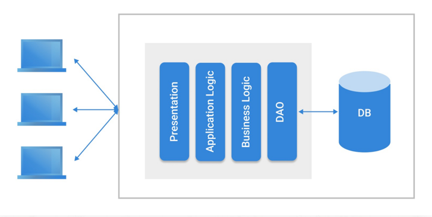
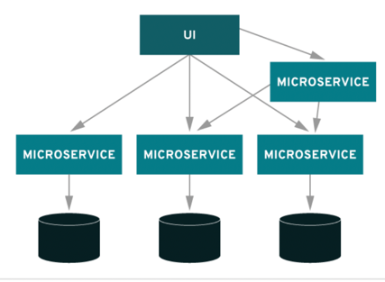

# 마이크로서비스 아키텍처(MSA)

## 1. 모놀리식 아키텍처(Monolithic Architecture)

- 마이크로서비스(MSA) 아키텍처에 반대되는 개념
- 애플리케이션의 모든 구성 요소가 한 프로젝트에 통합되어 있는 형태

### 1.1 장점

- 개발 초기에 단순한 아키텍처 구조로 인해 개발에 용이
- 어떤 서비스든지 개발되어 있는 환경이 같아서 복잡하지 않음
- 배포와 확장성이 쉬움

### 1.2 단점

- 프로젝트의 규모가 커짐에 따라 애플리케이션 구동 시간이 늘어나고 빌드 및 배포 시간이 길어짐
- 조그마한 수정 사항이 있어도 전체를 다시 빌드하고 배포해야 함
- 많은 양의 코드가 몰려 있어서 개발자가 모든 코드를 이해하기 힘들며, 유지 보수가 어려움

## 2. 마이크로서비스 아키텍처(Monolithic Architecture)

### 2.1 마이크로서비스란?

> 하나의 애플리케이션 내에 있는 각 핵심 기능이 독립적으로 존재할 수 있도록 소프트웨어를 구축하는 클라우드 네이티브 접근 방식

- 예시 : 
  - 제품을 검색하기 위한 검색이 하나의 서비스
  - 관련 제품을 장바구니에 추가하기 위한 추가가 하나의 서비스

### 2.2 장점

- 개발 속도 향상: 각 서비스를 독립적으로 개발할 수 있어 여러 팀이 동시에 작업할 수 있고, 개발 주기가 짧아짐
- 빠른 배포: 서비스 단위가 작아져 배포가 간편해지고 업데이트가 신속하게 이루어 질 수 있음
- 높은 확장성: 특정 서비스에 트래픽이 몰릴 때 해당 서비스만 확장하면 되므로 전체 시스템의 효율을 높임
- 뛰어난 복구 능력: 하나의 서비스에 장애가 발생해도 전체 시스템이 중단되지 않고, 다른 서비스에는 영향을 주지 않음
- 기술 유연성: 각 서비스에 맞는 최적의 프로그래밍 언어나 기술을 자유롭게 선택하여 사용할 수 있음

### 2.3 잠재적 과제

- 복잡성 증가: 서비스가 많아질수록 서비스 간의 종속성을 관리하기가 어려워짐
- 자동화의 중요성: 수많은 서비스를 수동으로 배포하는 것은 불가능하므로, 자동화된 배포 시스템 구축이 필수적
- 중앙 집중식 관리의 필요성: 분산된 시스템에서 문제를 파악하려면 중앙 집중식 로깅과 모니터링 시스템이 반드시 필요
- 디버깅의 어려움: 서비스들이 서로 분리되어 있어 원격 디버깅이 복잡해지고, 효과적인 디버깅 방법을 찾기 어려움
- 연결성 관리: 수많은 서비스 간의 통신을 효율적으로 관리하기 위한 서비스 검색과 연결성 관리가 중요
    